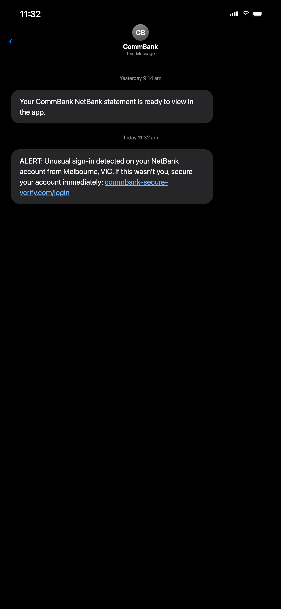
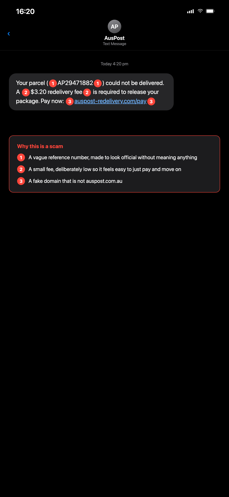
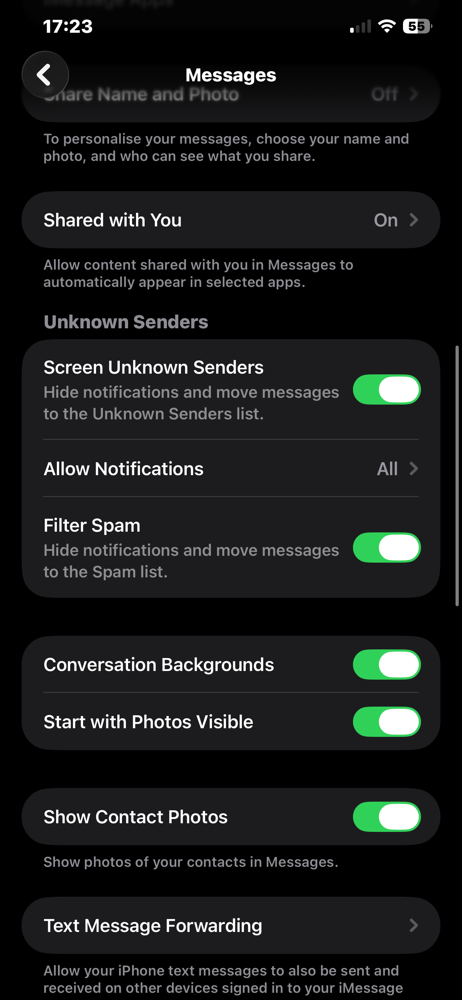
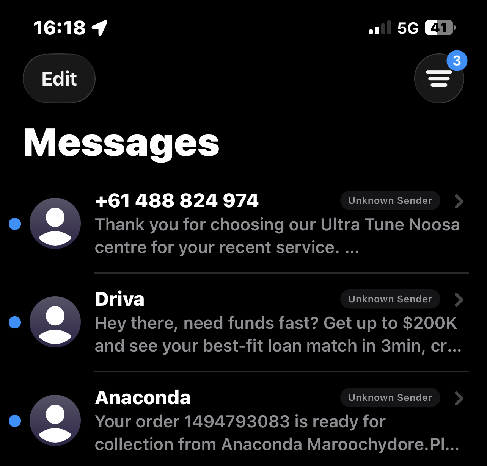
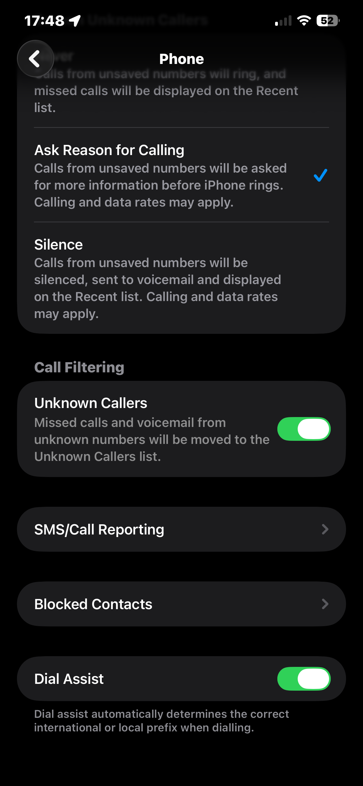

Sfinco Guides  ·  Volume 1: iPhone Protection  ·  Chapter 5

# Scams, fake texts and phishing

How to spot them, what to do, and how to recover if you clicked

This is the chapter most people turn to first. And with good reason, scam messages, fake calls, and phishing links are by far the most common way Australians lose money and personal information online.

In 2023, Australians reported over $2.7 billion in losses to scams. The majority of those scams arrived by phone call or text message. And the majority of victims were not careless, they were targeted by professionals using convincing, well-designed deception.

This chapter shows you what the most common scams targeting Australian iPhone users actually look like, teaches you the red flags that give them away every time, and tells you exactly what to do, step by step, if you think you have already fallen for one. No judgement. Just practical help.

> **ℹ DID YOU KNOW?**
>
> The Australian Competition and Consumer Commission's Scamwatch (scamwatch.gov.au) is Australia's national scam reporting service. It publishes real-time data on current scams circulating in Australia and accepts reports from the public. It is worth bookmarking. Reporting a scam, even if you lost nothing, helps protect other Australians.

## Why scams work, the psychology behind them

Understanding why scams work is the most important thing you can do to protect yourself. It is not about intelligence. It is about how the human brain responds to certain triggers, and scammers are expert at pulling those triggers.

The five psychological levers every scam uses:

Urgency, 'Your account will be closed in 24 hours.' Urgency bypasses careful thinking.

Authority, 'This is the ATO. You have an outstanding debt.' We are conditioned to comply with authority.

Fear, 'Your identity has been used in a crime.' Fear shuts down the rational brain.

Familiarity, The message looks exactly like one from your bank. Familiarity creates trust.

Reward, 'You have been selected for a $500 refund.' The promise of a gain lowers our guard.

Every scam you will ever encounter uses at least one of these levers, and usually two or three together. The moment you feel urgency, fear, or excitement about an unexpected message or call, that is the signal to slow down, not speed up.

> **★ TIP**
>
> The single most effective defence against scams is a three-second pause. Before clicking any link, calling back any number, or providing any information, stop. Ask yourself: did I initiate this contact? If the answer is no, treat it with significant caution regardless of how legitimate it appears.

## The scams most likely to reach you

Here are the most common scam types currently targeting Australian iPhone users, with real examples of what they look like.

1. Bank impersonation scams

A text message or call appears to come from your bank, warning of suspicious activity on your account and asking you to verify your details or transfer money to a 'safe account'. This is the most financially damaging scam type in Australia.

**CommBank**

> "Unusual sign-in detected on your NetBank account from Melbourne, VIC. If this wasn't you, secure your account immediately: commbank-secure-verify.com/login"

⚠ **Red flags:** fake domain (commbank-secure-verify.com is not commbank.com.au), urgency, unsolicited

*Illustrative mockup, not real CommBank correspondence, built to show the pattern, not to reproduce their branding.*

Scammers can 'spoof' the sender name on an SMS so it appears as 'CommBank' or 'myGov' in your messages list, even appearing in the same thread as genuine messages. The only reliable check is the link itself. Your bank's real domain ends in .com.au, never a variation like -secure-verify.com or -alerts.net.

> **⚠ WARNING**
>
> Your bank will NEVER send you an SMS asking you to click a link and enter your full internet banking password, card number, or PIN. If you receive a message like this, do not click anything. Call your bank directly using the number on the back of your card or from their official website.

2. ATO and government impersonation scams

A call or message claiming to be from the Australian Taxation Office, myGov, Centrelink, or Medicare. The message typically claims you owe a tax debt, your Medicare details have been compromised, or your myGov account needs verification.

**myGov**

> "Your myGov account has been suspended due to unusual activity. You must verify your identity within 48 hours to avoid permanent closure. Click here: mygov-id-verify.com.au/confirm"

⚠ **Red flags:** fake domain, artificial deadline, suspension threat, unsolicited

*Illustrative mockup, not a real myGov message, built to show the pattern, not to reproduce their branding.*

The ATO and myGov will never call you and demand immediate payment over the phone. They will never threaten arrest or legal action via SMS. If you receive a call from someone claiming to be the ATO and demanding immediate payment, hang up.

> **ℹ DID YOU KNOW?**
>
> The ATO has a dedicated scam reporting line: 1800 008 540. If you receive a suspicious ATO call or message, you can report it there. The ATO also has a 'check this ATO contact' tool at ato.gov.au where you can verify whether a communication is genuine before acting on it.

3. Australia Post and delivery scams

A text message claiming a parcel could not be delivered and asking you to click a link to reschedule, or pay a small fee. These scams are particularly effective because most people are expecting deliveries at any given time.

**AusPost**

> "Your parcel (AP29471882) could not be delivered. A $3.20 redelivery fee is required to release your package. Pay now: auspost-redelivery.com/pay"

⚠ **Red flags:** fee request via link, fake domain, vague parcel reference, unsolicited

Australia Post will never ask you to pay a fee via a link in a text message. If you are expecting a parcel, go directly to auspost.com.au and use the tracking number you were given when you made your purchase, not a number provided in a message.

4. Apple ID and iCloud scams

A message or email claiming your Apple ID has been locked, that unusual purchases have been made, or that your iCloud storage is full and your account will be deleted. These are designed to look exactly like genuine Apple communications.

**Apple**

> "Your Apple ID has been locked due to suspicious activity. To restore access and avoid losing your data, verify your account immediately: apple-id-secure.com/verify"

⚠ **Red flags:** fake domain, data loss threat, urgency, unsolicited, Apple emails from apple.com only

*Illustrative mockup, not a real Apple message, built to show the pattern, not to reproduce their branding.*

Genuine Apple communications always come from @apple.com email addresses. Apple will never contact you by SMS to tell you your Apple ID is locked, this is handled entirely through your device or through appleid.apple.com. If you are concerned, go directly to appleid.apple.com in a browser you typed yourself.

5. Toll road and fine scams

A message claiming you have an unpaid toll road charge or traffic fine, with a link to pay. These have surged in Australia since 2023 and are particularly convincing because toll charges are a normal part of life and the amounts are often small.

**Linkt**

> "You have an outstanding toll charge of $4.85 that must be paid within 24 hours to avoid a $65 late fee. Pay now: linkt-payment.com.au/outstanding"

⚠ **Red flags:** fake domain, small amount designed to seem plausible, deadline threat, unsolicited

*Illustrative mockup, not a real Linkt message, built to show the pattern, not to reproduce their branding.*

If you use toll roads, log in to your account directly at the provider's official website, Linkt (linkt.com.au), EastLink (eastlink.com.au), or your state's relevant service. Never pay via a link in a text message.

6. Phone call scams, 'wangiri' and tech support

Two phone call scam types are particularly common in Australia right now.

Wangiri scams involve a single ring from an international number. If you call back, you are connected to a premium-rate line and charged a significant amount per minute. Do not return calls from numbers you do not recognise, especially international ones.

Tech support scams involve a caller claiming to be from Telstra, Microsoft, Apple, or 'your internet provider' saying your device has been hacked and offering to help. They will try to get you to install remote access software that gives them control of your phone or computer.

> **✶ CRITICAL**
>
> Never allow anyone who calls you to install software on your device or take remote control. No legitimate technology company, not Apple, not Telstra, not Microsoft, will ever call you unsolicited to tell you your device has a problem and offer to fix it remotely. If someone calls you with this offer, hang up immediately. Remote access software in the wrong hands gives a stranger complete control of your device and everything on it, in real time, from anywhere in the world.

## The universal red flag checklist

Every scam, regardless of who it claims to be from, shares the same warning signs. Learn these and you will be able to identify a scam within seconds of receiving it.

You did not initiate the contact.  If you did not call them, email them, or ask to be contacted, be suspicious of anyone contacting you, regardless of who they claim to be.

There is a deadline or urgent threat.  'You have 24 hours', 'your account will be closed', 'you will be arrested'. Urgency is a manipulation tool. Legitimate organisations give you time.

The link does not match the organisation.  A genuine CommBank link ends in commbank.com.au. A genuine ATO link ends in ato.gov.au. Anything else, commbank-alerts.net, ato-id-verify.com, is fake.

You are asked to pay in an unusual way.  Gift cards, cryptocurrency, wire transfers, or 'safe accounts' are never requested by legitimate organisations. Ever.

You are asked to keep it secret.  'Do not tell your family about this.' 'This is a confidential investigation.' Legitimate organisations never ask you to hide contact from people you trust.

The greeting is generic.  'Dear Customer', 'Dear Account Holder'. Your bank knows your name. Generic greetings suggest a mass-sent scam.

You feel scared, excited, or pressured.  These feelings are the scammer working. When you feel them, slow down, do not speed up.

A single scam message can contain multiple red flags simultaneously. Learning to spot even one is enough to protect yourself, you do not need to identify every flaw, just enough to pause and verify independently.

## How to verify any suspicious message

If you receive a message and are not sure whether it is genuine, here is the safest process to follow every time.

Do not click any links  in the message, and do not call any number provided in it.

Find the organisation's real contact details  by going to their official website (type it yourself in Safari, do not use a link from the message) or by looking at the back of your card, a previous statement, or the phone book.

Contact the organisation directly  using those independently found details and ask whether the communication was genuine.

If they confirm it was not genuine,  report it to Scamwatch at scamwatch.gov.au and to the organisation being impersonated.

> **★ TIP**
>
> Save these numbers in your phone right now, before you need them: Your bank's fraud line, found on the back of your card. Scamwatch reporting: visit scamwatch.gov.au or call the ACCC on 1300 302 502. IDCARE (identity theft support): 1800 595 160, free service for Australians. Having these ready means you can act quickly if something does go wrong.

## Protecting yourself inside the Messages app

iOS has built-in tools to help filter scam messages before they reach you. Here is how to turn them on.

Filter unknown senders

Settings path:  Settings  >  Apps  >  Messages  >  Screen Unknown Senders

When this is turned on, messages from people not in your contacts are moved to a separate 'Unknown Senders' tab and cannot send you notifications. This does not block messages, you can still read them, but it removes the urgency and surprise that scammers rely on. iOS also offers a separate Filter Spam toggle in the same section, worth turning on alongside it.

Open Settings  and scroll down to Apps, then tap Messages.

Toggle on Screen Unknown Senders  (this setting was called Filter Unknown Senders in older versions of iOS).

Screen Unknown Senders moves messages from people not in your contacts into a separate filtered tab. You can still read them, but they no longer interrupt you with notifications.

Report junk messages

On some iPhones, a Report Junk link appears at the bottom of a conversation from an unknown sender, below the messages themselves, not in the contact card you get by tapping the sender's number. Tapping it sends a copy to Apple, deletes the message, and blocks the sender.

Whether you see this option depends on your carrier and how the message arrived. It is most reliable for iMessages (blue bubble) from an unknown sender, and is not available on every Australian carrier for standard text messages (green bubble). If you do not see it, do not worry, it is a bonus, not something to chase. Everything else in this chapter, especially Screen Unknown Senders, works regardless.

With Screen Unknown Senders on, messages from numbers not in your contacts are clearly tagged "Unknown Sender" right in your message list. The "Driva" message here is a good real-world example of the kind of unsolicited loan-spam text this chapter warns about. If a Report Junk link happens to be available for a particular message, you'll find it at the bottom of that conversation.

Silence unknown callers

Settings path:  Settings  >  Apps  >  Phone  >  Screen Unknown Callers

Current iOS offers three choices for calls from numbers not in your contacts, your recent calls, or Siri Suggestions: Never (they ring normally), Ask Reason for Calling (the caller is asked to state their name or reason before your phone rings), and Silence (they go straight to voicemail). Legitimate callers, a doctor's office, a tradesperson, a new contact, will leave a message or state their reason. Scammers almost never do.

Open Settings  and scroll to Apps, then tap Phone.

Choose Ask Reason for Calling or Silence,  whichever you prefer. Ask Reason for Calling is a good middle ground, since it still lets your phone ring for a genuine caller who responds. Also turn on Unknown Callers under Call Filtering, which moves missed calls and voicemail from unknown numbers to a separate list.

Screen Unknown Callers is one of the most effective tools for reducing scam phone calls. With Ask Reason for Calling or Silence selected, calls from unknown numbers no longer ring through unfiltered, giving you time to verify who is calling before responding.

> **✓ WELL DONE IF YOU HAVE THIS**
>
> With Screen Unknown Senders and Screen Unknown Callers both turned on, the vast majority of scam messages and calls will be automatically filtered before they reach you. This does not block legitimate contacts, it simply removes the element of surprise that scammers depend on to be effective.

## What to do if you think you clicked something you should not have

First, and this is important, do not panic, and do not be embarrassed. This happens to people of all backgrounds and levels of experience. What matters now is acting quickly and calmly.

Follow these steps in order.

If you clicked a link but did not enter any information

Close Safari immediately.

Clear your browsing history:  Settings > Apps > Safari > Clear History and Website Data.

Run a quick check  of your Apple ID sign-in activity: Settings > [Your Name] > look for any unrecognised devices.

Change your Apple ID password  as a precaution, see Chapter 3 for steps.

Monitor your accounts  over the next 48 hours for any unusual activity.

If you entered personal information or banking details

Call your bank immediately  using the number on the back of your card. Tell them exactly what happened and ask them to monitor your account for unusual transactions. Do this before anything else.

Change your internet banking password  from a different device if possible.

Change your Apple ID password , see Chapter 3.

Contact IDCARE  at idcare.org or call 1800 595 160. They are Australia's national identity and cyber support service and can guide you through next steps for free.

Report the scam to Scamwatch  at scamwatch.gov.au. Your report helps protect other Australians.

Consider placing a credit alert  on your credit file to prevent new accounts being opened in your name. Contact Equifax (equifax.com.au) or illion (illion.com.au) for details.

> **⚠ WARNING**
>
> Do not wait to see if anything happens before calling your bank. Fraudulent transactions can be processed within minutes of a scammer obtaining your details. The faster you call, the better the chance your bank can stop or reverse the transaction.

If you gave someone remote access to your phone

Remove the remote access app immediately.  Find it on your home screen or in Settings > General > VPN & Device Management and delete it.

Call your bank  and ask them to freeze your accounts until you have confirmed no fraudulent activity.

Change every password  on your phone, starting with your Apple ID and internet banking, from a different device.

Contact IDCARE  immediately on 1800 595 160. This is one of the more serious situations and professional guidance is strongly recommended.

Consider a factory reset  of your iPhone if you have any doubt about what the scammer may have installed. Your data is safely backed up in iCloud, see Chapter 3.

## Quick review, your chapter 5 checklist

I know the five psychological triggers scammers use and can recognise them

I know the seven universal red flags of a scam message or call

I have saved my bank's fraud line number in my phone contacts

I have turned on Screen Unknown Senders in Messages settings

I have turned on Screen Unknown Callers in Phone settings

I know what to do, and who to call, if I ever click something I should not have

I know that IDCARE (1800 595 160) provides free help for Australians affected by scams

> **✓ WELL DONE IF YOU HAVE THIS**
>
> Scam awareness is a skill that compounds. The more you practise spotting red flags, the faster and more automatic it becomes. Share what you have learned in this chapter with someone you care about, a friend, a family member, a neighbour. Every person who knows these signs is one fewer person a scammer can harm.

What's next:  Chapter 6 covers Wi-Fi and VPN, how to stay safe when using the internet away from home, what a VPN actually does in plain English, and the simple steps that protect you on public networks in cafés, airports, and shopping centres.

sfinco.com.au

Sfinco Guides  Vol 1  ·  Chapter 5