SFINCO GUIDES

VOLUME 2

MACBOOK PROTECTION

Securing your Mac in plain English

---

Author: Leonardo Pinheiro
Series: Sfinco Guides
Volume: 2 of 8
Category: Personal Digital Safety / Cybersecurity for Consumers
Format: Non-fiction, instructional, plain-English guide
Audience: Adults who want plain-English, practical guidance, particularly Australians aged 60+
Region: Australia (Sunshine Coast, Queensland focus, nationally applicable)

Publisher: Sfinco
Brand colours: Blue #1B4F8A · Amber #C47F00
Website: sfinco.com.au

---

---

Sfinco Guides  ·  Volume 2

MacBook Protection

Securing your Mac in plain English

# Introduction

If you moved to a Mac because someone told you "Macs don't get viruses," this book has some good news and some news you need to hear.

The good news: Apple builds macOS with serious security built in from the ground up, and a lot of the hard work is already done for you before you even open the lid.

The news you need to hear: "Macs don't get viruses" was never quite true, and it is even less true today. Mac users are now a bigger target than ever, precisely because so many people believe that sentence and never check another setting again. Scammers know it too, and they have built entire industries around convincing Mac owners that something is wrong with their computer.

This is not a technical manual. There are no complicated diagrams, no long lists of jargon, and no assumption that you already know what "FileVault" is or why "Gatekeeper" sounds like something from an airport rather than your laptop. (It isn't, and by the end of this book, checking on it will take you thirty seconds.)

What this guide is, is a plain-English, step-by-step walkthrough of the most important things you can do right now to protect yourself on your Mac. Each chapter tackles one area of your digital life, explains why it matters in everyday terms, and then shows you, with real screenshots, exactly what to do and where to find it.

Whether you are someone who has used a Mac for twenty years and never thought much about security, or someone who just switched from a PC and wants to start off on the right foot, this book is written for you.

## Who is this book for?

This guide is for anyone who uses a Mac, MacBook Air, MacBook Pro, iMac, or Mac mini, and wants to feel confident that their personal information, their money, and their files are protected. You do not need to be "tech-savvy." You just need to be willing to spend a few hours going through these steps, most of which take less than two minutes each.

In particular, this guide will be helpful if you:

have ever seen a pop-up warning you that your Mac is infected and wondered if it was real

are not entirely sure what FileVault is or whether yours is turned on

share a Mac with family members and want to keep everyone's information separate and safe

have a parent, grandparent, or older relative who uses a Mac and worries about scams

simply want peace of mind knowing your Mac and everything on it is properly protected

## A quick word from the author

I work in banking and technology on the Sunshine Coast in Queensland, and I spend a lot of time helping people, particularly older Australians, navigate the digital world safely. What I have seen over and over again is not stupidity or carelessness. It is a gap.

The people who design scams and cyberattacks are professionals. They are well-funded, creative, and relentless. Meanwhile, most of us were never taught how our own computers actually protect us, or what the handful of settings are that make the real difference. This book closes that gap for the Mac, the same way Volume 1 closed it for the iPhone.

Everything in here is written the way I would explain it to my own mum, sitting next to her at the kitchen table with her MacBook open.

# How to use this book

This book is designed to be used, not just read. Here is how to get the most out of it.

## Work through it chapter by chapter

Each chapter builds gently on the one before it, starting with the most fundamental protections (your login password and FileVault) and working through to more advanced topics (network security and what to do if your Mac is ever lost or stolen). If you are new to Mac security, the best approach is to start at Chapter 1 and work your way through.

That said, every chapter also stands on its own. If there is a specific topic that is urgent for you right now, a scam pop-up, for example, or backing up your files, feel free to jump straight there.

## Do the steps as you go

This is not a book to read on the couch and then forget about. It is a book to read with your Mac open in front of you. Each chapter includes step-by-step instructions with screenshots showing exactly what you will see on your screen. Work through each step as you read it, and by the time you finish a chapter, that protection is already in place.

*  TIP:  If you find a step confusing or your screen looks different from the screenshots, don't panic. macOS updates occasionally move settings around or rename them slightly. A quick search online for the setting name will usually point you in the right direction, or ask someone you trust for help.

## Use the tools at the back of the book

Chapter 8 ends with a one-page security checklist you can use every month to make sure your Mac stays protected over time. Print it out. Stick it on the fridge. Set a reminder on your calendar for the first Sunday of every month. Five minutes a month is all it takes to stay on top of things.

The very back of the book also has a Quick Reference Card, a condensed version of that same checklist plus the emergency contacts and steps from Chapter 7, and a Glossary of every term used in this guide. You don't need to read either before you start, just know they're there, so you can flip back whenever you need a number, a step, or a plain-English definition in a hurry.

## Share it with someone you care about

If you know someone, a parent, a neighbour, a friend, who could benefit from this guide, please share it with them. Scammers target people who are isolated and uninformed. The more people in your circle who know these basics, the safer everyone is.

## A note on screenshots and macOS versions

The screenshots in this book were taken using macOS Sequoia. If you are using a slightly older or newer version of macOS, some screens may look a little different, but the core settings and steps are almost always in the same place.

To check which version of macOS you are running: click the Apple menu in the top-left corner of your screen, choose About This Mac, and look at the line under your Mac's name. If your version is significantly older than macOS Ventura, consider updating before working through this guide, as some features may not be available on older software.

!  IMPORTANT:  Keeping your Mac updated is one of the single most important things you can do for your security. Apple regularly releases updates that fix known vulnerabilities. We cover this in detail in Chapter 8.

## What this book does not cover

This guide focuses specifically on your Mac. It does not cover iPhones, Android phones, or general internet safety beyond what relates directly to your computer. If you are interested in those topics, they are covered in other volumes in the Sfinco Guides series.

This guide also does not go deep into corporate or business-level IT management. If you run a small business and want to protect your team's computers and systems, take a look at the Sfinco Guide for Small Business, coming soon in Series 2.

Ready? Open your Mac. Chapter 1 starts with a story you might recognise.

sfinco.com.au

Part of the Sfinco Guides series, protecting Australians online

---

Sfinco Guides  ·  Volume 2: MacBook Protection  ·  Chapter 1

# Why your Mac is a target

The "Macs don't get viruses" myth, and why scammers love it

| ▶  REAL STORY Barbara, 68, from Noosaville, was browsing recipe websites on her iMac when a page suddenly filled her screen: a flashing red warning saying her Mac was infected with fifteen viruses, with a phone number to call for "Apple Support." She called. The person on the line spent forty minutes convincing her to install a remote access program, then told her she needed a $389 annual "protection plan" paid by gift card. Barbara is not careless. She had used Macs for fifteen years and genuinely believed they could not get infected. That belief is exactly what the scammer was counting on. |

Stories like Barbara's have become one of the most common tech scams in Australia, and Mac owners are targeted more than PC owners specifically because of how safe they believe themselves to be. The Australian Competition and Consumer Commission has reported hundreds of millions of dollars lost to remote access and technical support scams, and Mac users make up a growing share of the victims.

Macs are no longer a small, ignored corner of the computer market. They sit on desks in homes, offices, and government departments across the country, often holding years of banking records, family photos, and saved passwords. Scammers have noticed.

This chapter is not here to frighten you. It is here to show you clearly what is actually happening, why your Mac is valuable to the people who want to misuse it, and what the most common methods of attack look like. Because once you know what to look for, most of these threats become remarkably easy to avoid.

## What is actually on your Mac?

To understand why your Mac is worth targeting, it helps to think about what is stored on it. Probably far more than you realise.

Your bank accounts, through Safari's saved logins or banking websites you stay signed in to

Your email, which can be used to reset passwords for almost everything else

Your Apple ID, the master key to your Apple account, iCloud, purchases, and Find My

Your photos, including images of documents, Medicare cards, passports, and bank statements

Your documents, tax returns, wills, insurance papers, and other files stored in your Documents folder or iCloud Drive

Your saved passwords, stored in Safari's password manager or iCloud Keychain

Your Time Machine backup, a complete copy of everything above, sitting on an external drive or network share

Your contacts and calendar, names, phone numbers, and the pattern of your daily life

| ℹ  DID YOU KNOW? A scammer who gains remote access to your Mac, even for a few minutes through a fake "support" session, can often open Safari, find your saved passwords, and access your online banking directly, all while you watch the screen and believe they are "fixing" something. This is why remote access requests from unsolicited callers are so dangerous. |

Most people think of their Mac as a tool for email and photos. Scammers think of it as a filing cabinet with the lock already picked.

## How do attacks actually happen?

Attacks on Mac users generally fall into a small number of well-worn patterns. Understanding them is most of the battle.

Fake virus warnings.  A website or pop-up claims your Mac is infected and urges you to call a number or download "cleaning" software immediately. Real macOS security warnings never work this way, they never ask you to call a phone number.

Phishing emails and messages.  A message appears to come from Apple, your bank, or a delivery company, asking you to click a link and log in. The link leads to a fake site designed to steal your username and password.

Malicious downloads.  Software downloaded from outside the App Store, a "free" video converter, a pirated application, or a fake update, quietly installs adware or spyware alongside whatever you thought you were installing.

Remote access scams.  Someone convinces you, usually by phone, to install a legitimate remote access tool like AnyDesk or TeamViewer, then uses that access to look through your files, install malware, or ask for payment for problems that never existed.

Weak or reused passwords.  If your Apple ID or email password has been used on other websites that were later hacked, criminals can often reuse those same details to get into your Mac-connected accounts.

## Why older Australians are targeted more

People over 60 are disproportionately targeted by tech support and remote access scams. This is not because older people are less intelligent or less capable. It is because of several factors that scammers deliberately exploit: many people in this age group did not grow up with computers and are less certain about what "normal" looks like on screen, some live alone and value a friendly voice on the phone, and many have significant retirement savings that make a successful scam highly profitable for the criminal.

Scammers also specifically target people who have used the same computer for a long time without ever needing IT support, because that unfamiliarity with "how tech support actually works" makes a fake call far more convincing.

## The good news

Every single scam type in this chapter has a straightforward defence, and none of them require you to become a technical expert. A genuine Apple security alert never asks you to call a phone number. Genuine tech support never phones you unprompted. And a Mac with the settings covered in the rest of this book turned on is a genuinely difficult target, difficult enough that most scammers will simply move on to someone else.

| ✓  WELL DONE IF YOU HAVE THIS If you have never called a number from a pop-up warning, and you only download software from the App Store or directly from a company's official website, you are already doing two of the most protective things a Mac owner can do. |

The rest of this book walks through exactly what to check, one chapter at a time, starting with the single most important layer: the login screen itself.

---

Sfinco Guides  ·  Volume 2: MacBook Protection  ·  Chapter 2

# Locking the front door

Your login password, Touch ID, and the encryption setting most people never turn on

Every protection in this book sits behind one gate: the login screen. If someone can pick up your Mac and get straight to your desktop with no password, nothing else in this book matters very much. This chapter covers the three layers that make that gate a genuine barrier, plus one setting that protects your files even if your Mac is physically stolen.

## Layer 1, Your login password

Settings > Login Password  is where you set or change the password required to log in to your Mac.

Open System Settings, click your name at the top (or Users & Groups), and choose Change Password.

Choose a passphrase rather than a short password.  Three or four random words strung together, like "PelicanTaxi42Verandah", are far harder to guess than a shorter password packed with symbols, and much easier for you to remember and type.

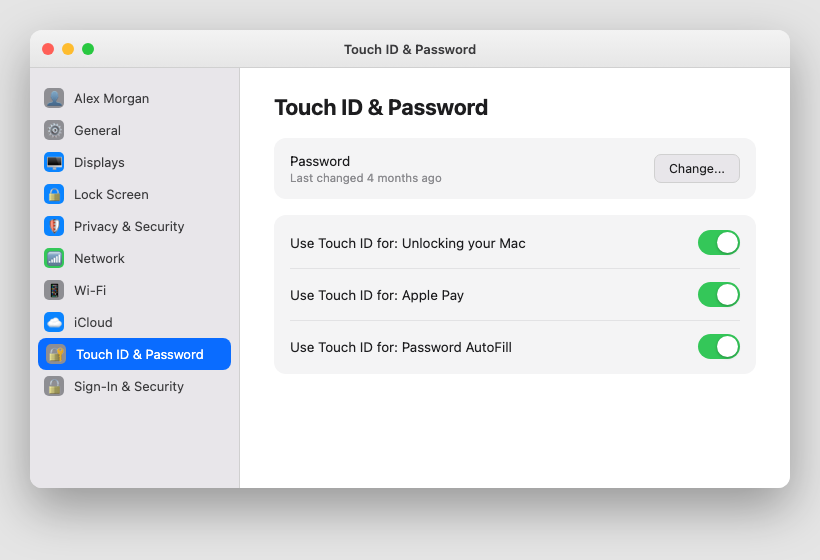

*Mockup illustration, styled to match macOS Sequoia, reshoot on a real Mac before final layout.*

| ⚠  WARNING Do not use: your date of birth, your address, your pet's name, "password", or any word or number someone who knows you could guess. Also avoid reusing your email password as your Mac password, if one is ever exposed, you do not want the other exposed with it. |

Every Mac account should also have a password set. If you have ever set your Mac to "log in automatically" with no password at all, turn that off in Users & Groups now, automatic login means anyone who opens the lid has full access to everything.

## Layer 2, Touch ID

If your Mac has a Touch ID sensor, built into the top-right of the keyboard on most MacBooks made since 2016, it is worth setting up alongside your password, not instead of it.

Settings path:  System Settings  >  Touch ID & Password.

Once set up, Touch ID can be used to:

unlock your Mac without typing your password

approve purchases from the App Store and Apple Books

confirm Apple Pay payments made through Safari

authorise password AutoFill and some system changes, like installing new software

★  TIP:  You can register more than one fingerprint. Adding a second finger, or a trusted family member's finger, if you want them to be able to unlock the Mac too, makes day-to-day unlocking faster without weakening security, since a fingerprint match is still required either way.

If your Mac does not have Touch ID, a strong login password used consistently is just as effective. Touch ID is a convenience layer on top of the password, not a replacement for it.

## Layer 3, Screen lock and auto-lock

A password only protects you if the Mac actually asks for it. Two settings control when that happens.

Settings > Lock Screen  controls how quickly your Mac locks itself after being left idle, and whether a password is required immediately after sleep or the screen saver starts.

| Setting | Recommended value |
| --- | --- |
| Require password after sleep or screen saver begins | Immediately |
| Start screen saver when inactive | 5 minutes or less |
| Turn display off when inactive | 10 minutes or less |

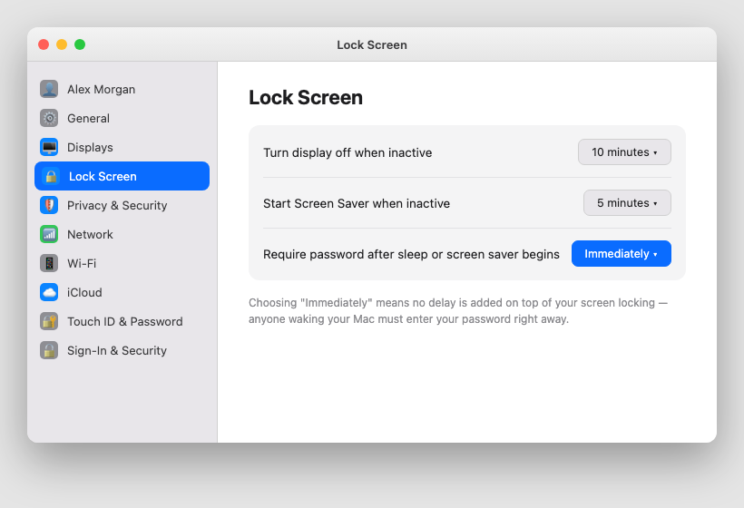

*Mockup illustration, styled to match macOS Sequoia, reshoot on a real Mac before final layout.*

| ⚠  WARNING If your Mac is set to require a password only after a long delay, or never, anyone who picks it up while you are away from your desk, even for a few minutes at a cafe or in a shared house, has a direct path to everything you are logged in to. "Immediately" costs you nothing in convenience and closes this gap completely. |

## The feature most people have never heard of, FileVault

FileVault is full-disk encryption built into every Mac. When it is turned on, everything stored on your Mac's drive is scrambled using your login password as the key. Without that password, the data on the drive is unreadable, even if someone removes the drive entirely and connects it to another computer.

This matters most if your Mac is ever lost or stolen. Without FileVault, a thief with basic technical knowledge can often read your files directly off the drive, bypassing the login screen altogether. With FileVault turned on, that same drive is just scrambled noise without your password.

Settings path:  System Settings  >  Privacy & Security  >  FileVault.

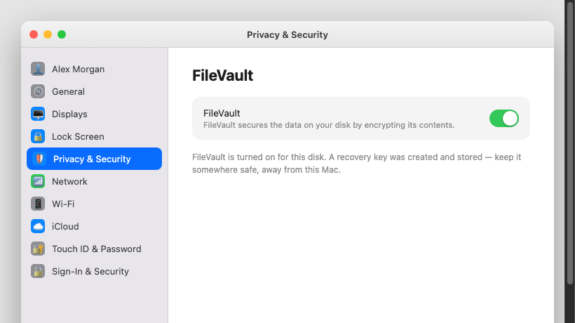

*Mockup illustration, styled to match macOS Sequoia, reshoot on a real Mac before final layout.*

| ℹ  DID YOU KNOW? FileVault has been available on every Mac since 2003, and on Apple Silicon Macs (the M1, M2, M3, and M4 chips) it runs with almost no effect on speed, since the encryption is handled by dedicated hardware. There is essentially no good reason to leave it turned off. |

When you turn FileVault on for the first time, macOS will ask you to save a recovery key, a long code that can unlock your Mac if you ever forget your password. Write this down and store it somewhere safe, like a password manager or a locked drawer, away from the computer itself. Do not store it in an email to yourself or a note on your desktop.

## Quick review, your chapter 2 checklist

| Done | Item |
| --- | --- |
| ☐ | My login password is a strong passphrase, not a short or guessable password |
| ☐ | Automatic login (no password) is turned off |
| ☐ | Touch ID is set up, if my Mac supports it |
| ☐ | Require password after sleep is set to Immediately |
| ☐ | FileVault is turned on, and I have stored my recovery key somewhere safe |

With the front door locked, the next chapter covers the master key to everything else on your Mac: your Apple ID.

---

Sfinco Guides  ·  Volume 2: MacBook Protection  ·  Chapter 3

# Your Apple ID and iCloud

Protecting the master key to your digital life

Your Apple ID is the single most important account connected to your Mac. It is also usually the same Apple ID connected to your iPhone, iPad, and Apple Watch, if you have them. Protect this one account well, and you protect an enormous amount of your digital life at once.

## What is your Apple ID, exactly?

Your Apple ID is the email address and password you use to sign in to Apple services, iCloud, the App Store, Messages, FaceTime, and more. It is the account behind iCloud Drive, iCloud Photos, and Find My. If someone gains access to your Apple ID, they can potentially see your photos, read your iCloud-synced Messages, track your devices, and lock you out of your own Mac entirely.

Settings path:  System Settings  >  [Your Name]  at the top of the sidebar shows your Apple ID and account details.

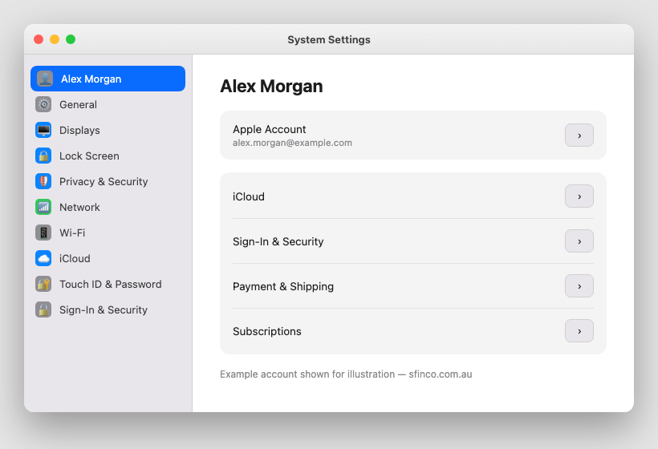

*Mockup illustration, styled to match macOS Sequoia, reshoot on a real Mac before final layout.*

## The password, and why it matters more than any other

Your Apple ID password should be unique, not reused from any other website or account. If you have ever used your Apple ID password anywhere else, change it today.

★  TIP:  The strongest passwords are passphrases: three or four unrelated words, like "GumtreeFerryOctober19", combined with a number. They are dramatically harder to crack than a short password with symbols swapped in for letters, and far easier for a person to actually remember.

If you struggle to remember unique passwords for every account, consider using Apple's built-in Passwords app (covered in more detail in Chapter 4), which can generate and store strong, unique passwords for every website you use, syncing them securely across your Apple devices.

## Two-factor authentication, your single most important security step

Two-factor authentication, often shortened to 2FA, means that signing in to your Apple ID from a new device requires both your password and a six-digit code sent to one of your trusted devices. Even if a criminal has your password, they cannot get in without also having physical access to your iPhone or another trusted Mac.

Settings path:  System Settings  >  [Your Name]  >  Sign-In & Security  >  Two-Factor Authentication.

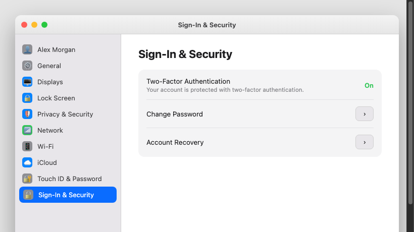

*Mockup illustration, styled to match macOS Sequoia, reshoot on a real Mac before final layout.*

| ✓  WELL DONE IF YOU HAVE THIS Two-factor authentication has been required for all new Apple IDs since 2021, so if your account is relatively recent, it is very likely already on. Checking takes thirty seconds and is worth doing regardless. |

| ⚠  WARNING Never share a six-digit Apple verification code with anyone, including someone claiming to be from Apple. Apple will never call you and ask for this code. If you receive a code you did not request, someone else may have your password, change it immediately. |

## Trusted phone numbers and trusted devices

Your Apple ID keeps a list of phone numbers and devices it trusts enough to send verification codes to. Keeping this list accurate matters, because an out-of-date trusted number, an old phone you no longer own, for instance, is a weak point.

Settings path:  System Settings  >  [Your Name]  >  Sign-In & Security  >  scroll to see trusted phone numbers.

Apple allows you to nominate an Account Recovery Contact, a trusted person who can help you regain access to your account if you are locked out. This person does not get access to your account; they simply receive a code that you use during the recovery process.

★  TIP:  Setting up an Account Recovery Contact now, before you ever need it, takes about two minutes and could save you days of frustration if you are ever locked out. Choose a trusted adult family member with their own Apple device.

## iCloud, what it is and why it matters

iCloud is Apple's cloud storage and sync service. On a Mac, it can back up your Desktop and Documents folders, sync your Safari passwords through iCloud Keychain, store your photos, and let you find your Mac if it is ever lost.

Settings path:  System Settings  >  [Your Name]  >  iCloud.

| iCloud feature | What it does |
| --- | --- |
| iCloud Drive | Syncs your Desktop and Documents folders across all your Apple devices |
| iCloud Keychain | Stores and syncs your saved passwords securely, protected by your Apple ID |
| iCloud Photos | Backs up and syncs your photo library |
| Find My Mac | Lets you locate, lock, or erase your Mac remotely if it is lost or stolen |

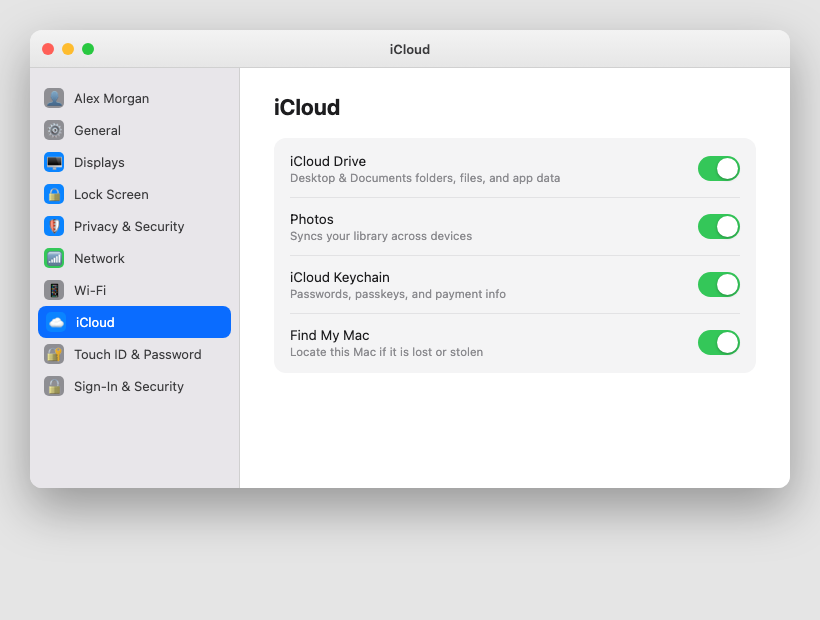

*Mockup illustration, styled to match macOS Sequoia, reshoot on a real Mac before final layout.*

| ℹ  DID YOU KNOW? iCloud Keychain uses end-to-end encryption, which means even Apple cannot read your saved passwords. They are only ever unlocked on a device where you are signed in to your Apple ID and have entered your device password. |

## Reviewing devices signed in to your Apple ID

Settings path:  System Settings  >  [Your Name]  scroll down to see every device currently signed in to your Apple ID.

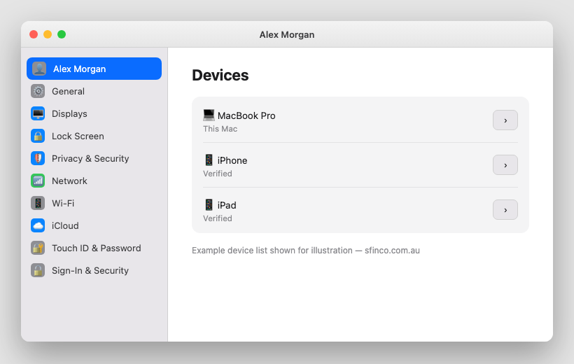

*Mockup illustration, styled to match macOS Sequoia, reshoot on a real Mac before final layout.*

| ⚠  WARNING If you see a device on this list you do not recognise, or an old device you sold or gave away without removing it first, tap it and choose Remove from Account. Then change your Apple ID password as a precaution. |

## What to do if you are locked out of your Apple ID

Go to iforgot.apple.com on any web browser, or use another trusted Apple device, and follow the prompts to reset your password. If you have an Account Recovery Contact set up, they can help you through the process. If not, Apple's account recovery process can take several days for security reasons, another good reason to set up a recovery contact now.

## Quick review, your chapter 3 checklist

| Done | Item |
| --- | --- |
| ☐ | My Apple ID password is unique and not used anywhere else |
| ☐ | Two-factor authentication is turned on |
| ☐ | My trusted phone number is current and correct |
| ☐ | I have set up an Account Recovery Contact |
| ☐ | I have reviewed the devices signed in to my Apple ID and removed anything unfamiliar |
| ☐ | iCloud Drive and Find My Mac are both turned on |

With your Apple ID secured, the next chapter looks at the apps on your Mac, and exactly what they can and cannot see.

---

Sfinco Guides  ·  Volume 2: MacBook Protection  ·  Chapter 4

# Gatekeeper and app permissions

What your Mac can see, and how to take back control

Every time you install a new application, or open one for the first time, macOS asks you a question: should this app be allowed to run, and what should it be allowed to see? Two systems handle these questions, Gatekeeper, which checks where an app came from, and Privacy & Security permissions, which control what a running app can access. This chapter walks through both.

## Gatekeeper, checking where your apps came from

Gatekeeper is a built-in macOS feature that checks whether an app has been verified by Apple before letting it run. Every app distributed through the App Store is automatically checked. Apps distributed outside the App Store can still run, but only if the developer has registered with Apple and "notarised" the app, a process where Apple scans it for known malware.

Settings path:  System Settings  >  Privacy & Security  >  scroll to Security, where you can see which sources of apps are currently allowed.

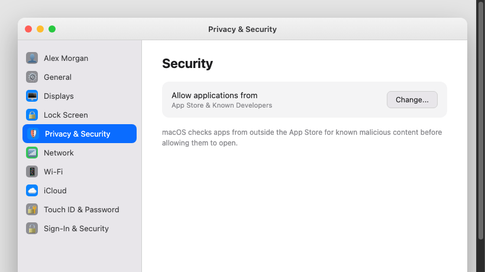

*Mockup illustration, styled to match macOS Sequoia, reshoot on a real Mac before final layout.*

| ⚠  WARNING If your Mac ever asks "Are you sure you want to open this application?" for something you did not deliberately choose to download, or if you have to disable Gatekeeper entirely to run something, treat that as a serious red flag. Legitimate, mainstream software almost never requires this. |

★  TIP:  When in doubt, download software directly from the developer's official website, typed into your browser yourself, not clicked from a search ad or a pop-up, or from the App Store. Avoid "download" buttons on random file-sharing sites, since these are one of the most common ways Mac malware spreads.

## The permission reference guide

Beyond Gatekeeper, individual apps can request access to specific parts of your Mac. Here is a plain-English explanation of the permissions you will see most often.

| Permission | What it actually means | Allow only when... |
| --- | --- | --- |
| Camera | The app can activate your Mac's built-in or connected camera | Video calling apps like FaceTime or Zoom. Deny for apps with no obvious reason to use a camera |
| Microphone | The app can listen through your Mac's microphone | Voice and video calling apps, dictation tools. Deny for anything else unless you actively use voice features |
| Screen Recording | The app can see and record everything shown on your screen | Screen-sharing and recording tools you trust. This is one of the most sensitive permissions on the Mac, it can capture passwords as you type them |
| Full Disk Access | The app can read every file on your Mac, including other apps' data | Backup software and system utilities from well-known developers. Almost nothing else needs this |
| Accessibility | The app can control your Mac, simulating clicks and keystrokes | Assistive tools and some automation apps. This permission can be misused to take control of your Mac, so grant it sparingly |
| Files and Folders | The app can access specific folders like Desktop, Documents, or Downloads | Apps that genuinely need to open or save your files, like word processors or photo editors |

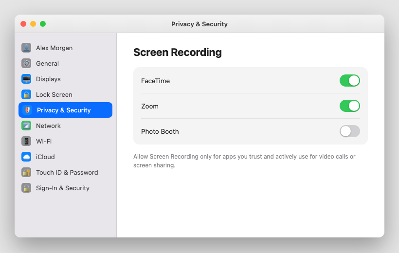

*Mockup illustration, styled to match macOS Sequoia, reshoot on a real Mac before final layout.*

| ⚠  WARNING Be especially cautious about granting Screen Recording and Full Disk Access. An app with Screen Recording access can see everything on your screen, including passwords as you type them into other apps. Full Disk Access can read files belonging to other applications, including your Mail and Messages databases. Neither should be granted to any app that does not have an obvious, specific need for it. |

## How to do a full permissions audit

Settings path:  System Settings  >  Privacy & Security  takes you to a list of every permission category. Work through each one, Camera, Microphone, Screen Recording, Files and Folders, and so on, and review which apps are listed.

What many people do not realise is that these permissions can be changed at any time, even long after you granted them. You are never permanently locked in to a choice you made at install. Revoking a permission is just as easy as granting one, and the app continues to work for everything it actually needs.

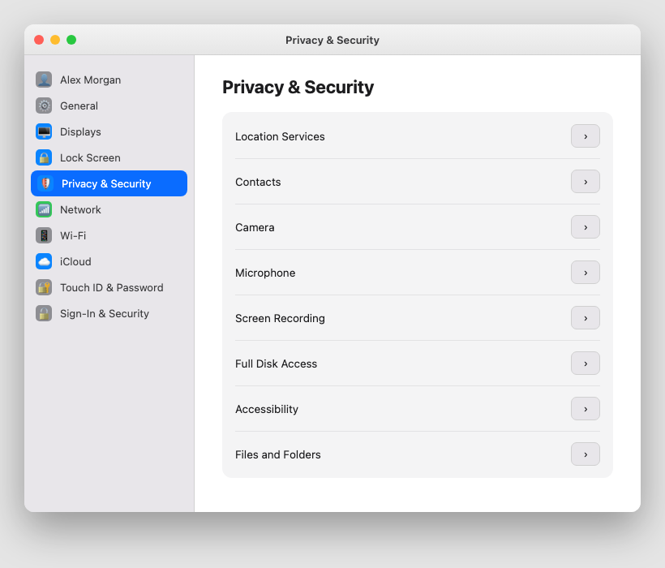

*Mockup illustration, styled to match macOS Sequoia, reshoot on a real Mac before final layout.*

## Which apps to look at most closely

Not all apps carry equal risk. Give particular attention to: apps you downloaded from outside the App Store, apps you installed once for a single task and have not opened since, browser extensions, which often request broad access to everything you view online, and any app you do not clearly remember installing yourself.

| ✓  WELL DONE IF YOU HAVE THIS If your apps list under each permission category is short, and every app on it is something you recognise and actively use, your Mac's permission footprint is already in very good shape. |

## Quick review, your chapter 4 checklist

| Done | Item |
| --- | --- |
| ☐ | I only install software from the App Store or official developer websites |
| ☐ | I have reviewed the Screen Recording and Full Disk Access lists for anything unfamiliar |
| ☐ | I have reviewed the Accessibility list for anything unfamiliar |
| ☐ | I have removed permissions from apps I no longer use |
| ☐ | I have deleted any apps I do not recognise or no longer use |

With your apps under control, the next chapter turns to the scams and phishing attempts most likely to actually reach you.

---

Sfinco Guides  ·  Volume 2: MacBook Protection  ·  Chapter 5

# Scams, fake pop-ups and phishing

How to spot them, what to do, and how to recover if you clicked

## Why scams work, the psychology behind them

Every scam in this chapter relies on the same handful of psychological triggers: urgency, fear, authority, and trust. A message that makes you feel you must act immediately, that something bad has already happened, or that it comes from an organisation you trust, is designed to make you skip the one step that would protect you, stopping to check.

## The scams most likely to reach you

Here are the most common scam types currently targeting Australian Mac users, with real examples of what they look like.

1. Fake virus warning pop-ups

A webpage suddenly fills your entire browser window with a flashing warning claiming your Mac is infected, often with a countdown timer and a phone number to call. These are almost always triggered by a website, not an actual infection.

| Browser pop-up |

| WARNING: Your Mac has been infected with 15 viruses! Call Apple Support immediately: 1800 000 000. Do not close this window or your data will be lost. |

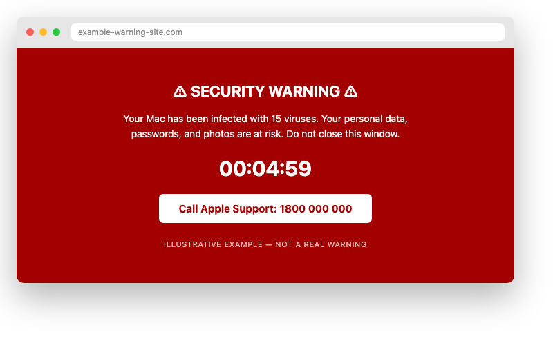

*Illustrative mockup, not a real warning, built to show the pattern.*

Genuine macOS security warnings never appear as a full-screen browser pop-up, never include a countdown timer, and never ask you to call a phone number. If you see one of these, close the browser window using Command-Q, or force-quit Safari from the Apple menu if it will not close normally. Do not call the number.

2. Fake Apple ID and iCloud storage emails

An email claims your Apple ID has been locked, that your iCloud storage is full and photos will be deleted, or that unusual purchases have been made. These are designed to look exactly like genuine Apple communications.

| Apple |

| Your Apple ID has been locked due to suspicious activity. Verify your account immediately or it will be permanently disabled: apple-id-verify-au.com/login |

*Illustrative mockup, not a real Apple message, built to show the pattern.*

| ⚠  WARNING Genuine Apple communications always come from an apple.com address. Apple will never email you a link asking you to enter your Apple ID password. If you are concerned about your account, go directly to appleid.apple.com in a browser you typed yourself, never click the link in the email. |

3. Fake software update prompts

A pop-up appears while browsing, styled to look like a macOS system update, urging you to download and install it immediately. Genuine macOS updates only ever appear through System Settings, never through a website.

| ℹ  DID YOU KNOW? You can always check for genuine updates yourself at System Settings > General > Software Update. If a website is telling you to update outside of this, it is not a real Apple update. |

4. Bank impersonation emails

An email appears to come from your bank, warning of suspicious activity and asking you to click a link to verify your details.

| CommBank |

| ALERT: Unusual sign-in detected on your NetBank account. Verify your identity now to avoid account suspension: commbank-secure-login.com/verify |

*Illustrative mockup, not real CommBank correspondence, built to show the pattern, not to reproduce their branding.*

Your bank's real domain always ends in .com.au. Hover your mouse over any link, without clicking, to see the actual web address it leads to at the bottom of your email or browser window.

5. Phone call tech support scams

A caller claims to be from Apple, Telstra, or "your internet provider," saying your Mac has been hacked or is sending out viruses, and offers to fix it remotely. This is the scam from the start of this chapter, and it remains one of the most damaging.

| ✶  CRITICAL, READ THIS CAREFULLY Never allow anyone who calls you unsolicited to install software on your Mac or take remote control of it. No legitimate technology company, not Apple, not Telstra, not Microsoft, will ever call you out of the blue to tell you your computer has a problem. If someone calls you with this offer, hang up immediately. Remote access software in the wrong hands gives a stranger complete control of your Mac and everything on it, in real time, from anywhere in the world. |

## The universal red flag checklist

Regardless of which scam you encounter, the same warning signs tend to appear.

You are asked to act immediately.  Genuine organisations rarely demand instant action, and never by threatening to lock or delete something within minutes.

You are asked to call a number provided in the message itself.  Always look up the organisation's number independently instead.

The link does not match the organisation's real website.  Hover over it first, or better still, do not click it at all, type the address yourself.

You are asked to pay by gift card, wire transfer, or cryptocurrency.  No legitimate business asks for payment this way.

The greeting is generic.  "Dear Customer" or "Dear User" suggests a mass-sent scam. Your bank and Apple both know your name.

## How to verify any suspicious message

If in doubt, do not click anything in the message. Open a new browser window yourself, type the organisation's known website address, and log in there directly. Or call the organisation using the number on the back of your card or from their official website, never a number provided in the suspicious message.

## Protecting yourself in Mail and Safari

Settings path:  Mail  >  Settings  >  Viewing  lets you turn off automatic loading of remote images, which stops some tracking and phishing techniques.

Safari also warns you automatically when a website you are visiting is a known fraudulent site, shown as a warning page before the site loads. Never proceed past this warning for a site asking you to enter personal or financial details.

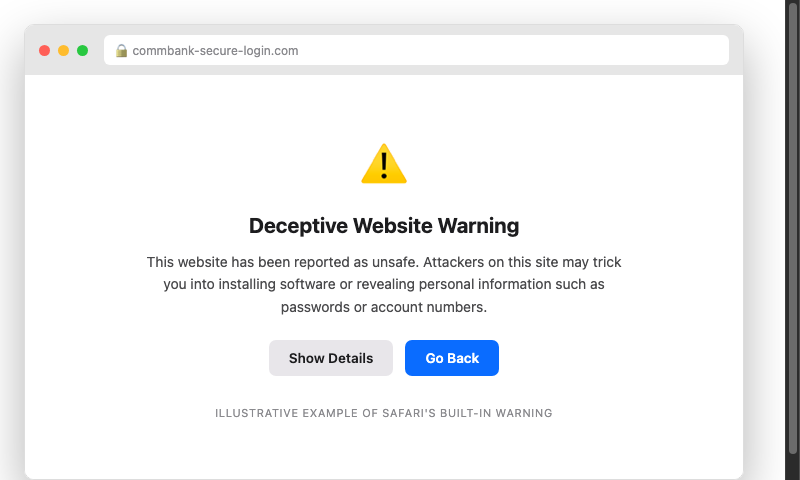

## What to do if you think you clicked something you should not have

Disconnect from the internet immediately by turning off Wi-Fi. Do not enter any passwords or personal details if a page is still open asking for them. Run a scan using a reputable security tool if you have one installed. Change the password for any account you may have entered details for, from a different, trusted device. Contact your bank directly if you entered any financial details, and monitor your accounts closely for the following weeks.

## Quick review, your chapter 5 checklist

| Done | Item |
| --- | --- |
| ☐ | I know that genuine security warnings never ask me to call a number |
| ☐ | I check the sender's actual email address before clicking any link |
| ☐ | I never call phone numbers provided inside an unexpected message |
| ☐ | I know to hang up on any unsolicited caller offering remote "tech support" |
| ☐ | I check for macOS updates only through System Settings |

With scams covered, the next chapter looks at keeping your Mac safe on Wi-Fi and what a VPN actually does for you.

---

Sfinco Guides  ·  Volume 2: MacBook Protection  ·  Chapter 6

# Wi-Fi, the firewall and VPN

Staying safe on public networks, and locking down file sharing at home

Most of us connect a laptop to Wi-Fi without thinking much about it. At a cafe, a library, an airport lounge, you see the network name, enter the password if there is one, and you are online. This chapter covers what is actually happening when you do that, and the handful of settings that make it safe.

## How public Wi-Fi works, and where the risk actually is

Public Wi-Fi networks are, by their nature, shared with everyone else in the room. On an unencrypted or poorly secured network, someone with the right knowledge and software nearby can potentially see some of the data travelling between your Mac and the internet.

The good news is that most websites and apps you use today, including all banking websites, use HTTPS encryption, shown as a padlock in your browser's address bar, which protects the content of your connection even on an open network. The remaining risk sits mostly with older or poorly built apps and websites that do not use HTTPS properly, and with a specific trick called an Evil Twin network.

| ℹ  DID YOU KNOW? An Evil Twin is a fake Wi-Fi network set up by an attacker to mimic a legitimate one, for example, "Cafe_Free_WiFi" instead of the cafe's real "CafeWiFi" network. If your Mac connects to the fake network, the attacker can see much more of your traffic than they could on the genuine one. |

## Safe habits on public Wi-Fi

Turn off Auto-Join for networks you do not use regularly, so your Mac does not silently reconnect to a network you connected to once, months ago, that may no longer be safe.

Settings path:  System Settings  >  Wi-Fi  >  click the (i) next to a saved network to see Auto-Join.

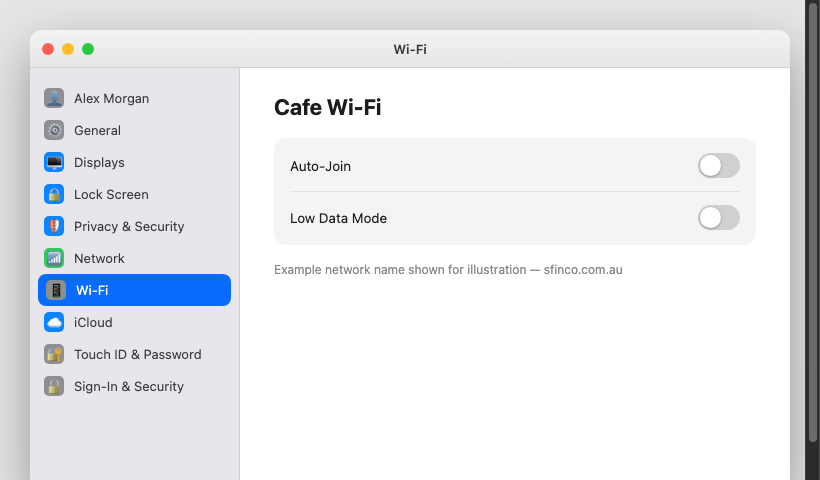

*Mockup illustration, styled to match macOS Sequoia, reshoot on a real Mac before final layout.*

Confirm the network name with staff before connecting, rather than picking the first similar-looking name you see. Avoid logging in to banking sites on public Wi-Fi without a VPN, covered later in this chapter. Turn on your Mac's firewall, covered next, before you connect to any network you do not fully trust.

## Turning on your Mac's firewall

macOS includes a built-in firewall that blocks unwanted incoming connections to your Mac from the network. It does not slow down your normal browsing at all, and it is not turned on by default on most Macs.

Settings path:  System Settings  >  Network  >  Firewall.

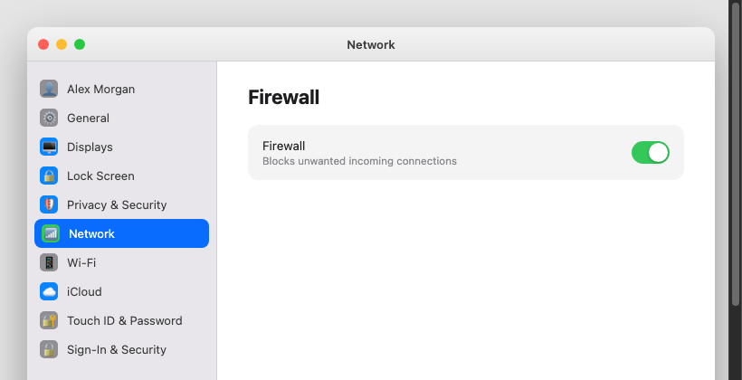

*Mockup illustration, styled to match macOS Sequoia, reshoot on a real Mac before final layout.*

| ✓  WELL DONE IF YOU HAVE THIS With the firewall turned on, unsolicited connection attempts from the network, including from other devices on a shared public Wi-Fi network, are blocked automatically, before they ever reach an application on your Mac. |

## File Sharing, a setting worth checking on public networks

If you use File Sharing, Screen Sharing, or Printer Sharing at home to share files or your screen with other devices on your own network, it is worth turning these off, or setting your network location to "Public," whenever you connect to a network outside your home or office.

Settings path:  System Settings  >  General  >  Sharing.

| Sharing option | Recommended when on public Wi-Fi |
| --- | --- |
| File Sharing | Off |
| Screen Sharing | Off |
| Printer Sharing | Off |
| Remote Login | Off, unless you specifically use it and understand the risk |

| ⚠  WARNING Leaving File Sharing or Screen Sharing turned on while connected to public Wi-Fi means other devices on that same network may be able to see your shared folders or attempt to connect to your screen. These features are designed for trusted home or office networks, not a cafe or airport. |

## What is a VPN, in plain English

A VPN, or Virtual Private Network, is a service that encrypts all of your Mac's internet traffic and routes it through a secure server before it reaches the internet. This means the website or app you are visiting sees the VPN server's location, not your actual location, and anyone else on the same Wi-Fi network cannot see your browsing activity at all, since it is wrapped inside the encrypted tunnel before it ever reaches the shared network.

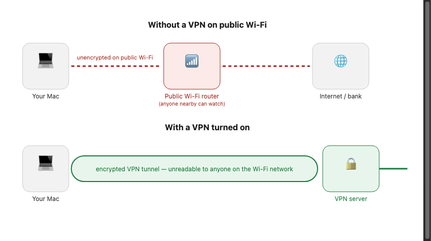

## Which VPN to choose, a plain-English comparison

There are hundreds of VPN providers. Here are four reputable options with native Mac apps, compared simply.

| VPN Provider | Cost | Best for |
| --- | --- | --- |
| Mullvad | ~AU$8/mo | Privacy-first, no account required, no logs, accepts cash payment. Best for maximum anonymity |
| ProtonVPN | Free tier / ~AU$12/mo | Swiss-based, strong privacy laws, free tier available with limited servers. Good for everyday use |
| ExpressVPN | ~AU$15/mo | Very fast, easy to use, good Australian server coverage. Best for streaming and travel |
| NordVPN | ~AU$7/mo (annual) | Popular, reliable, good value on annual plan. Solid choice for most everyday users |

| ℹ  DID YOU KNOW? Apple's own iCloud Private Relay, available with iCloud+ subscriptions, offers partial VPN-like protection for Safari browsing specifically, it hides your IP address and encrypts your DNS requests. It does not cover all apps the way a full VPN does, but it is a useful extra layer if you already subscribe to iCloud+. |

## How to install and use a VPN on your Mac

Choose a VPN provider from the table above and subscribe through their official website. Download their Mac app directly from the provider's website or the App Store. Open the app and sign in with the account you created. Click Connect to start the VPN, a small icon will usually appear in your menu bar when it is active. Use the VPN whenever you are on public Wi-Fi, and consider enabling any "auto-connect on untrusted networks" option the app offers.

| ✓  WELL DONE IF YOU HAVE THIS A VPN running on public Wi-Fi, combined with your firewall turned on and File Sharing off, covers the vast majority of real-world network security risks for a Mac. You do not need to run a VPN at home on your own secured network, save it for when you are out and about. |

## Quick review, your chapter 6 checklist

| Done | Item |
| --- | --- |
| ☐ | Auto-Join is off for networks I do not use regularly |
| ☐ | My Mac's firewall is turned on |
| ☐ | File Sharing and Screen Sharing are off when I am on public Wi-Fi |
| ☐ | I have a VPN installed and use it on public networks |

With your network settings squared away, the next chapter covers Time Machine backups and exactly what to do if your Mac is ever lost or stolen.

---

Sfinco Guides  ·  Volume 2: MacBook Protection  ·  Chapter 7

# Backups, Find My, and what to do if your Mac goes missing

Setting up your safety net before you ever need it

A lost or stolen Mac is stressful enough without also losing every photo, document, and file you had on it. This chapter covers the two things that turn a disaster into an inconvenience: a good backup, and Find My Mac set up in advance.

## Time Machine, your Mac's built-in backup system

Time Machine is macOS's built-in backup tool. Once set up, it automatically and continuously backs up your entire Mac to an external drive or a supported network location, keeping hourly backups for the past day, daily backups for the past month, and weekly backups beyond that.

Settings path:  System Settings  >  General  >  Time Machine.

Connect an external drive, choose it as your backup disk when prompted, and Time Machine takes care of the rest automatically in the background.

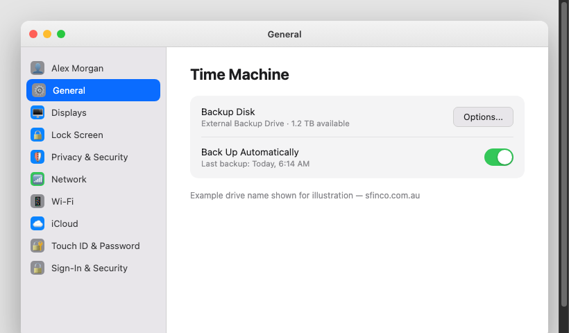

*Mockup illustration, styled to match macOS Sequoia, reshoot on a real Mac before final layout.*

| ★  TIP Buy an external drive with at least double the storage capacity of your Mac's internal drive. This gives Time Machine enough room to keep a useful history of backups, not just the most recent one. |

| ℹ  DID YOU KNOW? If your Mac is ever lost, stolen, damaged beyond repair, or simply needs a factory reset to fix a problem, a Time Machine backup lets you restore everything, every file, every setting, every app, onto a replacement Mac almost exactly as it was. Without a backup, all of that is gone permanently. |

## Setting up Find My Mac, before you need it

Find My Mac lets you locate your Mac on a map, lock it remotely, display a message on its screen, or erase it entirely if you are certain it will not be recovered.

Settings path:  System Settings  >  [Your Name]  >  iCloud  >  Find My Mac  >  ensure it is turned on.

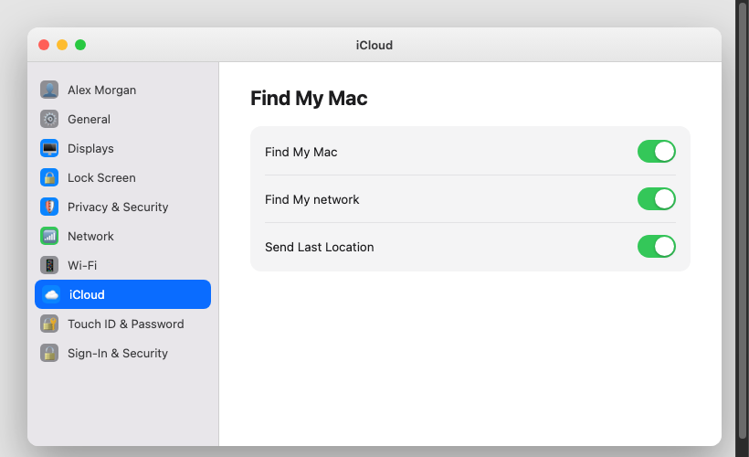

*Mockup illustration, styled to match macOS Sequoia, reshoot on a real Mac before final layout.*

| ⚠  WARNING Never turn off Find My Mac while trying to sell or give away a Mac before you have signed out of your Apple ID and erased it properly through Settings. Turning it off first, or erasing the Mac without signing out, can trigger Activation Lock and leave the new owner unable to use the Mac at all. |

## Activation Lock, why a stolen Mac is difficult to resell

Activation Lock is a security feature tied to Find My Mac on Apple Silicon Macs. Once enabled, the Mac cannot be erased and reactivated by anyone else without your Apple ID password, even after a factory reset. This is precisely what makes a stolen Mac far less valuable to a thief, since it cannot simply be wiped and resold as a working computer.

## The first thirty minutes, what to do if your Mac goes missing

If your Mac is ever lost or stolen, the steps below are designed to be followed calmly, in order, using another device.

| Time | What to do |
| --- | --- |
| 0–5 min | Use Find My on another device. Go to icloud.com/find on any browser, or open the Find My app on an iPhone or iPad signed in to the same Apple ID, and locate your Mac on the map |
| 5–10 min | Choose the right action. If the map shows your Mac at a specific, stationary location like your home, it may simply be misplaced. If it is at an unfamiliar location, it is more likely stolen |
| 10–15 min | Mark as Lost. This locks your Mac remotely with a passcode and displays a custom message and phone number on the lock screen |
| 15–20 min | Notify your bank. If you had Apple Pay or saved banking sessions active in Safari, call your bank to flag this as a precaution |
| 20–25 min | Change your Apple ID password. Do this from a different, trusted device, in case the Mac itself is ever recovered by someone else |
| 25–30 min | Report to police if stolen. Provide the serial number, found on the original box or under About This Mac, along with the location from Find My |

| ★  TIP Find your Mac's serial number now, before you ever need it, and save it somewhere safe, a note in a password manager, a photo of the original box, or written down in a locked drawer. You will need it if you ever have to report a theft to police or make an insurance claim. Find it at: Apple menu > About This Mac. |

## A note on insurance

Check whether your home and contents insurance policy covers a Mac used outside the home, since many standard policies only cover items while inside your house. If you regularly take your MacBook out with you, a specific portable electronics add-on may be worth the extra cost.

## Quick review, your chapter 7 checklist

| Done | Item |
| --- | --- |
| ☐ | Time Machine is set up and backing up automatically |
| ☐ | Find My Mac is turned on |
| ☐ | I know where to find my Mac's serial number |
| ☐ | I have checked whether my insurance covers my Mac outside the home |

With a proper backup and Find My Mac ready to go, the final chapter brings everything together into a fifteen-minute monthly routine.

---

Sfinco Guides  ·  Volume 2: MacBook Protection  ·  Chapter 8

# Your 15-minute Mac security checkup

A simple monthly routine to keep your Mac protected for years to come

You have now worked through every major layer of Mac security: your login and FileVault encryption, your Apple ID, your app permissions, scam awareness, your network settings, and your backups. This final chapter brings all of it together into one simple monthly habit.

| ℹ  DID YOU KNOW? Set a recurring reminder right now, the first Sunday of every month works well for most people. Open the Reminders app, create a new reminder called 'Mac security checkup', and set it to repeat monthly. This is the single most important step in this chapter: the checklist only works if you actually come back to it. |

## The complete monthly checklist

Work through this list with your Mac open. Each item references the chapter where you can find full instructions if you need a refresher.

### Login and FileVault

| Done | Item | Chapter |
| --- | --- | --- |
| ☐ | My login password is still a strong passphrase | Ch. 2 |
| ☐ | Automatic login remains turned off | Ch. 2 |
| ☐ | Require password after sleep is still set to Immediately | Ch. 2 |
| ☐ | FileVault is still turned on | Ch. 2 |

### Apple ID and iCloud

| Done | Item | Chapter |
| --- | --- | --- |
| ☐ | Two-factor authentication is still active on my Apple ID | Ch. 3 |
| ☐ | I have reviewed the devices signed in to my Apple ID for anything unfamiliar | Ch. 3 |

### Apps and permissions

| Done | Item | Chapter |
| --- | --- | --- |
| ☐ | I have reviewed any new apps installed this month and checked their permissions | Ch. 4 |
| ☐ | I have deleted any apps I have not used in the last three months | Ch. 4 |

### Scam awareness

| Done | Item | Chapter |
| --- | --- | --- |
| ☐ | I have not called a number from a pop-up warning this month | Ch. 5 |
| ☐ | I have not clicked any suspicious links, and if I have, I followed the recovery steps | Ch. 5 |

### Network

| Done | Item | Chapter |
| --- | --- | --- |
| ☐ | My firewall is still turned on | Ch. 6 |
| ☐ | File Sharing and Screen Sharing remain off unless I am actively using them | Ch. 6 |

### Backups and Find My

| Done | Item | Chapter |
| --- | --- | --- |
| ☐ | Time Machine shows a successful backup within the last week | Ch. 7 |
| ☐ | Find My Mac is still turned on | Ch. 7 |

### General software health

| Done | Item | Chapter |
| --- | --- | --- |
| ☐ | My Mac is running the latest version of macOS | New |
| ☐ | All my apps are updated to their latest versions | New |

## Two new habits worth adding

Beyond the checklist, two ongoing habits are worth building in.

Check for software updates weekly, not just monthly.  Settings path: System Settings > General > Software Update. Security fixes are often released between your monthly checkups, and installing them promptly closes gaps quickly.

Review your Time Machine backup drive occasionally.  An external drive that has quietly failed or filled up will stop protecting you without any obvious warning. Once every few months, open Time Machine settings and confirm the most recent backup date looks current.

## A final word

Security is not a single project you finish and forget. It is a small, repeated habit, the same way you would check your car's tyre pressure or test your smoke alarms. Fifteen minutes a month, done consistently, will protect you far better than an intense afternoon of settings changes done once and never revisited.

| ✓  WELL DONE You have completed Sfinco Guides Volume 2: MacBook Protection. Your Mac is now meaningfully more secure than it was when you started this book. Well done. Genuinely. |

Continuing your Sfinco journey:  The Sfinco Guides series continues with Volume 3 (Family and Home Network Protection), Volume 4 (Windows Protection), and Volume 5 (Android Protection), each written in the same plain-English, step-by-step style. See the final pages of this book for details.

---

Sfinco Guides  ·  Volume 2

## Glossary

These are the key terms used throughout this book, explained in plain English. You do not need to memorise them, this section is here to help if you encounter a word and want a clear definition.

| Term | Definition |
| --- | --- |
| Activation Lock | A security feature tied to Find My Mac that prevents a stolen Mac from being erased and reactivated by anyone else without your Apple ID password |
| App Store | Apple's official marketplace for Mac software, where every app is checked by Apple before being made available |
| Apple ID | The email address and password you use to sign in to Apple services, iCloud, the App Store, Messages, and more. It is the master key to everything Apple |
| Encryption | The process of scrambling data so it can only be read by someone with the right key. FileVault encrypts your Mac's entire drive |
| Evil Twin | A fake Wi-Fi network set up to mimic a legitimate one. When your Mac connects to it, the attacker can see your internet traffic |
| FileVault | Apple's built-in full-disk encryption, which scrambles everything on your Mac's drive using your login password as the key |
| Find My Mac | Apple's location and device tracking service, allowing you to locate, lock, or erase your Mac remotely |
| Firewall | A built-in macOS feature that blocks unwanted incoming connections to your Mac from the network |
| Gatekeeper | A macOS feature that checks whether an app has been verified by Apple before allowing it to run |
| HTTPS | The secure version of the web protocol. When a website address starts with https://, your connection to it is encrypted |
| iCloud | Apple's cloud storage service, which backs up your files, photos, and settings, and syncs them across your devices |
| iCloud Keychain | A feature that stores and syncs your saved passwords securely across your Apple devices |
| Notarised | An app that has been scanned by Apple for known malware before being distributed outside the App Store |
| Passphrase | A password made up of several unrelated words, which is generally longer, stronger, and easier to remember than a short, complex password |
| Phishing | A scam that impersonates a trusted organisation, via email or a fake website, to trick you into handing over personal or financial information |
| Scamwatch | The Australian government's national scam reporting service, run by the ACCC |
| Time Machine | macOS's built-in backup tool, which automatically and continuously backs up your Mac to an external drive |
| Two-Factor Authentication (2FA) | A security method requiring both your password and a code sent to a trusted device to sign in to your Apple ID |
| VPN (Virtual Private Network) | A service that encrypts your internet traffic and routes it through a secure server, particularly useful on public Wi-Fi |

Sfinco Guides  ·  Volume 2

## Quick reference card

Cut out or photograph this page and keep it somewhere handy, on the fridge, or saved as a photo on your Mac or phone. These are the numbers and steps you are most likely to need in a hurry.

### Emergency contacts

| Contact | Details |
| --- | --- |
| My bank fraud line | _________________________________ |
| Scamwatch (ACCC) | scamwatch.gov.au · 1300 302 502 |
| IDCARE (identity support) | idcare.org · 1800 595 160 |
| Apple Support | support.apple.com · 133 622 |

### My device details

| Detail | Your information |
| --- | --- |
| My Mac model | _________________________________ |
| macOS version | _________________________________ |
| Serial number | _________________________________ |
| My Apple ID email | _________________________________ |
| Time Machine backup, last checked | _________________________________ |

### If your Mac goes missing, first 30 minutes

| Step | What to do |
| --- | --- |
| 1. Locate it | icloud.com/find on any browser, or the Find My app |
| 2. Mark as Lost | In Find My, locks the Mac and displays your message |
| 3. Change your Apple ID password | From a different, trusted device |
| 4. Report to police | Provide the serial number and Find My location |

### If you see a suspicious pop-up or message

| Step | What to do |
| --- | --- |
| 1. Do not call any number shown | And do not click any links |
| 2. Force-quit the browser | Apple menu, or Command-Option-Escape |
| 3. Find real contact details | Official website or card, not from the message |
| 4. Report it | scamwatch.gov.au and the impersonated organisation |

Sfinco Guides  ·  Volume 2

## Monthly security checkup

15 minutes · First Sunday of every month

Month / Year: _________________     Completed by: _________________

### 🔐 Login and FileVault

| Done | Item | Chapter |
| --- | --- | --- |
| ☐ | Login password is strong and unique | Ch 2 |
| ☐ | Automatic login is off | Ch 2 |
| ☐ | FileVault is turned on | Ch 2 |

### ☁️ Apple ID and iCloud

| Done | Item | Chapter |
| --- | --- | --- |
| ☐ | Two-factor authentication still active | Ch 3 |
| ☐ | No unrecognised devices on Apple ID | Ch 3 |

### 📱 Apps

| Done | Item | Chapter |
| --- | --- | --- |
| ☐ | New apps reviewed for permissions | Ch 4 |
| ☐ | Unused apps deleted | Ch 4 |

### 🚨 Scams

| Done | Item | Chapter |
| --- | --- | --- |
| ☐ | No calls made to pop-up phone numbers | Ch 5 |

### 🛰 Network

| Done | Item | Chapter |
| --- | --- | --- |
| ☐ | Firewall still on | Ch 6 |
| ☐ | File Sharing off unless in use | Ch 6 |

### 💾 Backups

| Done | Item | Chapter |
| --- | --- | --- |
| ☐ | Time Machine backup successful within last week | Ch 7 |
| ☐ | Find My Mac still on | Ch 7 |

### ⚙️ Software

| Done | Item | Chapter |
| --- | --- | --- |
| ☐ | macOS running latest version | Settings > General > Software Update |
| ☐ | All apps updated | App Store > Updates |

sfinco.com.au · Vol 2 MacBook Protection

## Sfinco Guides, the complete series

More books in the series

The Sfinco Guides series is designed to cover every device and situation you are likely to encounter. Each book follows the same plain-English, step-by-step format, with real Australian examples, screenshots, and no technical jargon.

### Series 1, Personal protection

| Volume | What it covers |
| --- | --- |
| Vol 1 Available now | iPhone Protection. Your simple guide to staying safe online. Passcode · Face ID · Apple ID · App permissions · Scams · Wi-Fi · Find My |
| Vol 2 Available now | MacBook Protection. Securing your Mac in plain English. Login & FileVault · Gatekeeper · Apple ID · Scams · Firewall & VPN · Time Machine |
| Vol 3 Coming soon | Family and Home Network Protection. Keeping everyone safe under one roof. Router security · parental controls · guest Wi-Fi · IoT devices · kids online |
| Vol 4 Coming soon | Windows Protection. A plain-English guide for Windows users. Windows Defender · BitLocker · updates · browser security · ransomware defence |
| Vol 5 Coming soon | Android Protection. Staying safe on your Android phone. Play Protect · app sideloading · Google account · 2FA · scam SMS |

### Series 2, Organisational protection

| Volume | What it covers |
| --- | --- |
| Vol 6 Coming soon | Small Business Protection. Cyber security for Australian small businesses. Email security · staff access · backups · scam invoices · incident response |
| Vol 7 Coming soon | NGO and Not-for-Profit Protection. Protecting organisations that protect others. Volunteer access · donor data · email compromise · free tools for small teams |
| Vol 8 Coming soon | Personal Finance Protection. Protecting your money in a digital world. Banking security · investment scams · superannuation · password managers · wills |

| ★  TIP All Sfinco Guides are available on Amazon (search 'Sfinco Guides' or scan the QR code on the next page). Paperback and e-book editions are available. Bulk copies for community groups, RSL clubs, libraries, and medical practices are available directly through sfinco.com.au, contact us for pricing. |

## Connect with us

Scan to continue your Sfinco journey.

Each QR code below links to a different part of the Sfinco ecosystem. Scan any of them with your iPhone or Mac camera to go directly to the relevant page.

| Where it takes you | What you'll find |
| --- | --- |
| [ QR CODE ] WEBSITE | Visit the Sfinco website, free resources, guides, blog, and updates on new books in the series sfinco.com.au |
| [ QR CODE ] TECH HELP | Book a Senior Tech Concierge session, in-person help with your Mac, iPhone, or iPad on the Sunshine Coast sfinco.com.au/concierge |
| [ QR CODE ] ALL BOOKS | Browse all Sfinco Guides, the complete series on Amazon and direct from our website sfinco.com.au/guides |
| [ QR CODE ] BUSINESS | Sfinco for business, cyber security audits and assessments for Sunshine Coast small businesses sfinco.com.au/business |
| [ QR CODE ] FREE DOWNLOAD | Free printable resources, scam reference card, monthly checklist, and more (no sign-up required) sfinco.com.au/resources |

| ℹ  NOTE QR codes are scanned using your iPhone camera app or Mac's Photo Booth/QuickTime, no separate app needed. All Sfinco links are safe and will never ask for payment details. |

Sfinco Guides  ·  Volume 2

## About Leonardo Pinheiro

Leonardo Pinheiro, the author of the Sfinco Guides series, works in banking and technology on the Sunshine Coast in Queensland, with nearly two decades of experience across customer service, financial services, and digital security.

Holding qualifications in cybersecurity (CompTIA Security+), financial advising (RG146), and information technology, and completing further studies at CQUniversity, Leonardo brings together a rare combination of technical knowledge and the ability to explain it clearly to people who have no interest in becoming technical experts.

The inspiration for this series came from years of seeing the same pattern: intelligent, capable, careful people being harmed by scams and digital threats, not because they were careless, but because nobody had ever given them a clear, practical guide to protecting themselves. That gap is what these books exist to close.

Leonardo also volunteers with CoderDojo, teaching digital skills to young people on the Sunshine Coast, and has a background in community technology education across Australia and internationally.

Sfinco was founded on the belief that every Australian deserves to feel safe and confident in their digital life, regardless of their age, their technical background, or how much money they have.

| Sfinco Protecting Australians through technology, money, and trust. sfinco.com.au Noosa · Sunshine Coast · Queensland · Australia |

## Publication details

Sfinco Guides is published by Sfinco · ABN [to be added]

First published 2026 · © Sfinco · All rights reserved

No part of this publication may be reproduced without written permission from the publisher.

The information in this book is provided for general guidance only and does not constitute professional legal, financial, or cybersecurity advice.