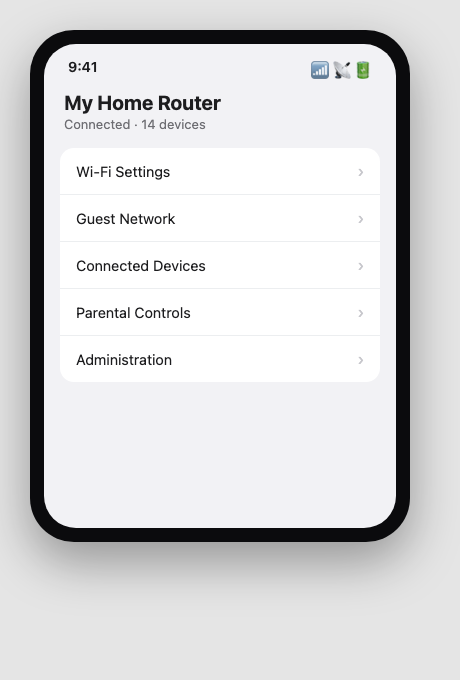
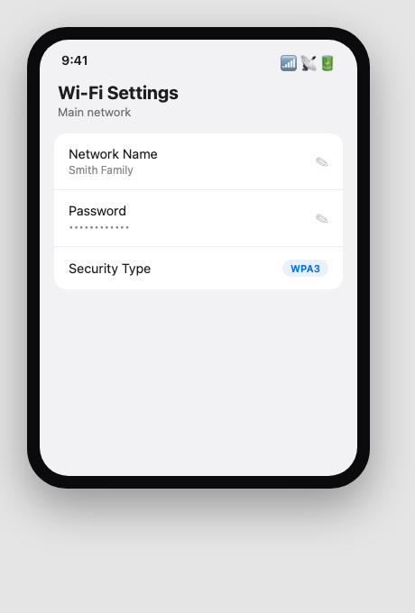
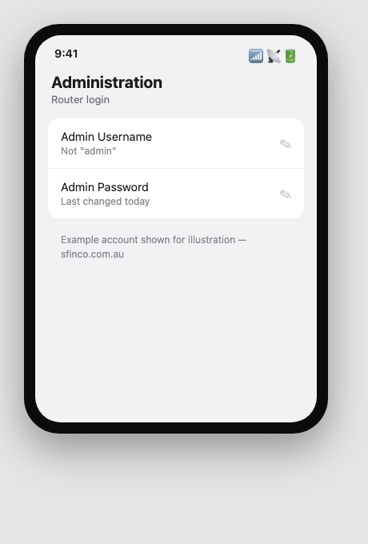
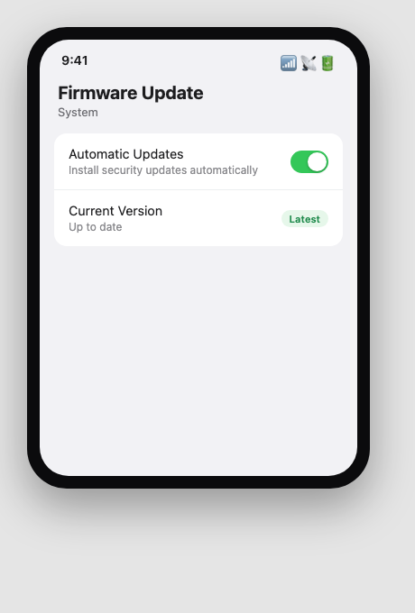

Sfinco Guides  ·  Volume 3 — Family and Home Network Protection  ·  Chapter 2

# Locking the router

Your Wi-Fi password, your admin password, and the update most people never install

Every protection in this book sits behind one device: your router. If someone can log in to it, or simply guess their way onto your Wi-Fi, nothing else in this book matters very much. This chapter covers the three settings that make your router a genuine barrier rather than an open door.

## Finding your router's settings

Most routers are managed either through a phone app provided by your internet provider or router manufacturer, or through a web address typed into a browser while connected to your home Wi-Fi — commonly 192.168.0.1 or 192.168.1.1, though this varies. Both the app and the address are usually printed on a sticker on the underside of the router, along with the default login details.

*Mockup illustration, styled to resemble a typical router app — reshoot on your own hardware before final layout.*

## Layer 1 — Your Wi-Fi password

This is the password anyone needs to join your home Wi-Fi network. If it is still the default password printed on the router, or something short and easy to guess, it is worth changing today.

Settings path:  Router app or admin page  >  Wi-Fi settings  >  Wi-Fi password.

Choose a passphrase rather than a short password.  Three or four random words strung together, like "PelicanTaxi42Verandah", are far harder to guess than a shorter password packed with symbols, and much easier to read aloud to a visitor or write down for a grandchild.

*Mockup illustration, styled to resemble a typical router app — reshoot on your own hardware before final layout.*

| ⚠  WARNING Do not use: your street address, your surname, "password", or any word or number a stranger walking past your house could reasonably guess. Also make sure your network is using WPA3 or WPA2 encryption, shown in the security type setting — never "Open" or "WEP", both of which are effectively unlocked. |

## Layer 2 — Your router's admin password

This is a separate password from your Wi-Fi password. It controls who can log in to the router's own settings and change anything — including your Wi-Fi password, or worse, redirect your entire household's internet traffic somewhere else.

Settings path:  Router app or admin page  >  Administration  >  Change admin password.

★  TIP:  If you have never changed this password, it is very likely still set to the factory default — often literally the word "admin" for both the username and password. This is one of the most well-known weaknesses in home networking, and it takes two minutes to fix.

*Mockup illustration, styled to resemble a typical router app — reshoot on your own hardware before final layout.*

| ✶  CRITICAL — READ THIS CAREFULLY If your router's admin password has never been changed, treat this as the single highest-priority item in this entire book. Anyone on your Wi-Fi network, or in some cases anyone within Wi-Fi range at all, can potentially log in to your router and take control of your entire home network using a password that is publicly listed online for your exact router model. |

## Layer 3 — Firmware updates

Firmware is the software that runs your router itself. Like your phone or computer, it occasionally needs updates that fix newly discovered security weaknesses. Unlike your phone, most routers do not update themselves automatically unless a specific setting is turned on.

Settings path:  Router app or admin page  >  Administration or System  >  Firmware Update.

| Setting | Recommended value |
| --- | --- |
| Automatic firmware updates | On |
| Check for updates | Monthly, if not automatic |
| Router age | Replace if older than 5–7 years and no longer receiving updates |

*Mockup illustration, styled to resemble a typical router app — reshoot on your own hardware before final layout.*

| ℹ  DID YOU KNOW? Some older routers, particularly ones provided free with an internet plan several years ago, stop receiving security updates entirely once the manufacturer moves on to newer models. If your router is more than five to seven years old and you cannot find a recent update, it may be worth asking your internet provider about a replacement. |

## Quick review — your chapter 2 checklist

| Done | Item |
| --- | --- |
| ☐ | My Wi-Fi password is a strong passphrase, not the factory default |
| ☐ | My network uses WPA3 or WPA2 security, not Open or WEP |
| ☐ | My router's admin password has been changed from the default |
| ☐ | Automatic firmware updates are turned on, or I check monthly |

With the router itself locked down, the next chapter covers keeping visitors and smart devices separate from the devices that matter most.
