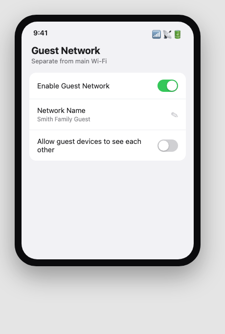
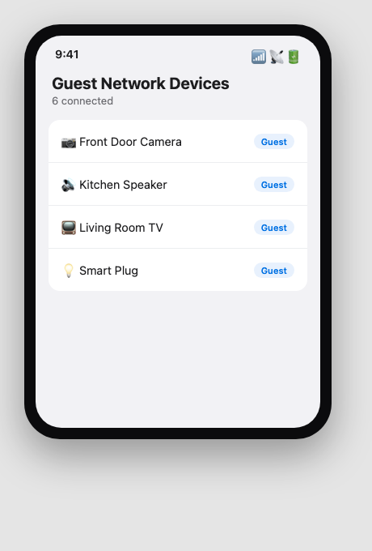
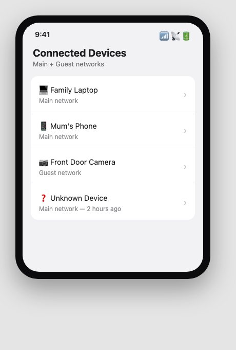

Sfinco Guides  ·  Volume 3 — Family and Home Network Protection  ·  Chapter 3

# Guest Wi-Fi and keeping devices apart

Why your smart plug should never be on the same network as your banking

Most home networks treat every connected device as equally trusted — your laptop, your smart speaker, and your visitor's phone all sit on exactly the same network, able to see and sometimes reach each other. This chapter covers the single setting that changes that: a guest network.

## What is a guest network, exactly?

A guest network is a second Wi-Fi network broadcast by the same router, with its own name and password, that gives devices internet access without letting them see or reach the main devices on your primary network. Almost every router made in the last several years supports this, though it is rarely turned on by default.

Settings path:  Router app or admin page  >  Guest Network or Guest Wi-Fi.

*Mockup illustration, styled to resemble a typical router app — reshoot on your own hardware before final layout.*

| ℹ  DID YOU KNOW? On a properly configured guest network, a device connected to it generally cannot see or connect to other devices on your main network at all. This means a visitor's phone, or an unfamiliar device, has no direct path to your laptop or your smart camera, even while using the same internet connection. |

## Who and what belongs on the guest network

As a simple rule: anything that is not one of your own trusted personal devices belongs on the guest network, not your main one.

Visitors, tradespeople, and anyone staying temporarily

Children's and grandchildren's devices, if you want an extra layer of separation

Smart TVs, streaming devices, and games consoles

Smart speakers, doorbells, cameras, plugs, and lights

★  TIP:  Give your guest network an obviously different name from your main one — for example, "Smith Family Guest" rather than something identical-looking to your main network. This avoids confusion and makes it easy to tell visitors and family members which one to join.

Keep your own phone, laptop, and any device you use for online banking on the main network, since these are the devices most worth protecting, and the ones you have the most control over.

## Setting up a separate network for smart devices

Many smart home devices — particularly cheaper ones — receive infrequent security updates and are a common target for automated scanning attacks that search the internet for known weaknesses. Placing them on your guest network, separate from your personal devices, limits the damage if one of them is ever compromised.

*Mockup illustration, styled to resemble a typical router app — reshoot on your own hardware before final layout.*

| ⚠  WARNING If a smart device on your main network is ever compromised, an attacker may be able to use it as a stepping stone to reach your laptop, your files, or your saved passwords on the same network. Moving smart devices to a guest network removes this stepping stone entirely, even if the device itself is never fully secured. |

## Reviewing who is actually connected

Most router apps show a live list of every device currently connected, on both your main and guest networks. It is worth checking this occasionally for anything you do not recognise.

Settings path:  Router app or admin page  >  Connected Devices or Device List.

*Mockup illustration, styled to resemble a typical router app — reshoot on your own hardware before final layout.*

| ✓  WELL DONE IF YOU HAVE THIS If every device on your main network's list is something you personally recognise, and every smart device and visitor is on a separate guest network, your home network is already meaningfully more secure than most Australian households. |

## Quick review — your chapter 3 checklist

| Done | Item |
| --- | --- |
| ☐ | My router has a separate guest network turned on |
| ☐ | Visitors and temporary guests use the guest network, not my main one |
| ☐ | My smart TVs, speakers, cameras, and other smart devices are on the guest network |
| ☐ | I have reviewed my connected devices list for anything unfamiliar |

With your devices properly separated, the next chapter looks specifically at the smart devices themselves, and the settings worth checking on each one.
