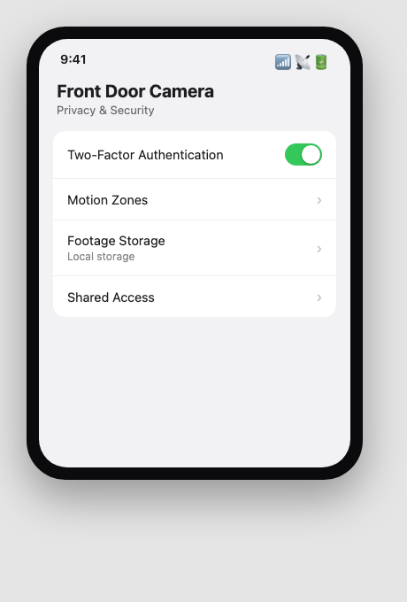
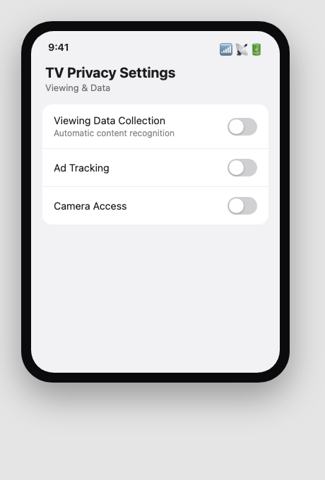

Sfinco Guides  ·  Volume 3: Family and Home Network Protection  ·  Chapter 4

# Smart devices and what they can see

Cameras, doorbells, speakers, and the permissions worth checking on each

A smart device is, in plain terms, a small computer connected to your home network and often to the internet at large. Many of them can see, hear, or record parts of your home. This chapter covers the handful of settings worth checking on the smart devices already in your house.

## Change every default password, every time

The single most important step for any smart device is changing its default password the moment you set it up, exactly as you would for your router.

Settings path:  The device's own app  >  Account or Device Settings  >  Change Password.

| ⚠  WARNING Default passwords for smart cameras and similar devices are often published online by the manufacturer's own instruction manual, freely searchable by anyone. There are websites specifically dedicated to indexing unsecured smart cameras that were never given a unique password. Do not assume a device is safe simply because it works. |

## Smart cameras and video doorbells

These devices can see and record video, sometimes continuously, and store that footage either locally or in the manufacturer's cloud service.

Settings path:  The camera's app  >  Privacy or Security Settings.

| Setting | What it does |
| --- | --- |
| Two-factor authentication | Requires a code in addition to your password to access footage remotely |
| Motion zones | Limits recording to specific areas, rather than everything the lens can see |
| Footage storage location | Choose between local storage you control or the manufacturer's cloud |
| Sharing access | Review who else has been given access to view footage |

*Mockup illustration, styled to resemble a typical router app, reshoot on your own hardware before final layout.*

| ℹ  DID YOU KNOW? Some smart camera brands have had well-publicised cases of footage being accessed by unauthorised parties, usually traced back to reused passwords or accounts without two-factor authentication turned on, not a flaw in the camera hardware itself. The account security matters as much as the device. |

## Smart speakers and voice assistants

Smart speakers are always listening for their wake word, and many keep a history of recordings that can be reviewed or deleted.

Settings path:  The assistant's app  >  Privacy Settings  >  Voice History or Recordings.

★  TIP:  Review and delete your voice recording history periodically, and turn off "help improve this service" style settings if you would prefer recordings are not reviewed by anyone for quality purposes.

Consider a physical mute switch, present on most smart speakers, for times when you would prefer the device is not listening at all, such as when discussing anything sensitive.

## Smart TVs and streaming devices

Smart TVs often collect viewing data for advertising purposes, and some include a built-in camera or microphone for video calling features.

Settings path:  TV Settings  >  Privacy  >  Viewing Data or Ad Tracking.

*Mockup illustration, styled to resemble a typical router app, reshoot on your own hardware before final layout.*

Turn off automatic content recognition or viewing data collection if you would prefer your viewing habits are not tracked, and cover or disable any built-in camera when not in active use for video calling.

## Which devices deserve the closest attention

Not all smart devices carry equal risk. Give particular attention to: any device with a camera or microphone, devices bought secondhand, which may retain a previous owner's account access, cheap or unbranded devices from marketplaces with no clear manufacturer support, and any device you cannot remember setting a unique password for.

| ✓  WELL DONE IF YOU HAVE THIS If every smart device in your home has its own unique password, sits on your guest network from Chapter 3, and you have reviewed the privacy settings on anything with a camera or microphone, your smart home is already in very good shape. |

## Quick review, your chapter 4 checklist

| Done | Item |
| --- | --- |
| ☐ | Every smart device has a unique password, not the factory default |
| ☐ | Two-factor authentication is turned on for camera and doorbell apps |
| ☐ | I have reviewed sharing access on any camera or doorbell |
| ☐ | Smart TV viewing data collection is turned off, if I prefer privacy |

With your smart devices under control, the next chapter turns to the scams and phishing attempts most likely to target your household.
