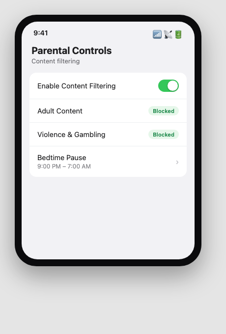
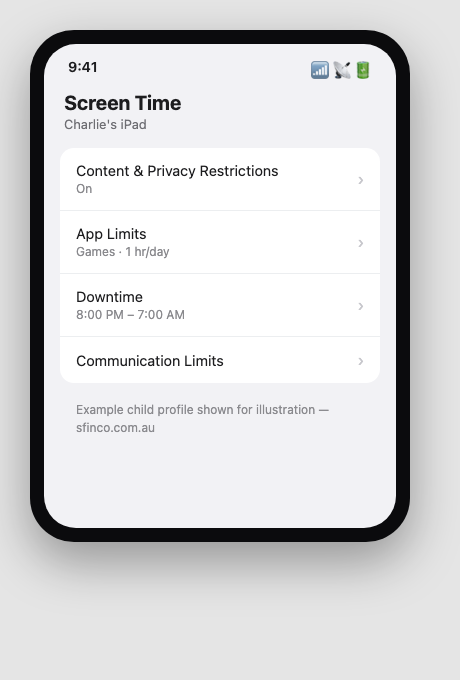
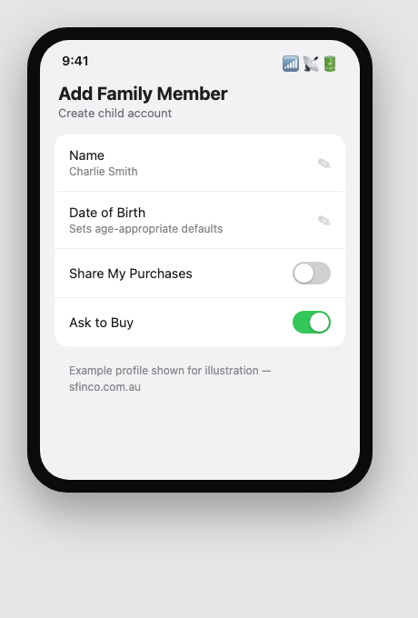

Sfinco Guides  ·  Volume 3 — Family and Home Network Protection  ·  Chapter 6

# Parental controls and keeping kids safe online

Setting boundaries at the router, and on every device that matters

Many grandparents and parents in this book's audience are responsible, at least some of the time, for children and grandchildren using their home network. This chapter covers the settings that help keep younger family members safer, without needing to watch over their shoulder constantly.

## Router-level content filtering

Many modern routers include a built-in option to filter certain categories of content across every device connected to your network, without needing to configure each device individually.

Settings path:  Router app or admin page  >  Parental Controls or Content Filtering.

*Mockup illustration, styled to resemble a typical router app — reshoot on your own hardware before final layout.*

★  TIP:  Router-level filtering is a useful baseline, but it is not foolproof — a determined teenager with technical knowledge may find ways around it. Combine it with the device-level and conversation-based approaches below for the most effective protection.

## Setting up device-level screen time and content limits

Apple, Google, and Microsoft all offer free, built-in tools to manage what a child can access and for how long, tied to a family or child account.

| Platform | Feature | Where to find it |
| --- | --- | --- |
| iPhone / iPad | Screen Time | Settings > Screen Time > Content & Privacy Restrictions |
| Mac | Screen Time | System Settings > Screen Time |
| Android | Family Link | Google Family Link app |
| Windows | Family Safety | Microsoft Family Safety app |

*Mockup illustration, styled to resemble iOS Screen Time — reshoot on a real device before final layout.*

| ℹ  DID YOU KNOW? Setting up a proper Family Sharing or Family Link group lets you manage several children's devices from your own phone or computer, including approving app downloads, setting daily time limits, and seeing a summary of what they have been using their device for. |

## Setting up a child-friendly account on shared devices

If a child uses a shared family computer or tablet rather than their own device, create a separate account for them with appropriate restrictions, rather than letting them use an adult's account.

Settings path:  Computer or tablet's account settings  >  Add a family member or child account.

*Mockup illustration, styled to resemble a typical device account setup screen — reshoot on your own hardware before final layout.*

| ⚠  WARNING Avoid letting a child use an account that is also signed in to your email, online banking, or saved payment details. A separate child account, even a simple one, prevents accidental purchases and keeps your own accounts fully separate. |

## Having the conversation, not just setting the controls

No filter or setting fully replaces an open conversation. Children who understand why certain settings exist, rather than simply hitting a wall they do not understand, are more likely to come to a trusted adult if something online worries them.

Useful topics to cover, in age-appropriate language: never sharing personal details or photos with people they only know online, telling a trusted adult if a game or app asks for payment details, understanding that people online are not always who they claim to be, and knowing it is always okay to come to you if something online feels wrong, without fear of getting in trouble.

| ✓  WELL DONE IF YOU HAVE THIS If you have both router-level filtering turned on and an ongoing, open conversation with the children in your household about online safety, you are covering this from both the technical and human side — which is exactly how it works best. |

## Quick review — your chapter 6 checklist

| Done | Item |
| --- | --- |
| ☐ | Router-level content filtering is turned on, if children use my network |
| ☐ | Children's devices have appropriate Screen Time or Family Link limits set |
| ☐ | Children use their own account on shared devices, not an adult's |
| ☐ | I have talked with the children in my household about online safety |

With the household's youngest members covered, the next chapter looks at what to do if your network is ever compromised, and how to recover.
