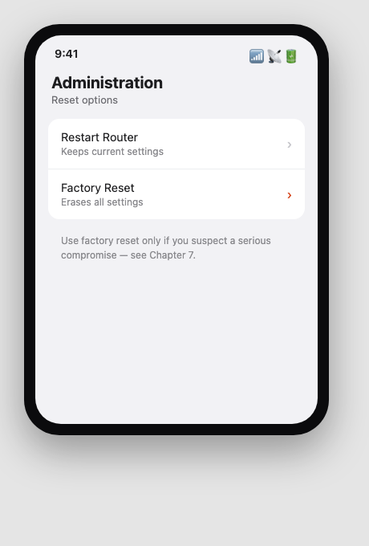

SFINCO GUIDES

VOLUME 3

FAMILY AND HOME NETWORK PROTECTION

Keeping everyone safe under one roof

---

Author: Leonardo Pinheiro
Series: Sfinco Guides
Volume: 3 of 8
Category: Personal Digital Safety / Cybersecurity for Consumers
Format: Non-fiction, instructional, plain-English guide
Audience: Adults who want plain-English, practical guidance, particularly Australians aged 60+
Region: Australia (Sunshine Coast, Queensland focus, nationally applicable)

Publisher: Sfinco
Brand colours: Blue #1B4F8A · Amber #C47F00
Website: sfinco.com.au

---

---

Sfinco Guides  ·  Volume 3

Family and Home Network Protection

Keeping everyone safe under one roof

# Introduction

Most homes today have one Wi-Fi network and a dozen or more devices quietly connected to it, phones, laptops, smart TVs, doorbells, speakers, sometimes even the fridge. Almost nobody who set that network up thinks about it again after the installer leaves or the box gets plugged in.

That single network is now the front door to everything your household does online. If it is left with a default password, an out-of-date router, or no separation between your laptop and your daughter's smart speaker, one weak link can expose everyone who shares your roof.

This is not a technical manual. There are no complicated diagrams, no long lists of jargon, and no assumption that you already know what a "guest network" is or why it matters that your smart doorbell has its own password. (It does, and by the end of this book, setting one up will take you two minutes.)

What this guide is, is a plain-English, step-by-step walkthrough of the most important things you can do right now to protect your home network and everyone who uses it. Each chapter tackles one area, explains why it matters in everyday terms, and then shows you, with real screenshots, exactly what to do and where to find it.

Whether you are the person in the house everyone calls when the internet stops working, or you have never once opened your router's settings, this book is written for you.

## Who is this book for?

This guide is for anyone responsible for a home network, a household, a granny flat, a small rental property, who wants everyone under that roof to be safer online. You do not need to be "tech-savvy." You just need to be willing to spend a few hours going through these steps, most of which take less than five minutes each.

In particular, this guide will be helpful if you:

have never changed your router's default admin password

share your home with grandchildren, tenants, or visitors who need Wi-Fi access

own any smart device, a camera, doorbell, speaker, or TV, connected to your home network

worry about what your children or grandchildren might come across online

simply want peace of mind knowing your home network is properly protected

## A quick word from the author

I work in banking and technology on the Sunshine Coast in Queensland, and I spend a lot of time helping people, particularly older Australians, navigate the digital world safely. What I have seen over and over again is not stupidity or carelessness. It is a gap.

Home networks are a particular blind spot, because the router usually gets set up once, works quietly for years, and is never thought about again, until something goes wrong. This book closes that gap, the same way Volumes 1 and 2 closed it for the iPhone and the Mac.

Everything in here is written the way I would explain it to my own mum, sitting at her kitchen table with her router unplugged and turned upside down so we can read the sticker on the back.

# How to use this book

This book is designed to be used, not just read. Here is how to get the most out of it.

## Work through it chapter by chapter

Each chapter builds gently on the one before it, starting with the most fundamental protection (your router's own password) and working through to more advanced topics (smart devices and what to do if something goes wrong). If you are new to home network security, the best approach is to start at Chapter 1 and work your way through.

That said, every chapter also stands on its own. If there is a specific topic that is urgent for you right now, a new smart camera, for example, or setting up parental controls before school holidays, feel free to jump straight there.

## Do the steps as you go

This is not a book to read on the couch and then forget about. It is a book to read with your router's admin page open in a browser, or your phone in hand. Each chapter includes step-by-step instructions with screenshots showing roughly what you will see on your screen. Work through each step as you read it, and by the time you finish a chapter, that protection is already in place.

*  TIP:  If your router or app looks different from the screenshots, don't panic. Every router manufacturer designs its own settings app slightly differently, and the exact wording can vary. A quick search for your router's brand and model name plus the setting you are looking for will usually point you in the right direction.

## Use the tools at the back of the book

Chapter 8 ends with a one-page security checklist you can use every month to make sure your home network stays protected over time. Print it out. Stick it on the fridge next to the router. Set a reminder on your calendar for the first Sunday of every month. Five minutes a month is all it takes to stay on top of things.

The very back of the book also has a Quick Reference Card, a condensed version of that same checklist plus the emergency contacts and steps from Chapter 7, and a Glossary of every term used in this guide. You don't need to read either before you start, just know they're there, so you can flip back whenever you need a number, a step, or a plain-English definition in a hurry.

## Share it with someone you care about

If you know someone, a parent, a neighbour, a friend, who could benefit from this guide, please share it with them. Scammers and intruders target networks that are left unprotected. The more people in your circle who know these basics, the safer everyone is.

## A note on screenshots and router differences

The screenshots in this book show a typical modern router's settings app, similar in layout to most current models from major Australian internet providers. If your router looks different, the same settings almost always exist, they are just named or arranged slightly differently.

To check your router's brand and model: look for a sticker on the underside or back of the device, which usually also lists the default Wi-Fi network name and password.

!  IMPORTANT:  Keeping your router's software (called firmware) updated is one of the single most important things you can do for your home network's security. We cover this in detail in Chapter 2.

## What this book does not cover

This guide focuses specifically on your home network and the devices connected to it. It does not cover the individual security settings of your iPhone, Mac, or Android device in detail, those are covered in other volumes in the Sfinco Guides series. It also does not go deep into business or enterprise networking. If you run a small business, take a look at the Sfinco Guide for Small Business, coming soon in Series 2.

Ready? Find your router. Chapter 1 starts with a story you might recognise.

sfinco.com.au

Part of the Sfinco Guides series, protecting Australians online

---

Sfinco Guides  ·  Volume 3: Family and Home Network Protection  ·  Chapter 1

# Why your home network is a target

One router, a dozen devices, and why nobody ever looks at either

| ▶  REAL STORY Graham, 71, from Cooroy, noticed his internet had been running slowly for weeks. When his grandson visited and checked the router, he found eleven devices connected that nobody in the house recognised. Someone nearby had guessed the Wi-Fi password, still the default password printed on the box, eight years after it was installed, and had been quietly using Graham's internet connection, and possibly watching his network traffic, for months. Graham is not careless. He simply never thought about the router again after the technician left. That is exactly the gap this chapter closes. |

Stories like Graham's are common, and they are becoming more common as the average home fills with connected devices. The Australian Cyber Security Centre has repeatedly flagged home routers and smart devices as one of the most under-protected parts of a typical household's digital life, precisely because, unlike a phone or a laptop, nobody feels responsible for maintaining them.

Your home network is not just a way to get online. It is the shared front door for every device in your house, and every person who uses it, including visitors, tenants, grandchildren, and increasingly, devices that are not really "computers" at all.

## What is actually connected to your home network?

To understand why your home network is worth protecting properly, it helps to think about everything that quietly relies on it. Probably far more than you realise.

Every phone, tablet, and laptop in your household, and everything saved or logged in to on them

Any smart TV, streaming device, or games console, often signed in to entertainment and payment accounts

Smart speakers and voice assistants, which are always listening for their wake word

Smart doorbells and security cameras, which can see and record your front door or living room

Smart plugs, lights, and thermostats, which may seem harmless but are still small computers with their own software

Any visitor, tenant, or family member's device you have ever given your Wi-Fi password to

| ℹ  DID YOU KNOW? Many smart home devices are built by small manufacturers who rarely release security updates. A cheap smart camera or plug bought several years ago may never receive a fix for a newly discovered vulnerability, even if the company that made it is still selling similar products today. |

Most people think of their home network as invisible plumbing. Criminals and opportunists think of it as the one shared weak point that can expose an entire household at once.

## How do attacks actually happen?

Attacks on home networks generally fall into a small number of well-worn patterns.

Default or weak Wi-Fi passwords.  Many routers ship with a default password that is either simple to guess or printed in plain sight on the device itself, visible to anyone who can see the router or its box.

Outdated router firmware.  Like any computer, a router runs software that occasionally needs security updates. A router that has never been updated may have known, publicly documented vulnerabilities.

Insecure smart devices.  A single poorly secured smart camera or plug can sometimes be used as a stepping stone into the rest of your network, particularly if every device shares the same network with no separation between them.

Guessed or shared admin passwords.  The password to log in to your router's own settings is different from your Wi-Fi password, and is often left as the factory default: "admin/admin" being the most common example in the world.

Sharing your Wi-Fi password too freely.  Every person and device you have ever given your password to retains access until you change it, including a tradesperson from three years ago or a visitor's phone that may since have been compromised elsewhere.

## Why this matters more for a shared household

A home network protects everyone who uses it equally poorly if it is left unsecured, including people who never made a single decision about it. Children, grandchildren, and older relatives visiting or living in the home are all exposed by the same weak router password, whether or not they know anything about how it works.

This is also why home networks are attractive to criminals specifically targeting older Australians: a single successful compromise can expose banking sessions, personal photos, and even live camera feeds from inside the home, without ever needing to trick a person directly.

## The good news

Every single risk in this chapter has a straightforward defence, and none of them require you to become a network engineer. A modern router with a strong, unique password, current firmware, and a separate guest network for visitors and smart devices is a genuinely difficult target.

| ✓  WELL DONE IF YOU HAVE THIS If you have already changed your Wi-Fi password from the default at least once, and you don't recognise the phrase "admin/admin," you are already ahead of a meaningful share of Australian households. |

The rest of this book walks through exactly what to check, one chapter at a time, starting with the single most important layer: your router's own front door.

---

Sfinco Guides  ·  Volume 3: Family and Home Network Protection  ·  Chapter 2

# Locking the router

Your Wi-Fi password, your admin password, and the update most people never install

Every protection in this book sits behind one device: your router. If someone can log in to it, or simply guess their way onto your Wi-Fi, nothing else in this book matters very much. This chapter covers the three settings that make your router a genuine barrier rather than an open door.

## Finding your router's settings

Most routers are managed either through a phone app provided by your internet provider or router manufacturer, or through a web address typed into a browser while connected to your home Wi-Fi, commonly 192.168.0.1 or 192.168.1.1, though this varies. Both the app and the address are usually printed on a sticker on the underside of the router, along with the default login details.

*Mockup illustration, styled to resemble a typical router app, reshoot on your own hardware before final layout.*

## Layer 1, Your Wi-Fi password

This is the password anyone needs to join your home Wi-Fi network. If it is still the default password printed on the router, or something short and easy to guess, it is worth changing today.

Settings path:  Router app or admin page  >  Wi-Fi settings  >  Wi-Fi password.

Choose a passphrase rather than a short password.  Three or four random words strung together, like "PelicanTaxi42Verandah", are far harder to guess than a shorter password packed with symbols, and much easier to read aloud to a visitor or write down for a grandchild.

*Mockup illustration, styled to resemble a typical router app, reshoot on your own hardware before final layout.*

| ⚠  WARNING Do not use: your street address, your surname, "password", or any word or number a stranger walking past your house could reasonably guess. Also make sure your network is using WPA3 or WPA2 encryption, shown in the security type setting, never "Open" or "WEP", both of which are effectively unlocked. |

## Layer 2, Your router's admin password

This is a separate password from your Wi-Fi password. It controls who can log in to the router's own settings and change anything, including your Wi-Fi password, or worse, redirect your entire household's internet traffic somewhere else.

Settings path:  Router app or admin page  >  Administration  >  Change admin password.

★  TIP:  If you have never changed this password, it is very likely still set to the factory default, often literally the word "admin" for both the username and password. This is one of the most well-known weaknesses in home networking, and it takes two minutes to fix.

*Mockup illustration, styled to resemble a typical router app, reshoot on your own hardware before final layout.*

| ✶  CRITICAL, READ THIS CAREFULLY If your router's admin password has never been changed, treat this as the single highest-priority item in this entire book. Anyone on your Wi-Fi network, or in some cases anyone within Wi-Fi range at all, can potentially log in to your router and take control of your entire home network using a password that is publicly listed online for your exact router model. |

## Layer 3, Firmware updates

Firmware is the software that runs your router itself. Like your phone or computer, it occasionally needs updates that fix newly discovered security weaknesses. Unlike your phone, most routers do not update themselves automatically unless a specific setting is turned on.

Settings path:  Router app or admin page  >  Administration or System  >  Firmware Update.

| Setting | Recommended value |
| --- | --- |
| Automatic firmware updates | On |
| Check for updates | Monthly, if not automatic |
| Router age | Replace if older than 5–7 years and no longer receiving updates |

*Mockup illustration, styled to resemble a typical router app, reshoot on your own hardware before final layout.*

| ℹ  DID YOU KNOW? Some older routers, particularly ones provided free with an internet plan several years ago, stop receiving security updates entirely once the manufacturer moves on to newer models. If your router is more than five to seven years old and you cannot find a recent update, it may be worth asking your internet provider about a replacement. |

## Quick review, your chapter 2 checklist

| Done | Item |
| --- | --- |
| ☐ | My Wi-Fi password is a strong passphrase, not the factory default |
| ☐ | My network uses WPA3 or WPA2 security, not Open or WEP |
| ☐ | My router's admin password has been changed from the default |
| ☐ | Automatic firmware updates are turned on, or I check monthly |

With the router itself locked down, the next chapter covers keeping visitors and smart devices separate from the devices that matter most.

---

Sfinco Guides  ·  Volume 3: Family and Home Network Protection  ·  Chapter 3

# Guest Wi-Fi and keeping devices apart

Why your smart plug should never be on the same network as your banking

Most home networks treat every connected device as equally trusted, your laptop, your smart speaker, and your visitor's phone all sit on exactly the same network, able to see and sometimes reach each other. This chapter covers the single setting that changes that: a guest network.

## What is a guest network, exactly?

A guest network is a second Wi-Fi network broadcast by the same router, with its own name and password, that gives devices internet access without letting them see or reach the main devices on your primary network. Almost every router made in the last several years supports this, though it is rarely turned on by default.

Settings path:  Router app or admin page  >  Guest Network or Guest Wi-Fi.

*Mockup illustration, styled to resemble a typical router app, reshoot on your own hardware before final layout.*

| ℹ  DID YOU KNOW? On a properly configured guest network, a device connected to it generally cannot see or connect to other devices on your main network at all. This means a visitor's phone, or an unfamiliar device, has no direct path to your laptop or your smart camera, even while using the same internet connection. |

## Who and what belongs on the guest network

As a simple rule: anything that is not one of your own trusted personal devices belongs on the guest network, not your main one.

Visitors, tradespeople, and anyone staying temporarily

Children's and grandchildren's devices, if you want an extra layer of separation

Smart TVs, streaming devices, and games consoles

Smart speakers, doorbells, cameras, plugs, and lights

★  TIP:  Give your guest network an obviously different name from your main one, for example, "Smith Family Guest" rather than something identical-looking to your main network. This avoids confusion and makes it easy to tell visitors and family members which one to join.

Keep your own phone, laptop, and any device you use for online banking on the main network, since these are the devices most worth protecting, and the ones you have the most control over.

## Setting up a separate network for smart devices

Many smart home devices, particularly cheaper ones, receive infrequent security updates and are a common target for automated scanning attacks that search the internet for known weaknesses. Placing them on your guest network, separate from your personal devices, limits the damage if one of them is ever compromised.

*Mockup illustration, styled to resemble a typical router app, reshoot on your own hardware before final layout.*

| ⚠  WARNING If a smart device on your main network is ever compromised, an attacker may be able to use it as a stepping stone to reach your laptop, your files, or your saved passwords on the same network. Moving smart devices to a guest network removes this stepping stone entirely, even if the device itself is never fully secured. |

## Reviewing who is actually connected

Most router apps show a live list of every device currently connected, on both your main and guest networks. It is worth checking this occasionally for anything you do not recognise.

Settings path:  Router app or admin page  >  Connected Devices or Device List.

*Mockup illustration, styled to resemble a typical router app, reshoot on your own hardware before final layout.*

| ✓  WELL DONE IF YOU HAVE THIS If every device on your main network's list is something you personally recognise, and every smart device and visitor is on a separate guest network, your home network is already meaningfully more secure than most Australian households. |

## Quick review, your chapter 3 checklist

| Done | Item |
| --- | --- |
| ☐ | My router has a separate guest network turned on |
| ☐ | Visitors and temporary guests use the guest network, not my main one |
| ☐ | My smart TVs, speakers, cameras, and other smart devices are on the guest network |
| ☐ | I have reviewed my connected devices list for anything unfamiliar |

With your devices properly separated, the next chapter looks specifically at the smart devices themselves, and the settings worth checking on each one.

---

Sfinco Guides  ·  Volume 3: Family and Home Network Protection  ·  Chapter 4

# Smart devices and what they can see

Cameras, doorbells, speakers, and the permissions worth checking on each

A smart device is, in plain terms, a small computer connected to your home network and often to the internet at large. Many of them can see, hear, or record parts of your home. This chapter covers the handful of settings worth checking on the smart devices already in your house.

## Change every default password, every time

The single most important step for any smart device is changing its default password the moment you set it up, exactly as you would for your router.

Settings path:  The device's own app  >  Account or Device Settings  >  Change Password.

| ⚠  WARNING Default passwords for smart cameras and similar devices are often published online by the manufacturer's own instruction manual, freely searchable by anyone. There are websites specifically dedicated to indexing unsecured smart cameras that were never given a unique password. Do not assume a device is safe simply because it works. |

## Smart cameras and video doorbells

These devices can see and record video, sometimes continuously, and store that footage either locally or in the manufacturer's cloud service.

Settings path:  The camera's app  >  Privacy or Security Settings.

| Setting | What it does |
| --- | --- |
| Two-factor authentication | Requires a code in addition to your password to access footage remotely |
| Motion zones | Limits recording to specific areas, rather than everything the lens can see |
| Footage storage location | Choose between local storage you control or the manufacturer's cloud |
| Sharing access | Review who else has been given access to view footage |

*Mockup illustration, styled to resemble a typical router app, reshoot on your own hardware before final layout.*

| ℹ  DID YOU KNOW? Some smart camera brands have had well-publicised cases of footage being accessed by unauthorised parties, usually traced back to reused passwords or accounts without two-factor authentication turned on, not a flaw in the camera hardware itself. The account security matters as much as the device. |

## Smart speakers and voice assistants

Smart speakers are always listening for their wake word, and many keep a history of recordings that can be reviewed or deleted.

Settings path:  The assistant's app  >  Privacy Settings  >  Voice History or Recordings.

★  TIP:  Review and delete your voice recording history periodically, and turn off "help improve this service" style settings if you would prefer recordings are not reviewed by anyone for quality purposes.

Consider a physical mute switch, present on most smart speakers, for times when you would prefer the device is not listening at all, such as when discussing anything sensitive.

## Smart TVs and streaming devices

Smart TVs often collect viewing data for advertising purposes, and some include a built-in camera or microphone for video calling features.

Settings path:  TV Settings  >  Privacy  >  Viewing Data or Ad Tracking.

*Mockup illustration, styled to resemble a typical router app, reshoot on your own hardware before final layout.*

Turn off automatic content recognition or viewing data collection if you would prefer your viewing habits are not tracked, and cover or disable any built-in camera when not in active use for video calling.

## Which devices deserve the closest attention

Not all smart devices carry equal risk. Give particular attention to: any device with a camera or microphone, devices bought secondhand, which may retain a previous owner's account access, cheap or unbranded devices from marketplaces with no clear manufacturer support, and any device you cannot remember setting a unique password for.

| ✓  WELL DONE IF YOU HAVE THIS If every smart device in your home has its own unique password, sits on your guest network from Chapter 3, and you have reviewed the privacy settings on anything with a camera or microphone, your smart home is already in very good shape. |

## Quick review, your chapter 4 checklist

| Done | Item |
| --- | --- |
| ☐ | Every smart device has a unique password, not the factory default |
| ☐ | Two-factor authentication is turned on for camera and doorbell apps |
| ☐ | I have reviewed sharing access on any camera or doorbell |
| ☐ | Smart TV viewing data collection is turned off, if I prefer privacy |

With your smart devices under control, the next chapter turns to the scams and phishing attempts most likely to target your household.

---

Sfinco Guides  ·  Volume 3: Family and Home Network Protection  ·  Chapter 5

# Scams that target your household

How to spot them, what to do, and how to recover if you clicked

## Why scams work, the psychology behind them

Every scam in this chapter relies on the same handful of psychological triggers: urgency, fear, authority, and trust. A message that makes you feel your internet is about to be cut off, that a family member is in trouble, or that it comes from your provider, is designed to make you skip the one step that would protect you, stopping to check.

## The scams most likely to reach your household

Here are the most common scam types currently targeting Australian households through their internet and home devices.

1. Fake internet provider emails

An email or text claims to be from Telstra, Optus, or your NBN provider, warning that your internet will be disconnected unless you click a link and pay an overdue amount immediately.

| Telstra |

| Your service will be suspended within 24 hours due to a failed payment. Update your details now: telstra-billing-au.com/pay |

*Illustrative mockup, not real Telstra correspondence, built to show the pattern, not to reproduce their branding.*

Your real provider's domain always matches their official website. Log in directly through the provider's app or by typing their address yourself, never through a link in an unexpected message.

2. Fake router security alerts

A pop-up or email claims your router has detected a security threat and directs you to call a number or download software to "fix" it.

| ⚠  WARNING Genuine routers do not send email alerts urging you to call a phone number. If you see a security warning while browsing, it almost always originates from the website you are visiting, not your actual router. Close the browser and check your router's real settings directly through its own app if you are concerned. |

3. Smart device subscription scams

An email claims your smart camera or doorbell's cloud storage subscription has expired or been charged incorrectly, with a link to "resolve" the billing issue.

| Ring |

| Your Ring Protect subscription payment failed. Update your payment details within 24 hours to avoid losing access to your video history: ring-account-billing.com/update |

*Illustrative mockup, not real Ring correspondence, built to show the pattern, not to reproduce their branding.*

Check subscription and billing status only inside the device's own official app, never through an emailed link.

4. Tech support scams targeting "slow internet"

A caller claims to be from your internet provider, saying they have detected a problem with your connection or router, and asks for remote access to "fix" it.

| ✶  CRITICAL, READ THIS CAREFULLY No legitimate internet provider will call you unprompted offering to remotely access your router or computer to fix a connection issue. If you are experiencing a genuine problem, you contact them, using the number on your bill or their official website, never a number provided by an unsolicited caller. |

5. Scams targeting children and grandchildren online

Messages or in-game offers targeting children promise free game currency, exclusive items, or prizes in exchange for personal details or a parent's payment information.

| ℹ  DID YOU KNOW? Many online game and app scams are designed to be shown to children specifically, because children are less likely to recognise the warning signs adults are taught to look for. Talking openly with children in your household about never entering payment details without an adult, and never sharing personal information with people they only know online, is one of the most effective protections available. |

## The universal red flag checklist

Regardless of which scam you encounter, the same warning signs tend to appear.

You are asked to act immediately.  Genuine providers rarely threaten disconnection within hours.

You are asked to call a number provided in the message itself.  Always look up the organisation's number independently instead.

The link does not match the organisation's real website.  Hover over it first, or better still, type the address yourself.

You are asked to pay by gift card, wire transfer, or cryptocurrency.  No legitimate provider asks for payment this way.

The greeting is generic.  "Dear Customer" suggests a mass-sent scam. Your provider knows your name and account number.

## What to do if you think you clicked something you should not have

Disconnect the affected device from Wi-Fi immediately. Do not enter any passwords or payment details if a page is still open asking for them. Change the password for any account you may have entered details for, from a different, trusted device. Contact your bank directly if you entered any financial details, and monitor your accounts closely for the following weeks. If a smart device account may be compromised, change that device's password too and review its connected sharing list.

## Quick review, your chapter 5 checklist

| Done | Item |
| --- | --- |
| ☐ | I know genuine providers never threaten disconnection by text within hours |
| ☐ | I check subscription and billing status only inside official apps |
| ☐ | I know to hang up on any unsolicited caller offering to fix my internet remotely |
| ☐ | I have talked with children in my household about online scams and in-game offers |

With scams covered, the next chapter looks at parental controls and keeping children safe online.

---

Sfinco Guides  ·  Volume 3: Family and Home Network Protection  ·  Chapter 6

# Parental controls and keeping kids safe online

Setting boundaries at the router, and on every device that matters

Many grandparents and parents in this book's audience are responsible, at least some of the time, for children and grandchildren using their home network. This chapter covers the settings that help keep younger family members safer, without needing to watch over their shoulder constantly.

## Router-level content filtering

Many modern routers include a built-in option to filter certain categories of content across every device connected to your network, without needing to configure each device individually.

Settings path:  Router app or admin page  >  Parental Controls or Content Filtering.

*Mockup illustration, styled to resemble a typical router app, reshoot on your own hardware before final layout.*

★  TIP:  Router-level filtering is a useful baseline, but it is not foolproof, a determined teenager with technical knowledge may find ways around it. Combine it with the device-level and conversation-based approaches below for the most effective protection.

## Setting up device-level screen time and content limits

Apple, Google, and Microsoft all offer free, built-in tools to manage what a child can access and for how long, tied to a family or child account.

| Platform | Feature | Where to find it |
| --- | --- | --- |
| iPhone / iPad | Screen Time | Settings > Screen Time > Content & Privacy Restrictions |
| Mac | Screen Time | System Settings > Screen Time |
| Android | Family Link | Google Family Link app |
| Windows | Family Safety | Microsoft Family Safety app |

*Mockup illustration, styled to resemble iOS Screen Time, reshoot on a real device before final layout.*

| ℹ  DID YOU KNOW? Setting up a proper Family Sharing or Family Link group lets you manage several children's devices from your own phone or computer, including approving app downloads, setting daily time limits, and seeing a summary of what they have been using their device for. |

## Setting up a child-friendly account on shared devices

If a child uses a shared family computer or tablet rather than their own device, create a separate account for them with appropriate restrictions, rather than letting them use an adult's account.

Settings path:  Computer or tablet's account settings  >  Add a family member or child account.

*Mockup illustration, styled to resemble a typical device account setup screen, reshoot on your own hardware before final layout.*

| ⚠  WARNING Avoid letting a child use an account that is also signed in to your email, online banking, or saved payment details. A separate child account, even a simple one, prevents accidental purchases and keeps your own accounts fully separate. |

## Having the conversation, not just setting the controls

No filter or setting fully replaces an open conversation. Children who understand why certain settings exist, rather than simply hitting a wall they do not understand, are more likely to come to a trusted adult if something online worries them.

Useful topics to cover, in age-appropriate language: never sharing personal details or photos with people they only know online, telling a trusted adult if a game or app asks for payment details, understanding that people online are not always who they claim to be, and knowing it is always okay to come to you if something online feels wrong, without fear of getting in trouble.

| ✓  WELL DONE IF YOU HAVE THIS If you have both router-level filtering turned on and an ongoing, open conversation with the children in your household about online safety, you are covering this from both the technical and human side, which is exactly how it works best. |

## Quick review, your chapter 6 checklist

| Done | Item |
| --- | --- |
| ☐ | Router-level content filtering is turned on, if children use my network |
| ☐ | Children's devices have appropriate Screen Time or Family Link limits set |
| ☐ | Children use their own account on shared devices, not an adult's |
| ☐ | I have talked with the children in my household about online safety |

With the household's youngest members covered, the next chapter looks at what to do if your network is ever compromised, and how to recover.

---

Sfinco Guides  ·  Volume 3: Family and Home Network Protection  ·  Chapter 7

# What to do if your network is compromised

Recognising the signs, and your household's recovery plan

Even a well-protected home network can occasionally be compromised, through a newly discovered router vulnerability, a forgotten device, or simple bad luck. This chapter covers how to recognise that something is wrong, and exactly what to do about it.

## Signs your network may be compromised

Your internet becomes noticeably and consistently slower, with no obvious cause. Devices you do not recognise appear in your router's connected devices list. Your router's settings have changed without you making the change, a new admin password, a different Wi-Fi name, or unfamiliar port forwarding rules. Smart devices behave unexpectedly, such as a camera repositioning itself or a speaker responding to commands nobody in the house gave. You receive login alerts or two-factor codes for accounts you were not trying to access.

| ℹ  DID YOU KNOW? Checking your router's connected devices list occasionally, covered in Chapter 3, is one of the simplest ways to notice a compromise early, often well before anything else seems wrong. |

## The first thirty minutes, what to do if you suspect a compromise

If you notice any of the signs above, the steps below are designed to be followed calmly, in order.

| Time | What to do |
| --- | --- |
| 0–5 min | Change your Wi-Fi password immediately. This disconnects every device, including any unauthorised one, until reconnected with the new password |
| 5–10 min | Change your router's admin password. Do this even if you are not certain it was the point of entry, as a precaution |
| 10–15 min | Review connected devices again. Confirm only devices you recognise reconnect with the new password |
| 15–20 min | Check for a firmware update. Install any available update, since it may address the specific issue |
| 20–25 min | Change passwords for your most important accounts. Prioritise email and banking, from a device you are confident is clean |
| 25–30 min | Consider a full factory reset. If anything still seems wrong, reset the router entirely and reconfigure it from scratch using the steps in Chapters 2 and 3 |

*Mockup illustration, styled to resemble a typical router app, reshoot on your own hardware before final layout.*

| ⚠  WARNING A factory reset erases all of your router's settings, including your Wi-Fi password and any custom configuration. Be prepared to set everything up again from Chapter 2 onward, and make sure you know your internet provider's connection details before you begin, in case they are needed to reconnect. |

## Keeping a record for next time

Once you have secured your network again, take five minutes to write down your new Wi-Fi password, admin password, and router model in a safe place, such as a password manager or a note kept somewhere other than taped to the router itself.

★  TIP:  Photograph or note down your router's default settings sticker before making any changes, so you always have a fallback if you ever need to fully reset and cannot recall your internet provider's original connection details.

## When to contact your internet provider

Contact your internet provider if you cannot resolve unusual activity yourself, if you suspect the compromise may involve your provider-supplied equipment specifically, or if your service itself appears to have been affected, such as unexpected data usage far beyond your normal pattern.

## Quick review, your chapter 7 checklist

| Done | Item |
| --- | --- |
| ☐ | I know the warning signs of a compromised network |
| ☐ | I know the first steps to take if I suspect a compromise |
| ☐ | I have written down my current Wi-Fi and admin passwords somewhere safe |
| ☐ | I know how to contact my internet provider if needed |

With a recovery plan in place, the final chapter brings everything together into a fifteen-minute monthly routine.

---

Sfinco Guides  ·  Volume 3: Family and Home Network Protection  ·  Chapter 8

# Your 15-minute home network checkup

A simple monthly routine to keep your household protected for years to come

You have now worked through every major layer of home network security: your router's own passwords, guest network separation, your smart devices, scam awareness, parental controls, and your recovery plan. This final chapter brings all of it together into one simple monthly habit.

| ℹ  DID YOU KNOW? Set a recurring reminder right now, the first Sunday of every month works well for most people. Open the Reminders or Calendar app on your phone, create a new reminder called 'Home network checkup', and set it to repeat monthly. This is the single most important step in this chapter: the checklist only works if you actually come back to it. |

## The complete monthly checklist

Work through this list with your router's app or admin page open. Each item references the chapter where you can find full instructions if you need a refresher.

### Router basics

| Done | Item | Chapter |
| --- | --- | --- |
| ☐ | Wi-Fi password remains a strong passphrase | Ch. 2 |
| ☐ | Router admin password remains changed from default | Ch. 2 |
| ☐ | Firmware is up to date | Ch. 2 |

### Guest network and devices

| Done | Item | Chapter |
| --- | --- | --- |
| ☐ | Guest network is still active and separate from my main network | Ch. 3 |
| ☐ | Connected devices list reviewed for anything unfamiliar | Ch. 3 |

### Smart devices

| Done | Item | Chapter |
| --- | --- | --- |
| ☐ | Any new smart device has a unique password set | Ch. 4 |
| ☐ | Camera and doorbell sharing access reviewed | Ch. 4 |

### Scam awareness

| Done | Item | Chapter |
| --- | --- | --- |
| ☐ | No unexpected provider or billing links clicked this month | Ch. 5 |

### Parental controls

| Done | Item | Chapter |
| --- | --- | --- |
| ☐ | Screen Time or Family Link limits still appropriate for each child's age | Ch. 6 |

### Recovery readiness

| Done | Item | Chapter |
| --- | --- | --- |
| ☐ | Current Wi-Fi and admin passwords still recorded somewhere safe | Ch. 7 |

## Two new habits worth adding

Beyond the checklist, two ongoing habits are worth building in.

Do a proper device audit twice a year.  Beyond the monthly connected-devices glance, set aside fifteen minutes twice a year to physically walk through your home and confirm every smart device you actually own is accounted for and still needed.

Review who still has your Wi-Fi password.  A tradesperson, a former housemate, or an old family friend's device may still be able to reconnect automatically if within range. Changing your password periodically, even once a year, naturally clears out access nobody remembers granting.

## A final word

Security is not a single project you finish and forget. It is a small, repeated habit, the same way you would check your car's tyre pressure or test your smoke alarms. Fifteen minutes a month, done consistently, will protect your household far better than an intense afternoon of settings changes done once and never revisited.

| ✓  WELL DONE You have completed Sfinco Guides Volume 3: Family and Home Network Protection. Your household's network is now meaningfully more secure than it was when you started this book. Well done. Genuinely. |

Continuing your Sfinco journey:  The Sfinco Guides series continues with Volume 4 (Windows Protection) and Volume 5 (Android Protection), each written in the same plain-English, step-by-step style. See the final pages of this book for details.

---

Sfinco Guides  ·  Volume 3

## Glossary

These are the key terms used throughout this book, explained in plain English. You do not need to memorise them, this section is here to help if you encounter a word and want a clear definition.

| Term | Definition |
| --- | --- |
| Admin password | The password used to log in to your router's own settings, separate from your Wi-Fi password |
| Firmware | The built-in software that runs your router, which occasionally needs security updates |
| Guest network | A second Wi-Fi network, with its own name and password, that keeps visitors and devices separate from your main network |
| HTTPS | The secure version of the web protocol. When a website address starts with https://, your connection to it is encrypted |
| IoT (Internet of Things) | A general term for everyday devices, cameras, plugs, speakers, that connect to the internet |
| Network segmentation | Splitting your devices across separate networks (main and guest) to limit what a compromised device can reach |
| Parental controls | Settings that limit or filter what a child can access online, either at the router or on individual devices |
| Phishing | A scam that impersonates a trusted organisation, via email or text, to trick you into handing over personal or financial information |
| Router | The device that connects your home to the internet and broadcasts your Wi-Fi network |
| Scamwatch | The Australian government's national scam reporting service, run by the ACCC |
| Two-Factor Authentication (2FA) | A security method requiring both your password and a code sent to a trusted device to sign in to an account |
| WPA2 / WPA3 | Wi-Fi security protocols that encrypt wireless network traffic. WPA3 is the current standard; WPA2 is also acceptable. "Open" and "WEP" are insecure |

Sfinco Guides  ·  Volume 3

## Quick reference card

Cut out or photograph this page and keep it somewhere handy, on the fridge next to the router, or saved as a photo on your phone. These are the numbers and steps you are most likely to need in a hurry.

### Emergency contacts

| Contact | Details |
| --- | --- |
| My internet provider | _________________________________ |
| Scamwatch (ACCC) | scamwatch.gov.au · 1300 302 502 |
| IDCARE (identity support) | idcare.org · 1800 595 160 |
| ACMA (telecommunications) | acma.gov.au · 1300 850 115 |

### My network details

| Detail | Your information |
| --- | --- |
| Router brand and model | _________________________________ |
| Wi-Fi network name | _________________________________ |
| Wi-Fi password, last changed | _________________________________ |
| Admin password, last changed | _________________________________ |

### If you suspect your network is compromised

| Step | What to do |
| --- | --- |
| 1. Change your Wi-Fi password | Disconnects every device until reconnected |
| 2. Change your admin password | Do this as a precaution regardless |
| 3. Review connected devices | Confirm only recognised devices reconnect |
| 4. Update firmware | Install any available update |

### If you see a suspicious message about your internet or a device

| Step | What to do |
| --- | --- |
| 1. Do not click any links | And do not call numbers in the message |
| 2. Check the app directly | Log in to your provider or device's official app instead |
| 3. Verify independently | Call using the number on your bill, not the message |
| 4. Report it | scamwatch.gov.au and the impersonated organisation |

Sfinco Guides  ·  Volume 3

## Monthly security checkup

15 minutes · First Sunday of every month

Month / Year: _________________     Completed by: _________________

### 🔐 Router basics

| Done | Item | Chapter |
| --- | --- | --- |
| ☐ | Wi-Fi password is a strong passphrase | Ch 2 |
| ☐ | Admin password changed from default | Ch 2 |
| ☐ | Firmware up to date | Ch 2 |

### 📶 Guest network and devices

| Done | Item | Chapter |
| --- | --- | --- |
| ☐ | Guest network active and separate | Ch 3 |
| ☐ | Connected devices reviewed | Ch 3 |

### 📷 Smart devices

| Done | Item | Chapter |
| --- | --- | --- |
| ☐ | Unique passwords on all smart devices | Ch 4 |
| ☐ | Camera/doorbell sharing access reviewed | Ch 4 |

### 🚨 Scams

| Done | Item | Chapter |
| --- | --- | --- |
| ☐ | No unexpected billing links clicked | Ch 5 |

### 👨‍👩‍👧 Parental controls

| Done | Item | Chapter |
| --- | --- | --- |
| ☐ | Screen Time / Family Link limits still appropriate | Ch 6 |

### 🗝️ Recovery readiness

| Done | Item | Chapter |
| --- | --- | --- |
| ☐ | Passwords recorded somewhere safe | Ch 7 |

sfinco.com.au · Vol 3 Family and Home Network Protection

## Sfinco Guides, the complete series

More books in the series

The Sfinco Guides series is designed to cover every device and situation you are likely to encounter. Each book follows the same plain-English, step-by-step format, with real Australian examples, screenshots, and no technical jargon.

### Series 1, Personal protection

| Volume | What it covers |
| --- | --- |
| Vol 1 Available now | iPhone Protection. Your simple guide to staying safe online. Passcode · Face ID · Apple ID · App permissions · Scams · Wi-Fi · Find My |
| Vol 2 Available now | MacBook Protection. Securing your Mac in plain English. Login & FileVault · Gatekeeper · Apple ID · Scams · Firewall & VPN · Time Machine |
| Vol 3 Available now | Family and Home Network Protection. Keeping everyone safe under one roof. Router security · guest Wi-Fi · smart devices · scams · parental controls |
| Vol 4 Coming soon | Windows Protection. A plain-English guide for Windows users. Windows Defender · BitLocker · updates · browser security · ransomware defence |
| Vol 5 Coming soon | Android Protection. Staying safe on your Android phone. Play Protect · app sideloading · Google account · 2FA · scam SMS |

### Series 2, Organisational protection

| Volume | What it covers |
| --- | --- |
| Vol 6 Coming soon | Small Business Protection. Cyber security for Australian small businesses. Email security · staff access · backups · scam invoices · incident response |
| Vol 7 Coming soon | NGO and Not-for-Profit Protection. Protecting organisations that protect others. Volunteer access · donor data · email compromise · free tools for small teams |
| Vol 8 Coming soon | Personal Finance Protection. Protecting your money in a digital world. Banking security · investment scams · superannuation · password managers · wills |

| ★  TIP All Sfinco Guides are available on Amazon (search 'Sfinco Guides' or scan the QR code on the next page). Paperback and e-book editions are available. Bulk copies for community groups, RSL clubs, libraries, and medical practices are available directly through sfinco.com.au, contact us for pricing. |

## Connect with us

Scan to continue your Sfinco journey.

Each QR code below links to a different part of the Sfinco ecosystem. Scan any of them with your phone's camera to go directly to the relevant page.

| Where it takes you | What you'll find |
| --- | --- |
| [ QR CODE ] WEBSITE | Visit the Sfinco website, free resources, guides, blog, and updates on new books in the series sfinco.com.au |
| [ QR CODE ] TECH HELP | Book a Senior Tech Concierge session, in-person help with your home network, Mac, or iPhone on the Sunshine Coast sfinco.com.au/concierge |
| [ QR CODE ] ALL BOOKS | Browse all Sfinco Guides, the complete series on Amazon and direct from our website sfinco.com.au/guides |
| [ QR CODE ] BUSINESS | Sfinco for business, cyber security audits and assessments for Sunshine Coast small businesses sfinco.com.au/business |
| [ QR CODE ] FREE DOWNLOAD | Free printable resources, scam reference card, monthly checklist, and more (no sign-up required) sfinco.com.au/resources |

| ℹ  NOTE QR codes are scanned using your phone's camera app, no separate app needed. All Sfinco links are safe and will never ask for payment details. |

Sfinco Guides  ·  Volume 3

## About Leonardo Pinheiro

Leonardo Pinheiro, the author of the Sfinco Guides series, works in banking and technology on the Sunshine Coast in Queensland, with nearly two decades of experience across customer service, financial services, and digital security.

Holding qualifications in cybersecurity (CompTIA Security+), financial advising (RG146), and information technology, and completing further studies at CQUniversity, Leonardo brings together a rare combination of technical knowledge and the ability to explain it clearly to people who have no interest in becoming technical experts.

The inspiration for this series came from years of seeing the same pattern: intelligent, capable, careful people being harmed by scams and digital threats, not because they were careless, but because nobody had ever given them a clear, practical guide to protecting themselves. That gap is what these books exist to close.

Leonardo also volunteers with CoderDojo, teaching digital skills to young people on the Sunshine Coast, and has a background in community technology education across Australia and internationally.

Sfinco was founded on the belief that every Australian deserves to feel safe and confident in their digital life, regardless of their age, their technical background, or how much money they have.

| Sfinco Protecting Australians through technology, money, and trust. sfinco.com.au Noosa · Sunshine Coast · Queensland · Australia |

## Publication details

Sfinco Guides is published by Sfinco · ABN [to be added]

First published 2026 · © Sfinco · All rights reserved

No part of this publication may be reproduced without written permission from the publisher.

The information in this book is provided for general guidance only and does not constitute professional legal, financial, or cybersecurity advice.