SFINCO GUIDES

VOLUME 4

WINDOWS PROTECTION

A plain-English guide for Windows users

---

Author: Leonardo Pinheiro
Series: Sfinco Guides
Volume: 4 of 8
Category: Personal Digital Safety / Cybersecurity for Consumers
Format: Non-fiction, instructional, plain-English guide
Audience: Adults who want plain-English, practical guidance, particularly Australians aged 60+
Region: Australia (Sunshine Coast, Queensland focus, nationally applicable)

Publisher: Sfinco
Brand colours: Blue #1B4F8A · Amber #C47F00
Website: sfinco.com.au

---

---

Sfinco Guides  ·  Volume 4

Windows Protection

A plain-English guide for Windows users

# Introduction

If you have used a Windows PC for years, you have probably also seen your share of pop-ups warning you about viruses, emails claiming to be from Microsoft, and at least one moment where the computer felt like it was working against you rather than for you.

Windows runs on more computers than any other operating system in the world, which is exactly why it remains the single most targeted platform for scams, viruses, and fraud. That is not a reason to feel anxious about your PC. It is a reason to know the handful of settings that make the real difference, and to stop guessing about which warnings are genuine.

This is not a technical manual. There are no complicated diagrams, no long lists of jargon, and no assumption that you already know what "BitLocker" is or why a padlock icon on your files matters. (It doesn't take long to find out, and by the end of this book, checking it will take you thirty seconds.)

What this guide is, is a plain-English, step-by-step walkthrough of the most important things you can do right now to protect yourself on your Windows PC. Each chapter tackles one area of your digital life, explains why it matters in everyday terms, and then shows you, with clear illustrations, exactly what to do and where to find it.

Whether you have used Windows since it came on floppy disks, or you only recently moved to a Windows laptop, this book is written for you.

## Who is this book for?

This guide is for anyone who uses a Windows PC or laptop and wants to feel confident that their personal information, their money, and their files are protected. You do not need to be "tech-savvy." You just need to be willing to spend a few hours going through these steps, most of which take less than two minutes each.

In particular, this guide will be helpful if you:

have ever seen a pop-up warning that your PC is infected and wondered whether it was real

are not entirely sure whether Windows Defender is actually turned on

share a computer with family members and want to keep everyone's information separate and safe

have received a call from someone claiming to be "Microsoft Support"

simply want peace of mind knowing your PC and everything on it is properly protected

## A quick word from the author

I work in banking and technology on the Sunshine Coast in Queensland, and I spend a lot of time helping people, particularly older Australians, navigate the digital world safely. What I have seen over and over again is not stupidity or carelessness. It is a gap.

Windows PCs are a favourite target precisely because there are so many of them, and because scammers know most people were never shown which warnings are genuine and which are not. This book closes that gap, the same way the earlier volumes closed it for the iPhone, the Mac, and the home network.

Everything in here is written the way I would explain it to my own mum, sitting next to her at the kitchen table with her laptop open.

# How to use this book

This book is designed to be used, not just read. Here is how to get the most out of it.

## Work through it chapter by chapter

Each chapter builds gently on the one before it, starting with the most fundamental protection (your login and encryption) and working through to more advanced topics (network security and what to do if your PC is ever compromised, lost, or stolen). If you are new to Windows security, the best approach is to start at Chapter 1 and work your way through.

That said, every chapter also stands on its own. If there is a specific topic that is urgent for you right now, a scam pop-up, for example, or backing up your files, feel free to jump straight there.

## Do the steps as you go

This is not a book to read on the couch and then forget about. It is a book to read with your PC in front of you. Each chapter includes step-by-step instructions with screenshots showing exactly what you will see on your screen. Work through each step as you read it, and by the time you finish a chapter, that protection is already in place.

*  TIP:  If you find a step confusing or your screen looks different from the screenshots, don't panic. Windows updates occasionally move settings around or rename them slightly. A quick search online for the setting name will usually point you in the right direction, or ask someone you trust for help.

## Use the tools at the back of the book

Chapter 8 ends with a one-page security checklist you can use every month to make sure your PC stays protected over time. Print it out. Stick it on the fridge. Set a reminder on your calendar for the first Sunday of every month. Five minutes a month is all it takes to stay on top of things.

The very back of the book also has a Quick Reference Card, a condensed version of that same checklist plus the emergency contacts and steps from Chapter 7, and a Glossary of every term used in this guide. You don't need to read either before you start, just know they're there, so you can flip back whenever you need a number, a step, or a plain-English definition in a hurry.

## Share it with someone you care about

If you know someone, a parent, a neighbour, a friend, who could benefit from this guide, please share it with them. Scammers target people who are isolated and uninformed. The more people in your circle who know these basics, the safer everyone is.

## A note on screenshots and Windows versions

The screenshots in this book were taken using Windows 11. If you are using Windows 10, most of the same settings exist, though some screens and menu names differ slightly.

To check which version of Windows you are running: click Start, go to Settings, then System, then About, and look at the line labelled "Edition" and "Version."

!  IMPORTANT:  Keeping Windows updated is one of the single most important things you can do for your security. Microsoft regularly releases updates that fix known vulnerabilities. We cover this in detail in Chapter 8.

## What this book does not cover

This guide focuses specifically on your Windows PC. It does not cover iPhones, Macs, or Android phones in detail, those are covered in other volumes in the Sfinco Guides series. It also does not go deep into corporate or business-level IT management. If you run a small business, take a look at the Sfinco Guide for Small Business, coming soon in Series 2.

Ready? Open your PC. Chapter 1 starts with a story you might recognise.

sfinco.com.au

Part of the Sfinco Guides series, protecting Australians online

---

Sfinco Guides  ·  Volume 4: Windows Protection  ·  Chapter 1

# Why your Windows PC is a target

The most popular operating system in the world is also the most attacked

| ▶  REAL STORY Margaret, 69, from Tewantin, received a call from someone claiming to be from "Microsoft Technical Support," saying her PC had been sending out error reports indicating a serious virus. The caller guided her to a website that displayed a real-looking (but entirely fake) Windows warning screen, then talked her through installing a remote access program. Over the next hour, they convinced her to pay $299 for a "lifetime protection licence" using a gift card. Margaret is not careless. She had used Windows for over a decade and had no reason to doubt a caller who sounded professional and knew technical-sounding terms. That is exactly the gap this chapter closes. |

Stories like Margaret's happen every day across Australia. Windows runs on the vast majority of the world's desktop and laptop computers, and that popularity is precisely why it remains the single most targeted platform for scams, viruses, and fraud, criminals build their tools for the operating system with the largest possible number of potential victims.

This chapter is not here to frighten you. It is here to show you clearly what is actually happening, why your PC is valuable to the people who want to misuse it, and what the most common methods of attack look like. Because once you know what to look for, most of these threats become remarkably easy to avoid.

## What is actually on your PC?

To understand why your PC is worth targeting, it helps to think about what is stored on it. Probably far more than you realise.

Your bank accounts, through saved logins or browser sessions kept signed in

Your email, which can be used to reset passwords for almost everything else

Your Microsoft account, the master key to OneDrive, the Microsoft Store, and Windows itself

Your documents and photos, tax returns, wills, insurance papers, and family photos

Your saved passwords, stored in your browser or a password manager

Your backup, a complete copy of everything above, whether on OneDrive or an external drive

| ℹ  DID YOU KNOW? A scammer who gains remote access to your PC, even for a short "support" session, can often open your browser, find saved passwords, and access your online banking directly, all while you watch the screen and believe they are "fixing" something. This is why remote access requests from unsolicited callers are so dangerous. |

Most people think of their PC as a tool for email and browsing. Scammers think of it as a filing cabinet with the lock already picked.

## How do attacks actually happen?

Attacks on Windows users generally fall into a small number of well-worn patterns. Understanding them is most of the battle.

Fake virus warning pop-ups.  A website suddenly displays a warning claiming your PC is infected, styled to look like a genuine Windows alert, urging you to call a number immediately. Real Windows security warnings never work this way.

Phishing emails.  A message appears to come from Microsoft, your bank, or a delivery company, asking you to click a link and log in. The link leads to a fake site designed to steal your username and password.

Malicious downloads.  Software downloaded from outside the Microsoft Store, a "free" program, a pirated application, or a fake update, quietly installs malware alongside whatever you thought you were installing.

Remote access scams.  Someone convinces you, usually by phone, to install a legitimate remote access tool, then uses that access to look through your files, install malware, or ask for payment for problems that never existed.

Ransomware.  A type of malware that locks or encrypts your files and demands payment to release them, often arriving through an email attachment or an infected download.

## Why older Australians are targeted more

People over 60 are disproportionately targeted by tech support and remote access scams. This is not because older people are less intelligent or less capable. It is because of several factors that scammers deliberately exploit: many people in this age group did not grow up with computers and are less certain about what "normal" looks like on screen, some live alone and value a friendly voice on the phone, and many have significant retirement savings that make a successful scam highly profitable for the criminal.

## The good news

Every single scam type in this chapter has a straightforward defence, and none of them require you to become a technical expert. A genuine Windows security alert never asks you to call a phone number. Genuine Microsoft support never phones you unprompted. And a PC with the settings covered in the rest of this book turned on is a genuinely difficult target.

| ✓  WELL DONE IF YOU HAVE THIS If you have never called a number from a pop-up warning, and you only download software from the Microsoft Store or directly from a company's official website, you are already doing two of the most protective things a Windows user can do. |

The rest of this book walks through exactly what to check, one chapter at a time, starting with the single most important layer: the login screen itself.

---

Sfinco Guides  ·  Volume 4: Windows Protection  ·  Chapter 2

# Locking the front door

Your PIN, Windows Hello, and the encryption setting most people never turn on

Every protection in this book sits behind one gate: the login screen. If someone can turn on your PC and get straight to your desktop with no password or PIN, nothing else in this book matters very much. This chapter covers the layers that make that gate a genuine barrier, plus one setting that protects your files even if your PC is physically stolen.

## Layer 1, Your PIN or password

Settings path:  Settings  >  Accounts  >  Sign-in options.

A Windows PIN is tied to your specific device and, despite being shorter than a password, is generally considered just as secure, since it cannot be used to sign in anywhere except that one PC.

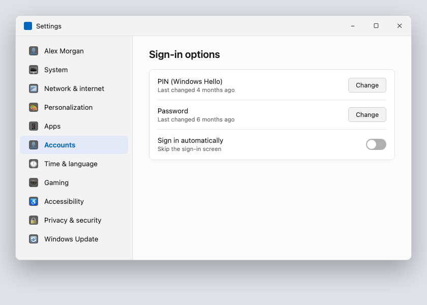

*Illustrative mockup, styled to match Windows 11, not a real PC screen.*

★  TIP:  Choose a PIN that is not your birth year, your address number, or a simple sequence like 1234. Windows allows longer PINs and even PINs with letters and symbols if you want extra strength.

| ⚠  WARNING If your PC is set to sign in automatically with no PIN or password at all, turn this off in Sign-in options now, automatic sign-in means anyone who opens the lid or turns on the PC has full access to everything. |

## Layer 2, Windows Hello

If your PC has a fingerprint reader or an infrared camera, Windows Hello lets you sign in with your face or fingerprint instead of typing a PIN every time.

Settings path:  Settings  >  Accounts  >  Sign-in options  >  Windows Hello.

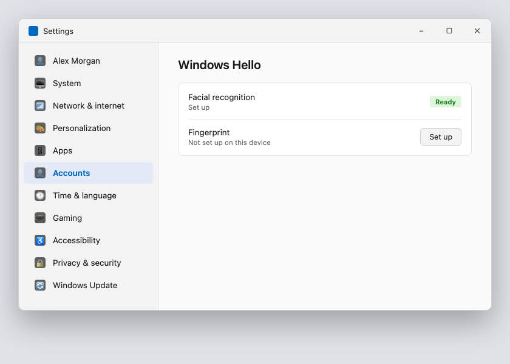

*Illustrative mockup, styled to match Windows 11, not a real PC screen.*

If your PC does not support Windows Hello, a strong PIN used consistently is just as effective. Windows Hello is a convenience layer on top of your PIN, not a replacement for it, your PIN or password still works as a backup.

## Layer 3, Screen lock timing

A PIN only protects you if Windows actually asks for it. This setting controls when that happens.

Settings path:  Settings  >  Accounts  >  Sign-in options  >  "If you've been away, when should Windows require you to sign in again?"

| Setting | Recommended value |
| --- | --- |
| Require sign-in after screen turns off | Immediately or 1 minute |
| Screen timeout (on battery) | 5 minutes or less |
| Screen timeout (plugged in) | 10 minutes or less |

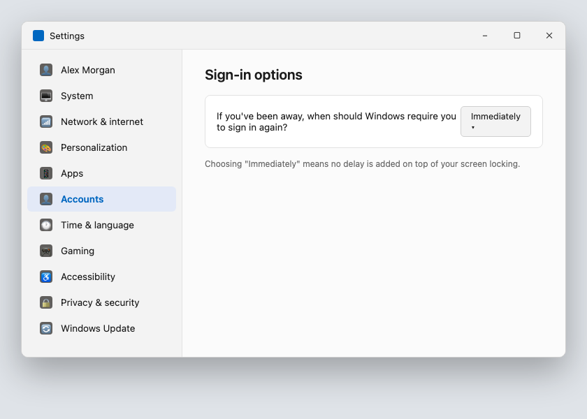

*Illustrative mockup, styled to match Windows 11, not a real PC screen.*

| ⚠  WARNING If your PC is set to require sign-in only after a long delay, or never, anyone who picks it up while you are away from your desk, even for a few minutes at a cafe or in a shared house, has a direct path to everything you are logged in to. |

## The feature most people have never heard of, BitLocker

BitLocker is full-disk encryption built into most editions of Windows. When it is turned on, everything stored on your PC's drive is scrambled using your sign-in credentials as the key. Without them, the data on the drive is unreadable, even if someone removes the drive entirely and connects it to another computer.

Settings path:  Settings  >  Privacy & Security  >  Device encryption, or search for "BitLocker" in the Start menu.

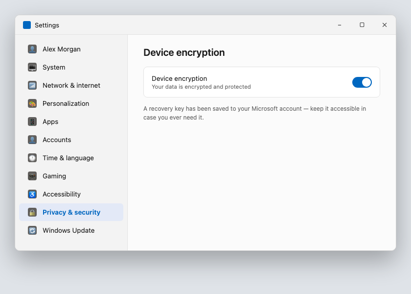

*Illustrative mockup, styled to match Windows 11, not a real PC screen.*

| ℹ  DID YOU KNOW? Not every edition of Windows includes full BitLocker, some editions offer a simpler "Device Encryption" instead, which works similarly but with fewer options. Either one is far better than no encryption at all, and most PCs sold in the last several years support at least the simpler version. |

When you turn on device encryption for the first time, Windows will ask you to save a recovery key, a long code that can unlock your PC if you ever forget your PIN or password. Save this to your Microsoft account when prompted, or write it down and store it somewhere safe, away from the computer itself.

## Quick review, your chapter 2 checklist

| Done | Item |
| --- | --- |
| ☐ | My PIN or password is not a simple sequence or personal detail |
| ☐ | Automatic sign-in (no PIN) is turned off |
| ☐ | Windows Hello is set up, if my PC supports it |
| ☐ | Require sign-in after screen off is set to immediately or 1 minute |
| ☐ | Device encryption or BitLocker is turned on |

With the front door locked, the next chapter covers the master key to everything else on your PC: your Microsoft account.

---

Sfinco Guides  ·  Volume 4: Windows Protection  ·  Chapter 3

# Your Microsoft account and OneDrive

Protecting the master key to your digital life

Your Microsoft account is the single most important account connected to your PC. It is also usually the same account connected to Xbox, Office, and OneDrive, if you use them. Protect this one account well, and you protect an enormous amount of your digital life at once.

## What is your Microsoft account, exactly?

Your Microsoft account is the email address and password you use to sign in to Windows, OneDrive, Outlook, and the Microsoft Store. If someone gains access to it, they can potentially see your files, read your email, and lock you out of your own PC entirely.

Settings path:  Settings  >  Accounts  >  Your info shows your Microsoft account and details.

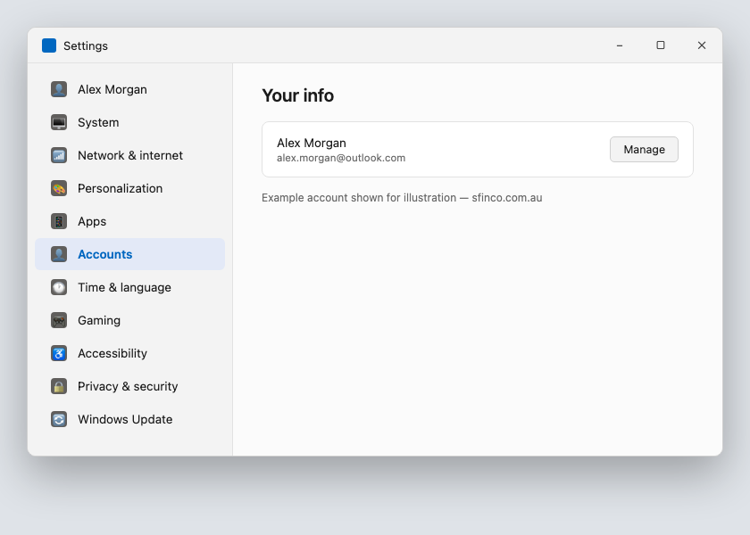

*Illustrative mockup, styled to match Windows 11, not a real PC screen.*

## The password, and why it matters more than any other

Your Microsoft account password should be unique, not reused from any other website or account. If you have ever used it anywhere else, change it today.

★  TIP:  The strongest passwords are passphrases: three or four unrelated words, like "GumtreeFerryOctober19", combined with a number. They are dramatically harder to crack than a short password with symbols swapped in for letters, and far easier for a person to actually remember.

## Two-factor authentication, your single most important security step

Two-factor authentication, often shortened to 2FA, means that signing in to your Microsoft account from a new device requires both your password and a code sent to your phone or authenticator app. Even if a criminal has your password, they cannot get in without also having access to your phone.

Settings path:  account.microsoft.com  >  Security  >  Advanced security options  >  Two-step verification.

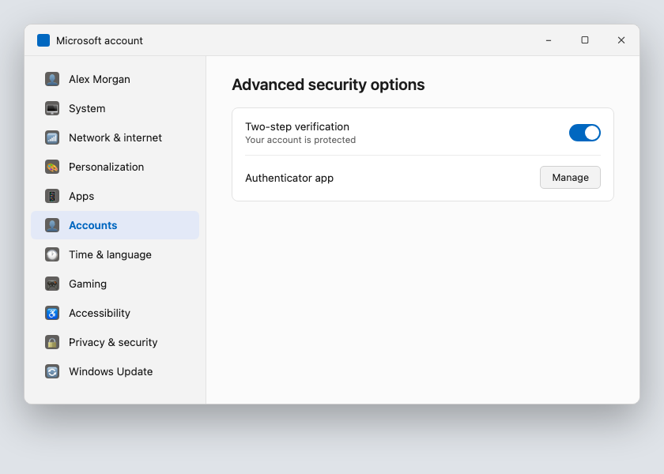

*Illustrative mockup, styled to match Windows 11, not a real PC screen.*

| ⚠  WARNING Never share a verification code with anyone, including someone claiming to be from Microsoft. Microsoft will never call you and ask for this code. If you receive a code you did not request, someone else may have your password, change it immediately. |

## OneDrive, what it is and why it matters

OneDrive is Microsoft's cloud storage and backup service. It can back up your Desktop, Documents, and Pictures folders automatically, and sync them across every device signed in to your Microsoft account.

Settings path:  OneDrive icon in the taskbar  >  Help & Settings  >  Settings  >  Backup.

| OneDrive feature | What it does |
| --- | --- |
| Folder backup | Automatically backs up Desktop, Documents, and Pictures |
| File sharing | Lets you share specific files or folders with others |
| Version history | Lets you restore an earlier version of a file if it is changed or deleted |
| Ransomware detection | Alerts you and helps recover files if OneDrive detects mass file changes typical of ransomware |

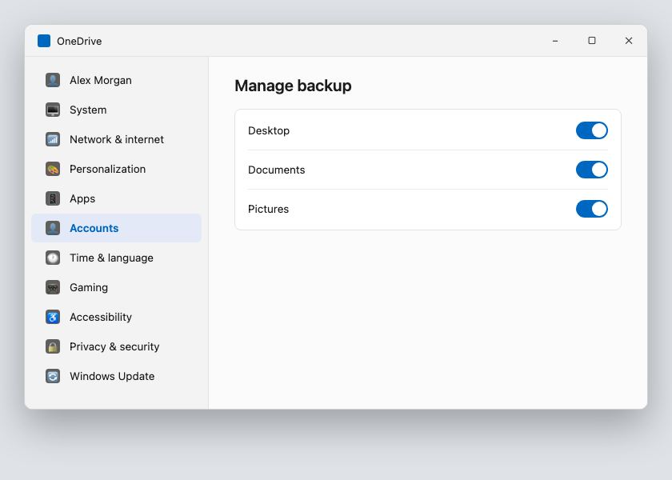

*Illustrative mockup, styled to match Windows 11, not a real PC screen.*

| ℹ  DID YOU KNOW? OneDrive's ransomware detection feature can notify you if it detects a sudden, unusual pattern of file changes across your account, often the first sign of a ransomware infection, and can help you restore your files to before the attack occurred, within a limited time window. |

## Reviewing devices signed in to your account

Settings path:  account.microsoft.com  >  Devices, shows every device currently signed in to your Microsoft account.

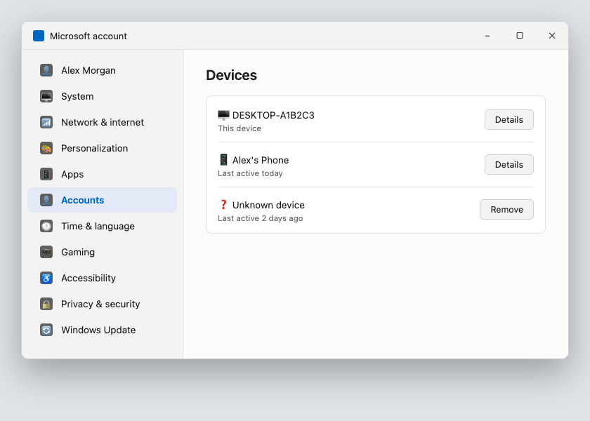

*Illustrative mockup, styled to match Windows 11, not a real PC screen.*

| ⚠  WARNING If you see a device on this list you do not recognise, or an old device you sold or gave away without removing it first, remove it and change your Microsoft account password as a precaution. |

## What to do if you are locked out of your account

Go to account.live.com/password/reset on any web browser and follow the prompts. Having a recovery phone number or email set up in advance, and two-step verification turned on, makes this process significantly faster.

## Quick review, your chapter 3 checklist

| Done | Item |
| --- | --- |
| ☐ | My Microsoft account password is unique and not used anywhere else |
| ☐ | Two-step verification is turned on |
| ☐ | OneDrive folder backup is turned on for my important folders |
| ☐ | I have reviewed the devices signed in to my Microsoft account |

With your Microsoft account secured, the next chapter looks at the apps on your PC, and exactly what they can and cannot do.

---

Sfinco Guides  ·  Volume 4: Windows Protection  ·  Chapter 4

# Windows Defender and app permissions

What your PC can see, and how to take back control

Windows includes a built-in security system, Microsoft Defender, that runs quietly in the background on every modern PC. This chapter covers making sure it is actually doing its job, plus the handful of app permissions worth checking.

## Confirming Windows Defender is turned on

Many people assume they need to buy separate antivirus software, but Microsoft Defender, built into Windows, provides strong protection on its own and is turned on by default, unless something has switched it off.

Settings path:  Settings  >  Privacy & Security  >  Windows Security  >  Virus & threat protection.

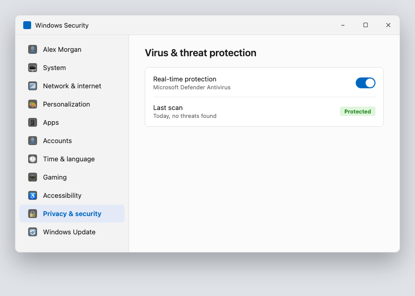

*Illustrative mockup, styled to match Windows 11, not a real PC screen.*

| ⚠  WARNING If you have installed a third-party antivirus program, Windows Defender may automatically switch to a supporting role. Make sure whichever program is "active" shows a green tick with no warnings, and that you are not paying for a subscription that has quietly expired while believing you are still protected. |

## SmartScreen, checking where your downloads came from

Microsoft Defender SmartScreen checks files and websites against a list of known malicious content before allowing them to run, similar in spirit to a security guard checking IDs at the door.

Settings path:  Settings  >  Privacy & Security  >  Windows Security  >  App & browser control.

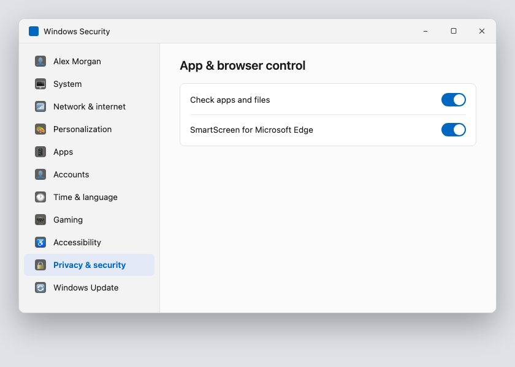

*Illustrative mockup, styled to match Windows 11, not a real PC screen.*

★  TIP:  If Windows ever blocks a file you deliberately downloaded from a source you trust, you can choose to run it anyway, but treat any unexpected SmartScreen warning on a file you did not deliberately seek out as a serious red flag.

## The permission reference guide

Beyond built-in security, individual apps can request access to specific parts of your PC. Here is a plain-English explanation of the permissions you will see most often.

| Permission | What it actually means | Allow only when... |
| --- | --- | --- |
| Camera | The app can activate your PC's built-in or connected camera | Video calling apps like Teams or Zoom. Deny for apps with no obvious reason to use a camera |
| Microphone | The app can listen through your PC's microphone | Voice and video calling apps, dictation tools. Deny for anything else |
| Location | The app can see your general or precise location | Maps and weather apps. Deny for apps with no clear need to know where you are |
| File system access | The app can read files in specific folders like Documents or Downloads | Apps that genuinely need to open or save your files |

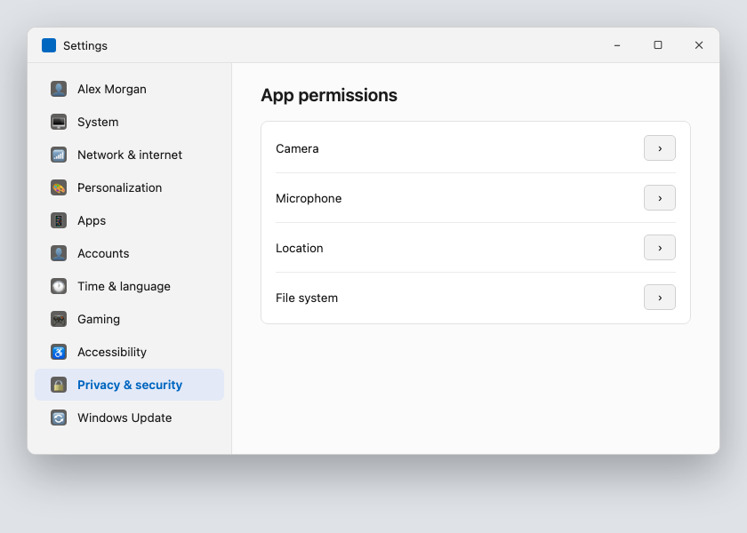

*Illustrative mockup, styled to match Windows 11, not a real PC screen.*

| ℹ  DID YOU KNOW? These permissions can be changed at any time, even long after you granted them. You are never permanently locked in to a choice you made when an app was first installed. Revoking a permission is just as easy as granting one. |

## Which apps to look at most closely

Not all apps carry equal risk. Give particular attention to: apps downloaded from outside the Microsoft Store, apps you installed once for a single task and have not opened since, browser extensions, which often request broad access to everything you view online, and any app you do not clearly remember installing yourself.

| ✓  WELL DONE IF YOU HAVE THIS If Windows Defender shows active protection with no warnings, and your apps list under each permission category is short and familiar, your PC's security footing is already in good shape. |

## Quick review, your chapter 4 checklist

| Done | Item |
| --- | --- |
| ☐ | Windows Defender (or my antivirus) shows active, up-to-date protection |
| ☐ | SmartScreen is turned on for apps and files |
| ☐ | I have reviewed camera, microphone, and location permissions |
| ☐ | I have removed permissions from apps I no longer use |

With your apps under control, the next chapter turns to the scams and phishing attempts most likely to actually reach you.

---

Sfinco Guides  ·  Volume 4: Windows Protection  ·  Chapter 5

# Scams, fake pop-ups and phishing

How to spot them, what to do, and how to recover if you clicked

## Why scams work, the psychology behind them

Every scam in this chapter relies on the same handful of psychological triggers: urgency, fear, authority, and trust. A message that makes you feel your PC is already infected, that you must act immediately, or that it comes from Microsoft itself, is designed to make you skip the one step that would protect you, stopping to check.

## The scams most likely to reach you

Here are the most common scam types currently targeting Australian Windows users, with real examples of what they look like.

1. Fake virus warning pop-ups

A webpage suddenly fills your entire browser window with a flashing warning claiming your PC is infected, often with a countdown timer and a phone number to call. These are almost always triggered by a website, not an actual infection.

| Browser pop-up |

| WARNING: Windows Defender has detected 15 threats on this PC! Call Microsoft Support immediately: 1800 000 000. Do not restart your computer or your files will be lost. |

*Illustrative mockup, not a real warning, built to show the pattern.*

Genuine Windows security warnings never appear as a full-screen browser pop-up, never include a countdown timer, and never ask you to call a phone number. If you see one of these, close the browser using Alt+F4, or open Task Manager with Ctrl+Shift+Esc and end the browser task if it will not close normally.

2. Fake Microsoft account emails

An email claims your Microsoft account has been locked, that unusual sign-in activity was detected, or that your OneDrive storage is full and files will be deleted.

| Microsoft |

| Your Microsoft account has been locked due to suspicious activity. Verify your account immediately or it will be permanently disabled: microsoft-account-verify.com/login |

*Illustrative mockup, not a real Microsoft message, built to show the pattern.*

| ⚠  WARNING Genuine Microsoft communications always come from a microsoft.com or outlook.com address. Microsoft will never email you a link asking you to enter your account password. If you are concerned about your account, go directly to account.microsoft.com in a browser you typed yourself, never click the link in the email. |

3. Fake Windows update prompts

A pop-up appears while browsing, styled to look like a Windows Update screen, urging you to download and install it immediately. Genuine Windows updates only ever appear through Settings, never through a website.

| ℹ  DID YOU KNOW? You can always check for genuine updates yourself at Settings > Windows Update. If a website is telling you to update outside of this, it is not a real Windows update. |

4. Bank impersonation emails

An email appears to come from your bank, warning of suspicious activity and asking you to click a link to verify your details.

| ANZ |

| ALERT: Unusual sign-in detected on your Internet Banking account. Verify your identity now to avoid account suspension: anz-secure-login.com/verify |

*Illustrative mockup, not real ANZ correspondence, built to show the pattern, not to reproduce their branding.*

Your bank's real domain always ends in .com.au. Hover your mouse over any link, without clicking, to see the actual web address it leads to at the bottom of your email or browser window.

5. Phone call tech support scams

A caller claims to be from Microsoft, Telstra, or "your internet provider," saying your PC has been hacked or is sending out viruses, and offers to fix it remotely. This is the scam from the start of this book, and it remains one of the most damaging.

| ✶  CRITICAL, READ THIS CAREFULLY Never allow anyone who calls you unsolicited to install software on your PC or take remote control of it. No legitimate technology company, not Microsoft, not Telstra, not your bank, will ever call you out of the blue to tell you your computer has a problem. If someone calls you with this offer, hang up immediately. Remote access software in the wrong hands gives a stranger complete control of your PC and everything on it, in real time, from anywhere in the world. |

## The universal red flag checklist

Regardless of which scam you encounter, the same warning signs tend to appear.

You are asked to act immediately.  Genuine organisations rarely demand instant action, and never by threatening to lock or delete something within minutes.

You are asked to call a number provided in the message itself.  Always look up the organisation's number independently instead.

The link does not match the organisation's real website.  Hover over it first, or better still, do not click it at all, type the address yourself.

You are asked to pay by gift card, wire transfer, or cryptocurrency.  No legitimate business asks for payment this way.

The greeting is generic.  "Dear Customer" or "Dear User" suggests a mass-sent scam. Your bank and Microsoft both know your name.

## How to verify any suspicious message

If in doubt, do not click anything in the message. Open a new browser window yourself, type the organisation's known website address, and log in there directly. Or call the organisation using the number on the back of your card or from their official website, never a number provided in the suspicious message.

## What to do if you think you clicked something you should not have

Disconnect from the internet immediately by turning off Wi-Fi or unplugging the network cable. Do not enter any passwords or personal details if a page is still open asking for them. Run a full scan using Windows Security if you have any doubt. Change the password for any account you may have entered details for, from a different, trusted device. Contact your bank directly if you entered any financial details, and monitor your accounts closely for the following weeks.

## Quick review, your chapter 5 checklist

| Done | Item |
| --- | --- |
| ☐ | I know that genuine security warnings never ask me to call a number |
| ☐ | I check the sender's actual email address before clicking any link |
| ☐ | I never call phone numbers provided inside an unexpected message |
| ☐ | I know to hang up on any unsolicited caller offering remote "tech support" |
| ☐ | I check for Windows updates only through Settings |

With scams covered, the next chapter looks at keeping your PC safe on Wi-Fi and what a VPN actually does for you.

---

Sfinco Guides  ·  Volume 4: Windows Protection  ·  Chapter 6

# Wi-Fi, Windows Firewall and VPN

Staying safe on public networks, and locking down file sharing at home

Most of us connect a laptop to Wi-Fi without thinking much about it. At a cafe, a library, an airport lounge, you see the network name, enter the password if there is one, and you are online. This chapter covers what is actually happening when you do that, and the handful of settings that make it safe.

## How public Wi-Fi works, and where the risk actually is

Public Wi-Fi networks are, by their nature, shared with everyone else in the room. On an unencrypted or poorly secured network, someone with the right knowledge and software nearby can potentially see some of the data travelling between your PC and the internet.

The good news is that most websites and apps you use today, including all banking websites, use HTTPS encryption, shown as a padlock in your browser's address bar, which protects the content of your connection even on an open network. The remaining risk sits mostly with older or poorly built apps and websites that do not use HTTPS properly, and with a specific trick called an Evil Twin network.

| ℹ  DID YOU KNOW? An Evil Twin is a fake Wi-Fi network set up by an attacker to mimic a legitimate one, for example, "Cafe_Free_WiFi" instead of the cafe's real "CafeWiFi" network. If your PC connects to the fake network, the attacker can see much more of your traffic than they could on the genuine one. |

## Setting your network to "Public"

Windows asks whether a new network is "Private" or "Public" the first time you connect. This single setting controls how visible your PC is to others on the same network.

Settings path:  Settings  >  Network & Internet  >  Wi-Fi  >  select the network  >  Network profile type.

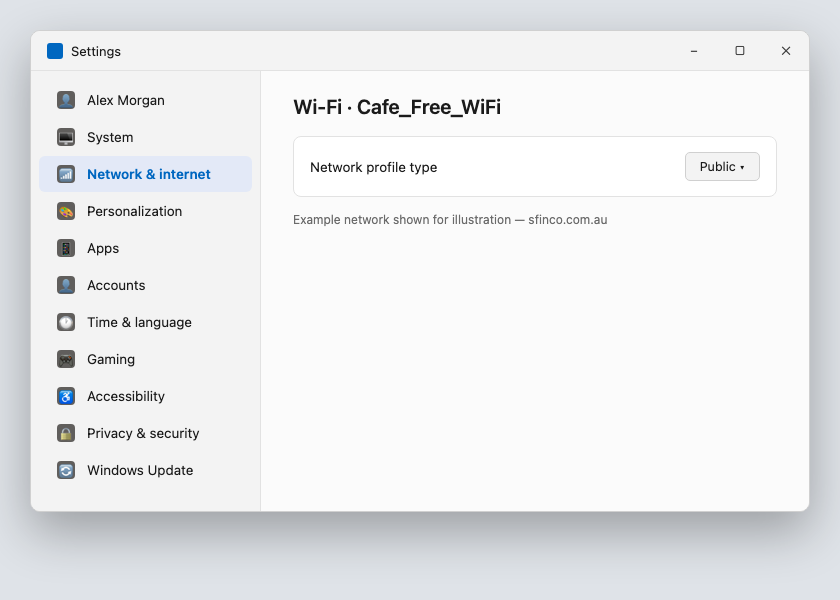

*Illustrative mockup, styled to match Windows 11, not a real PC screen.*

★  TIP:  Always choose "Public" for cafes, airports, and any network you do not personally manage. Reserve "Private" only for your own home or work network, where you trust the other devices connected to it.

## Turning on Windows Firewall

Windows Firewall blocks unwanted incoming connections to your PC from the network. It is turned on by default on most PCs, but it is worth confirming.

Settings path:  Settings  >  Privacy & Security  >  Windows Security  >  Firewall & network protection.

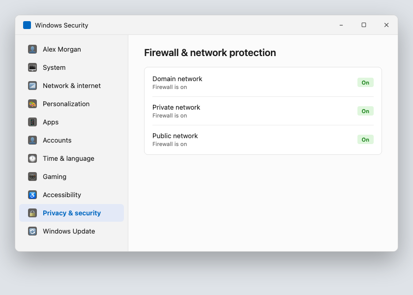

*Illustrative mockup, styled to match Windows 11, not a real PC screen.*

| ✓  WELL DONE IF YOU HAVE THIS With the firewall turned on for all three network types, Domain, Private, and Public, unsolicited connection attempts are blocked automatically, before they ever reach an application on your PC. |

## File sharing, a setting worth checking on public networks

If you use file or printer sharing at home with other devices on your own network, these settings should automatically turn off when your network profile is set to Public, but it is worth confirming directly.

Settings path:  Control Panel  >  Network and Sharing Center  >  Advanced sharing settings.

| Sharing option | Recommended when on public Wi-Fi |
| --- | --- |
| Network discovery | Off |
| File and printer sharing | Off |
| Public folder sharing | Off |

| ⚠  WARNING Leaving file or printer sharing turned on while connected to public Wi-Fi means other devices on that same network may be able to see your shared folders. These features are designed for trusted home or office networks, not a cafe or airport. |

## What is a VPN, in plain English

A VPN, or Virtual Private Network, is a service that encrypts all of your PC's internet traffic and routes it through a secure server before it reaches the internet. This means the website or app you are visiting sees the VPN server's location, not your actual location, and anyone else on the same Wi-Fi network cannot see your browsing activity at all.

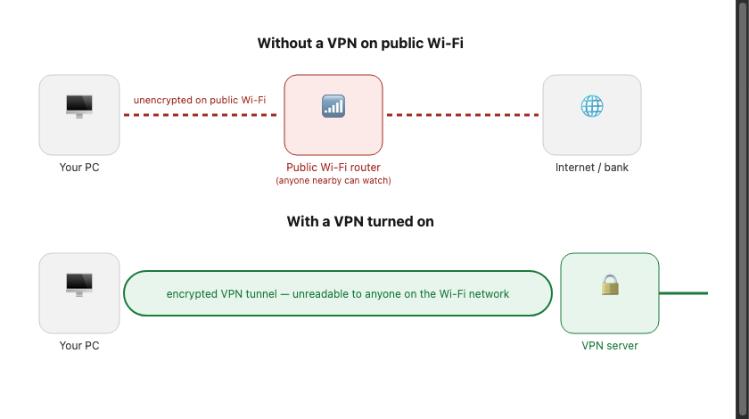

## Which VPN to choose, a plain-English comparison

There are hundreds of VPN providers. Here are four reputable options with native Windows apps, compared simply.

| VPN Provider | Cost | Best for |
| --- | --- | --- |
| Mullvad | ~AU$8/mo | Privacy-first, no account required, no logs, accepts cash payment. Best for maximum anonymity |
| ProtonVPN | Free tier / ~AU$12/mo | Swiss-based, strong privacy laws, free tier available with limited servers. Good for everyday use |
| ExpressVPN | ~AU$15/mo | Very fast, easy to use, good Australian server coverage. Best for streaming and travel |
| NordVPN | ~AU$7/mo (annual) | Popular, reliable, good value on annual plan. Solid choice for most everyday users |

## How to install and use a VPN on your PC

Choose a VPN provider from the table above and subscribe through their official website. Download their Windows app directly from the provider's website or the Microsoft Store. Open the app and sign in with the account you created. Click Connect to start the VPN, a small icon will usually appear in your system tray when it is active. Use the VPN whenever you are on public Wi-Fi, and consider enabling any "auto-connect on untrusted networks" option the app offers.

| ✓  WELL DONE IF YOU HAVE THIS A VPN running on public Wi-Fi, combined with your firewall turned on and your network profile set to Public, covers the vast majority of real-world network security risks for a Windows PC. |

## Quick review, your chapter 6 checklist

| Done | Item |
| --- | --- |
| ☐ | My network profile is set to Public on unfamiliar networks |
| ☐ | Windows Firewall is turned on for all network types |
| ☐ | File and printer sharing are off when I am on public Wi-Fi |
| ☐ | I have a VPN installed and use it on public networks |

With your network settings squared away, the next chapter covers backups and exactly what to do if your PC is ever compromised, lost, or stolen.

---

Sfinco Guides  ·  Volume 4: Windows Protection  ·  Chapter 7

# Backups, Find My Device, and what to do if things go wrong

Setting up your safety net before you ever need it

A lost, stolen, or ransomware-infected PC is stressful enough without also losing every photo, document, and file you had on it. This chapter covers the two things that turn a disaster into an inconvenience: a good backup, and Find My Device set up in advance.

## OneDrive and File History, your backup options

Chapter 3 covered OneDrive's automatic folder backup for Desktop, Documents, and Pictures. Windows also includes File History, which can back up a wider range of folders to an external drive.

Settings path:  Settings  >  System  >  Storage  >  Backup options, or search "File History" in the Start menu.

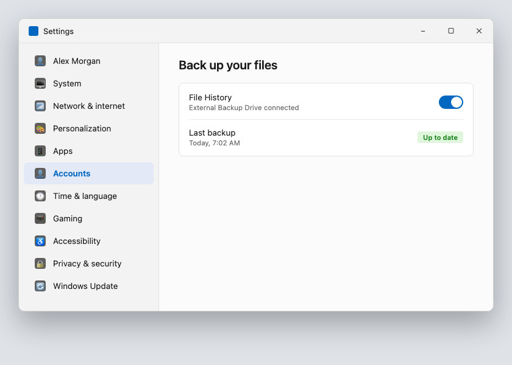

*Illustrative mockup, styled to match Windows 11, not a real PC screen.*

★  TIP:  Using both OneDrive and an external drive with File History gives you two independent copies of your most important files, useful if one backup method ever fails or is unavailable when you need it most.

| ℹ  DID YOU KNOW? If your PC is ever lost, stolen, damaged beyond repair, or infected with ransomware, a proper backup lets you restore your files onto a replacement PC without paying a ransom or losing years of photos and documents. Without a backup, recovery options become far more limited. |

## Setting up Find My Device, before you need it

Find My Device lets you locate your PC on a map (if it is online and location services are enabled), lock it remotely, or erase it entirely if you are certain it will not be recovered.

Settings path:  Settings  >  Privacy & Security  >  Find my device  >  ensure it is turned on.

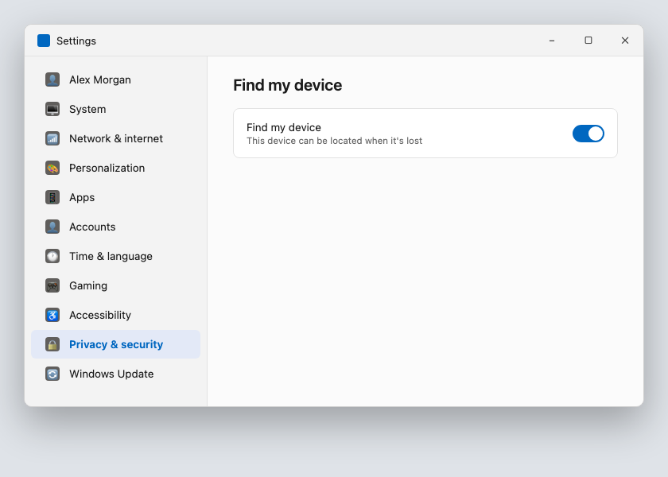

*Illustrative mockup, styled to match Windows 11, not a real PC screen.*

## Ransomware, what it is and how to reduce the damage

Ransomware is malware that encrypts your files and demands payment to unlock them. The single best defence is a backup that ransomware cannot also reach and encrypt, such as an external drive that is disconnected when not actively backing up, or OneDrive's built-in ransomware detection covered in Chapter 3.

| ⚠  WARNING If your PC is ever affected by ransomware, do not pay the ransom. Payment does not guarantee your files will be restored, and it funds further criminal activity. Disconnect the PC from the internet and any network drives immediately, and seek help from a trusted technician or your files' backup source instead. |

## The first thirty minutes, what to do if your PC goes missing

If your PC is ever lost or stolen, the steps below are designed to be followed calmly, in order, using another device.

| Time | What to do |
| --- | --- |
| 0–5 min | Use Find My Device on another device. Go to account.microsoft.com/devices/findmydevice and sign in with your Microsoft account |
| 5–10 min | Choose the right action. If the map shows your PC at a specific, stationary location like your home, it may simply be misplaced. If it is at an unfamiliar location, it is more likely stolen |
| 10–15 min | Lock the device remotely, if this option is available for your PC |
| 15–20 min | Change your Microsoft account password. Do this from a different, trusted device |
| 20–25 min | Notify your bank. If you had any saved banking sessions active in a browser, call your bank to flag this as a precaution |
| 25–30 min | Report to police if stolen. Provide the serial number, found on the original packaging or under Settings > System > About |

★  TIP:  Find your PC's serial number now, before you ever need it, and save it somewhere safe, a note in a password manager, a photo of the original box, or written down in a locked drawer.

## A note on insurance

Check whether your home and contents insurance policy covers a laptop used outside the home, since many standard policies only cover items while inside your house. If you regularly take your laptop out with you, a specific portable electronics add-on may be worth the extra cost.

## Quick review, your chapter 7 checklist

| Done | Item |
| --- | --- |
| ☐ | OneDrive or File History is set up and backing up regularly |
| ☐ | Find My Device is turned on |
| ☐ | I know where to find my PC's serial number |
| ☐ | I have checked whether my insurance covers my laptop outside the home |

With a proper backup and Find My Device ready to go, the final chapter brings everything together into a fifteen-minute monthly routine.

---

Sfinco Guides  ·  Volume 4: Windows Protection  ·  Chapter 8

# Your 15-minute Windows security checkup

A simple monthly routine to keep your PC protected for years to come

You have now worked through every major layer of Windows security: your sign-in and encryption, your Microsoft account, Windows Defender and app permissions, scam awareness, your network settings, and your backups. This final chapter brings all of it together into one simple monthly habit.

| ℹ  DID YOU KNOW? Set a recurring reminder right now, the first Sunday of every month works well for most people. Open the Reminders or Calendar app, create a new reminder called 'Windows security checkup', and set it to repeat monthly. This is the single most important step in this chapter: the checklist only works if you actually come back to it. |

## The complete monthly checklist

Work through this list with your PC open. Each item references the chapter where you can find full instructions if you need a refresher.

### Sign-in and encryption

| Done | Item | Chapter |
| --- | --- | --- |
| ☐ | My PIN or password remains strong and not a simple sequence | Ch. 2 |
| ☐ | Automatic sign-in remains turned off | Ch. 2 |
| ☐ | Device encryption or BitLocker is still turned on | Ch. 2 |

### Microsoft account

| Done | Item | Chapter |
| --- | --- | --- |
| ☐ | Two-step verification is still active on my Microsoft account | Ch. 3 |
| ☐ | I have reviewed the devices signed in to my Microsoft account | Ch. 3 |

### Defender and apps

| Done | Item | Chapter |
| --- | --- | --- |
| ☐ | Windows Defender shows active, up-to-date protection | Ch. 4 |
| ☐ | I have reviewed app permissions for anything unfamiliar | Ch. 4 |

### Scam awareness

| Done | Item | Chapter |
| --- | --- | --- |
| ☐ | I have not called a number from a pop-up warning this month | Ch. 5 |
| ☐ | I have not clicked any suspicious links, and if I have, I followed the recovery steps | Ch. 5 |

### Network

| Done | Item | Chapter |
| --- | --- | --- |
| ☐ | Windows Firewall is still turned on | Ch. 6 |
| ☐ | File and printer sharing remain off unless I am actively using them | Ch. 6 |

### Backups

| Done | Item | Chapter |
| --- | --- | --- |
| ☐ | OneDrive or File History shows a successful backup within the last week | Ch. 7 |
| ☐ | Find My Device is still turned on | Ch. 7 |

### General software health

| Done | Item | Chapter |
| --- | --- | --- |
| ☐ | Windows is running the latest available update | New |
| ☐ | All my apps are updated to their latest versions | New |

## Two new habits worth adding

Beyond the checklist, two ongoing habits are worth building in.

Check for Windows updates weekly, not just monthly.  Settings path: Settings > Windows Update. Security fixes are often released between your monthly checkups, and installing them promptly closes gaps quickly.

Review your backup drive occasionally.  An external drive that has quietly failed or filled up will stop protecting you without any obvious warning. Once every few months, confirm the most recent backup date looks current.

## A final word

Security is not a single project you finish and forget. It is a small, repeated habit, the same way you would check your car's tyre pressure or test your smoke alarms. Fifteen minutes a month, done consistently, will protect you far better than an intense afternoon of settings changes done once and never revisited.

| ✓  WELL DONE You have completed Sfinco Guides Volume 4: Windows Protection. Your PC is now meaningfully more secure than it was when you started this book. Well done. Genuinely. |

Continuing your Sfinco journey:  The Sfinco Guides series continues with Volume 5 (Android Protection), each written in the same plain-English, step-by-step style. See the final pages of this book for details.

---

Sfinco Guides  ·  Volume 4

## Glossary

These are the key terms used throughout this book, explained in plain English. You do not need to memorise them, this section is here to help if you encounter a word and want a clear definition.

| Term | Definition |
| --- | --- |
| BitLocker | Microsoft's full-disk encryption feature, which scrambles everything on your PC's drive using your sign-in credentials as the key |
| Device encryption | A simpler version of BitLocker included on more editions of Windows |
| File History | A built-in Windows backup tool that copies files to an external drive |
| Find My Device | Microsoft's location and device tracking service, allowing you to locate or lock a lost or stolen PC |
| HTTPS | The secure version of the web protocol. When a website address starts with https://, your connection to it is encrypted |
| Microsoft account | The email address and password you use to sign in to Windows, OneDrive, and the Microsoft Store |
| OneDrive | Microsoft's cloud storage service, which backs up your files and syncs them across devices |
| Phishing | A scam that impersonates a trusted organisation, via email, to trick you into handing over personal or financial information |
| Ransomware | Malware that encrypts your files and demands payment to unlock them |
| Scamwatch | The Australian government's national scam reporting service, run by the ACCC |
| SmartScreen | A Microsoft Defender feature that checks files and websites against known malicious content before allowing them to run |
| Two-step verification | A security method requiring both your password and a code sent to a trusted device to sign in to your Microsoft account |
| VPN (Virtual Private Network) | A service that encrypts your internet traffic and routes it through a secure server, particularly useful on public Wi-Fi |
| Windows Defender | Microsoft's built-in antivirus and security software, included free with Windows |
| Windows Hello | A feature that lets you sign in to Windows using your face or fingerprint instead of typing a PIN |

Sfinco Guides  ·  Volume 4

## Quick reference card

Cut out or photograph this page and keep it somewhere handy, on the fridge, or saved as a photo on your phone. These are the numbers and steps you are most likely to need in a hurry.

### Emergency contacts

| Contact | Details |
| --- | --- |
| My bank fraud line | _________________________________ |
| Scamwatch (ACCC) | scamwatch.gov.au · 1300 302 502 |
| IDCARE (identity support) | idcare.org · 1800 595 160 |
| Microsoft Support | support.microsoft.com · 13 20 58 |

### My device details

| Detail | Your information |
| --- | --- |
| My PC make and model | _________________________________ |
| Windows version | _________________________________ |
| Serial number | _________________________________ |
| My Microsoft account email | _________________________________ |
| Backup, last checked | _________________________________ |

### If your PC goes missing, first 30 minutes

| Step | What to do |
| --- | --- |
| 1. Locate it | account.microsoft.com/devices/findmydevice |
| 2. Lock the device | If available for your PC |
| 3. Change your Microsoft account password | From a different, trusted device |
| 4. Report to police | Provide the serial number and location |

### If you see a suspicious pop-up or message

| Step | What to do |
| --- | --- |
| 1. Do not call any number shown | And do not click any links |
| 2. Close the browser | Alt+F4, or Ctrl+Shift+Esc to end the task |
| 3. Find real contact details | Official website or card, not from the message |
| 4. Report it | scamwatch.gov.au and the impersonated organisation |

Sfinco Guides  ·  Volume 4

## Monthly security checkup

15 minutes · First Sunday of every month

Month / Year: _________________     Completed by: _________________

### 🔐 Sign-in and encryption

| Done | Item | Chapter |
| --- | --- | --- |
| ☐ | PIN or password strong and unique | Ch 2 |
| ☐ | Automatic sign-in off | Ch 2 |
| ☐ | Device encryption turned on | Ch 2 |

### ☁️ Microsoft account

| Done | Item | Chapter |
| --- | --- | --- |
| ☐ | Two-step verification still active | Ch 3 |
| ☐ | No unrecognised devices on account | Ch 3 |

### 🛡️ Defender and apps

| Done | Item | Chapter |
| --- | --- | --- |
| ☐ | Windows Defender active and up to date | Ch 4 |
| ☐ | App permissions reviewed | Ch 4 |

### 🚨 Scams

| Done | Item | Chapter |
| --- | --- | --- |
| ☐ | No calls made to pop-up phone numbers | Ch 5 |

### 🛰 Network

| Done | Item | Chapter |
| --- | --- | --- |
| ☐ | Firewall still on | Ch 6 |
| ☐ | File sharing off unless in use | Ch 6 |

### 💾 Backups

| Done | Item | Chapter |
| --- | --- | --- |
| ☐ | Backup successful within last week | Ch 7 |
| ☐ | Find My Device still on | Ch 7 |

### ⚙️ Software

| Done | Item | Chapter |
| --- | --- | --- |
| ☐ | Windows running latest update | Settings > Windows Update |
| ☐ | All apps updated | Microsoft Store > Downloads |

sfinco.com.au · Vol 4 Windows Protection

## Sfinco Guides, the complete series

More books in the series

The Sfinco Guides series is designed to cover every device and situation you are likely to encounter. Each book follows the same plain-English, step-by-step format, with real Australian examples, screenshots, and no technical jargon.

### Series 1, Personal protection

| Volume | What it covers |
| --- | --- |
| Vol 1 Available now | iPhone Protection. Your simple guide to staying safe online. Passcode · Face ID · Apple ID · App permissions · Scams · Wi-Fi · Find My |
| Vol 2 Available now | MacBook Protection. Securing your Mac in plain English. Login & FileVault · Gatekeeper · Apple ID · Scams · Firewall & VPN · Time Machine |
| Vol 3 Available now | Family and Home Network Protection. Keeping everyone safe under one roof. Router security · guest Wi-Fi · smart devices · scams · parental controls |
| Vol 4 Available now | Windows Protection. A plain-English guide for Windows users. Sign-in & BitLocker · Microsoft account · Defender · Scams · Firewall & VPN · Backups |
| Vol 5 Coming soon | Android Protection. Staying safe on your Android phone. Play Protect · app sideloading · Google account · 2FA · scam SMS |

### Series 2, Organisational protection

| Volume | What it covers |
| --- | --- |
| Vol 6 Coming soon | Small Business Protection. Cyber security for Australian small businesses. Email security · staff access · backups · scam invoices · incident response |
| Vol 7 Coming soon | NGO and Not-for-Profit Protection. Protecting organisations that protect others. Volunteer access · donor data · email compromise · free tools for small teams |
| Vol 8 Coming soon | Personal Finance Protection. Protecting your money in a digital world. Banking security · investment scams · superannuation · password managers · wills |

| ★  TIP All Sfinco Guides are available on Amazon (search 'Sfinco Guides' or scan the QR code on the next page). Paperback and e-book editions are available. Bulk copies for community groups, RSL clubs, libraries, and medical practices are available directly through sfinco.com.au, contact us for pricing. |

## Connect with us

Scan to continue your Sfinco journey.

Each QR code below links to a different part of the Sfinco ecosystem. Scan any of them with your phone's camera to go directly to the relevant page.

| Where it takes you | What you'll find |
| --- | --- |
| [ QR CODE ] WEBSITE | Visit the Sfinco website, free resources, guides, blog, and updates on new books in the series sfinco.com.au |
| [ QR CODE ] TECH HELP | Book a Senior Tech Concierge session, in-person help with your PC, Mac, or iPhone on the Sunshine Coast sfinco.com.au/concierge |
| [ QR CODE ] ALL BOOKS | Browse all Sfinco Guides, the complete series on Amazon and direct from our website sfinco.com.au/guides |
| [ QR CODE ] BUSINESS | Sfinco for business, cyber security audits and assessments for Sunshine Coast small businesses sfinco.com.au/business |
| [ QR CODE ] FREE DOWNLOAD | Free printable resources, scam reference card, monthly checklist, and more (no sign-up required) sfinco.com.au/resources |

| ℹ  NOTE QR codes are scanned using your phone's camera app, no separate app needed. All Sfinco links are safe and will never ask for payment details. |

Sfinco Guides  ·  Volume 4

## About Leonardo Pinheiro

Leonardo Pinheiro, the author of the Sfinco Guides series, works in banking and technology on the Sunshine Coast in Queensland, with nearly two decades of experience across customer service, financial services, and digital security.

Holding qualifications in cybersecurity (CompTIA Security+), financial advising (RG146), and information technology, and completing further studies at CQUniversity, Leonardo brings together a rare combination of technical knowledge and the ability to explain it clearly to people who have no interest in becoming technical experts.

The inspiration for this series came from years of seeing the same pattern: intelligent, capable, careful people being harmed by scams and digital threats, not because they were careless, but because nobody had ever given them a clear, practical guide to protecting themselves. That gap is what these books exist to close.

Leonardo also volunteers with CoderDojo, teaching digital skills to young people on the Sunshine Coast, and has a background in community technology education across Australia and internationally.

Sfinco was founded on the belief that every Australian deserves to feel safe and confident in their digital life, regardless of their age, their technical background, or how much money they have.

| Sfinco Protecting Australians through technology, money, and trust. sfinco.com.au Noosa · Sunshine Coast · Queensland · Australia |

## Publication details

Sfinco Guides is published by Sfinco · ABN [to be added]

First published 2026 · © Sfinco · All rights reserved

No part of this publication may be reproduced without written permission from the publisher.

The information in this book is provided for general guidance only and does not constitute professional legal, financial, or cybersecurity advice.