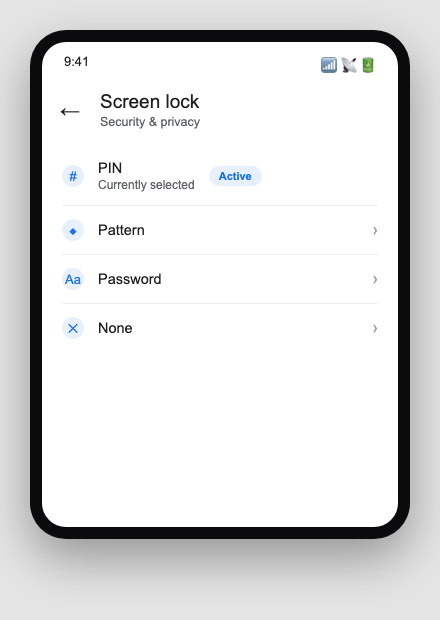
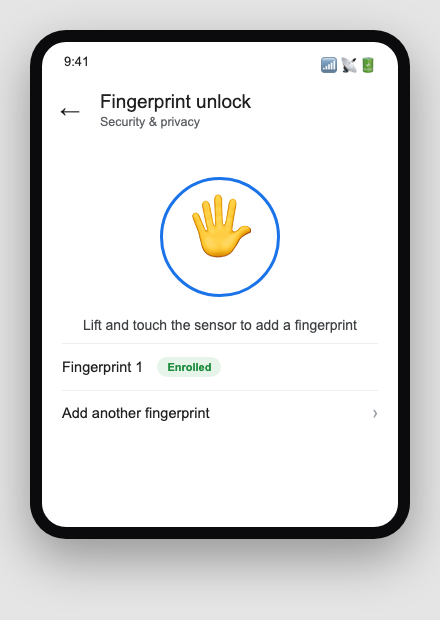
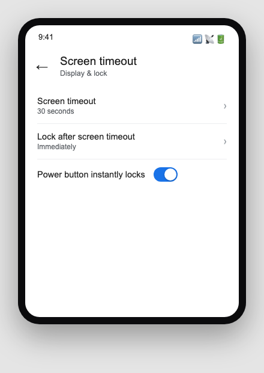
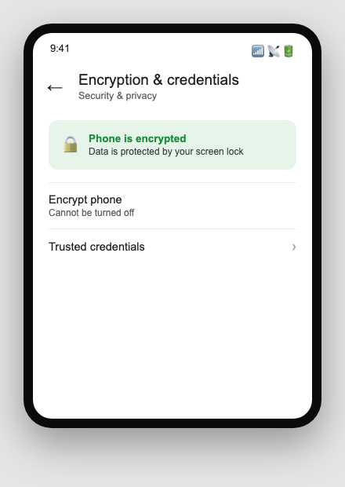

Sfinco Guides  ·  Volume 5 — Android Protection  ·  Chapter 2

# Locking the front door

Your PIN, fingerprint or face unlock, and the encryption setting that runs quietly in the background

Every protection in this book sits behind one gate: your lock screen. If someone can pick up your phone and get straight to your home screen with no PIN, pattern, or password, nothing else in this book matters very much. This chapter covers the layers that make that gate a genuine barrier, plus one setting that protects your data even if your phone is physically stolen.

## Layer 1 — Your screen lock

Settings path:  Settings  >  Security & privacy  >  Screen lock (on some phones this is under Settings > Lock screen).

Android offers a PIN, a pattern, or a password. A PIN of six digits or more is a good, simple choice for most people — long enough to resist guessing, short enough to type quickly and reliably.

*Mockup illustration, styled to match a typical Android settings layout — reshoot on a real device before final layout.*

★  TIP:  Choose a PIN that is not your birth year, your address number, or a simple sequence like 123456. Avoid patterns that trace an obvious shape like a letter of your name, since these are often the first patterns a stranger will try.

| ⚠  WARNING If your screen lock is set to "None" or "Swipe," anyone who picks up your phone has immediate, complete access to everything on it, including your banking apps and your email. Set a PIN, pattern, or password now if this applies to you. |

## Layer 2 — Fingerprint or face unlock

Most Android phones from the last several years include a fingerprint sensor, a face unlock camera, or both. These let you unlock quickly without typing your PIN every time, while your PIN still works as the backup method.

Settings path:  Settings  >  Security & privacy  >  Fingerprint unlock or Face unlock.

*Mockup illustration, styled to match a typical Android settings layout — reshoot on a real device before final layout.*

If your phone does not support fingerprint or face unlock, a strong PIN used consistently is just as effective. Biometric unlock is a convenience layer on top of your PIN, not a replacement for it.

| ℹ  DID YOU KNOW? Face unlock on many budget and mid-range Android phones relies only on the front camera, which can sometimes be less secure than a fingerprint sensor or the more advanced face-scanning hardware on premium phones. If security matters more to you than speed, a fingerprint or a strong PIN is the safer primary choice. |

## Layer 3 — Screen lock timing

A PIN only protects you if your phone actually asks for it soon after the screen goes dark. This setting controls when that happens.

Settings path:  Settings  >  Display  >  Screen timeout, and separately Settings  >  Security & privacy  >  Screen lock  >  Lock after screen timeout.

| Setting | Recommended value |
| --- | --- |
| Screen timeout | 30 seconds to 1 minute |
| Lock after screen timeout | Immediately |

*Mockup illustration, styled to match a typical Android settings layout — reshoot on a real device before final layout.*

| ⚠  WARNING If your phone is set to lock only after a long delay after the screen turns off, anyone who picks it up while you are distracted, even for a minute at a cafe or on public transport, has a direct path to everything you are logged in to. |

## The feature that runs quietly in the background — device encryption

Modern Android phones encrypt your storage by default, meaning everything saved on your phone is scrambled and can only be read using your PIN, pattern, or password as the key. Without it, the data on the phone is unreadable, even if someone removes the storage chip entirely.

Settings path:  Settings  >  Security & privacy  >  Encryption & credentials, to confirm encryption is active.

*Mockup illustration, styled to match a typical Android settings layout — reshoot on a real device before final layout.*

On virtually every Android phone sold in the last decade, encryption is switched on automatically as soon as you set a screen lock, which is one more reason a PIN, pattern, or password matters more than it might seem.

## Quick review — your chapter 2 checklist

| Done | Item |
| --- | --- |
| ☐ | My screen lock is a PIN, pattern, or password — not "None" or "Swipe" |
| ☐ | My PIN or pattern is not a simple sequence or personal detail |
| ☐ | Fingerprint or face unlock is set up, if my phone supports it |
| ☐ | Screen timeout and lock timing are both set to a minute or less |
| ☐ | I have confirmed encryption is active under Encryption & credentials |

With the front door locked, the next chapter covers the master key to everything else on your phone: your Google Account.
