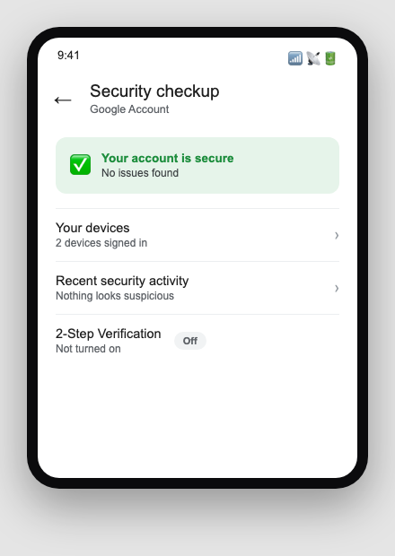
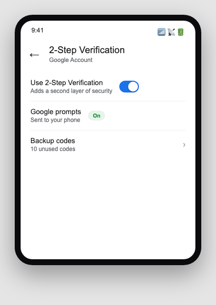
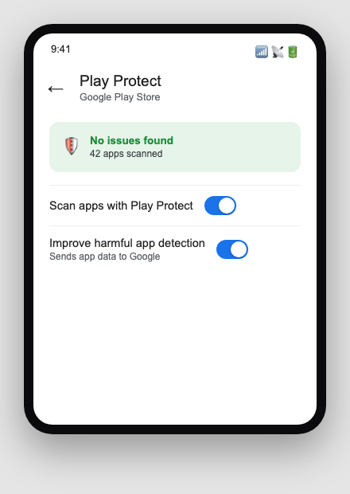
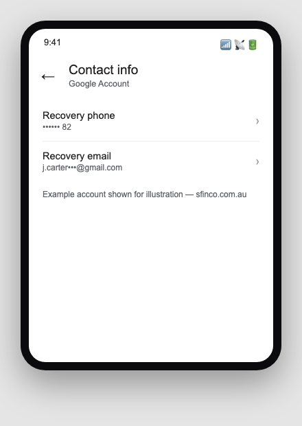

Sfinco Guides  ·  Volume 5 — Android Protection  ·  Chapter 3

# Your Google Account and Play Protect

The master key to your email, your photos, and almost everything else on your phone

Your Google Account is the single most important thing to protect on your Android phone. It is the master key that unlocks your Gmail, your Google Photos, your contacts, your Google Drive files, and often your saved payment cards. If someone gains access to it, they gain access to nearly everything else, even without ever touching your physical phone.

## Checking your Google Account security

Settings path:  Settings  >  Google  >  Manage your Google Account  >  Security.

This is your account's control centre. Google shows a "Security checkup" here that flags anything worth attention, such as an old password, a device you no longer use that is still signed in, or a recovery option that has never been set up.

*Mockup illustration, styled to match the Google Account app — reshoot on a real device before final layout.*

★  TIP:  Run the Security checkup once now, and again every few months. It only takes a couple of minutes and often surfaces an old, forgotten device or app connection worth removing.

## Turning on two-step verification

Two-step verification (also called two-factor authentication, or 2FA) means that even if someone learns your password, they still cannot get into your account without a second step, usually a code sent to your phone or a prompt you approve.

Settings path:  Settings  >  Google  >  Manage your Google Account  >  Security  >  2-Step Verification.

*Mockup illustration, styled to match the Google Account app — reshoot on a real device before final layout.*

| ⚠  WARNING If two-step verification is not turned on, your entire Google Account, and everything connected to it, is protected by your password alone. A password that has ever been reused on another site is far more vulnerable than most people realise. |

| ℹ  DID YOU KNOW? Google can send a simple "Yes, it's me" prompt to your phone instead of a text code for many sign-ins, which is both faster and slightly more secure, since a prompt cannot be intercepted the way a text message sometimes can. |

## Google Play Protect — your phone's built-in scanner

Play Protect is a built-in feature that continually checks the apps on your phone, and any app you are about to install, for signs of malicious behaviour, whether the app came from the Play Store or elsewhere.

Settings path:  Open the Play Store app  >  tap your profile picture  >  Play Protect.

*Mockup illustration, styled to match the Google Play Store app — reshoot on a real device before final layout.*

Make sure both "Scan apps with Play Protect" and "Improve harmful app detection" are turned on. These settings work quietly in the background and rarely need attention once they are switched on.

| ✓  WELL DONE IF YOU HAVE THIS If Play Protect shows "No issues found" and scanning is turned on, your phone is actively checking every app you install against Google's constantly updated list of known threats. |

## Recovery details — your safety net

If you are ever locked out of your account, or someone else tries to get into it, Google uses your recovery phone number and recovery email to verify it is really you.

Settings path:  Settings  >  Google  >  Manage your Google Account  >  Personal info  >  Contact info.

*Mockup illustration, styled to match the Google Account app — reshoot on a real device before final layout.*

Make sure both are current. A recovery phone number that was disconnected years ago, or a recovery email you no longer check, can turn a simple password reset into a genuinely stressful ordeal.

## Quick review — your chapter 3 checklist

| Done | Item |
| --- | --- |
| ☐ | I have run the Google Account Security checkup |
| ☐ | Two-step verification is turned on |
| ☐ | Play Protect is turned on and shows no issues |
| ☐ | My recovery phone number and email are both current |

With your Google Account locked down, the next chapter looks at the apps on your phone itself, and which of their permissions are worth trimming.
