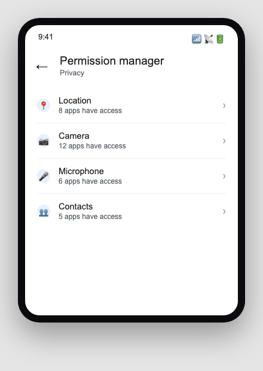
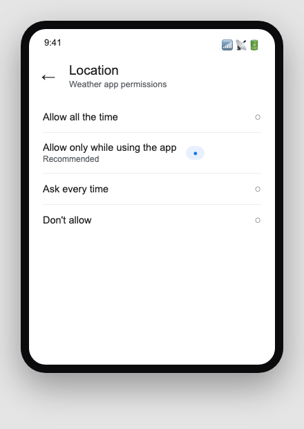
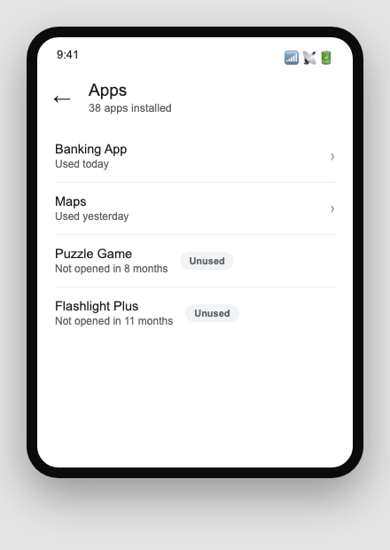
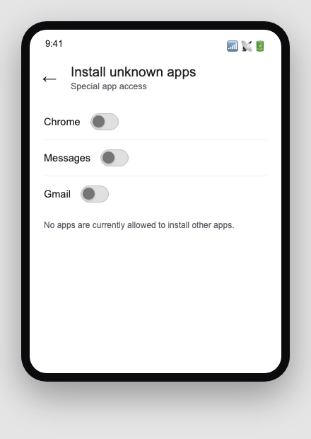

Sfinco Guides  ·  Volume 5: Android Protection  ·  Chapter 4

# App permissions worth trimming

What every app on your phone can actually see, and how to take some of it back

Every app you install asks for permission to access certain parts of your phone, your camera, your location, your contacts, your microphone. Many of these requests are genuinely needed for the app to work. A surprising number are not, and simply accumulate quietly over time until an app you barely use still knows exactly where you are, every minute of the day.

## Reviewing permissions by type

Settings path:  Settings  >  Privacy  >  Permission manager (on some phones this is under Settings > Apps > Permissions).

This screen groups permissions by type, camera, location, microphone, contacts, and more, and shows every app that currently has access to each one.

*Mockup illustration, styled to match a typical Android settings layout, reshoot on a real device before final layout.*

Work through location, camera, and microphone first, since these are the three permissions most worth a second look.

| ℹ  DID YOU KNOW? Android lets you grant location access "Only while using the app" instead of "Allow all the time," which stops an app from tracking your movements in the background when you are not actively using it. |

## Location, the permission worth the most attention

Ask yourself, for each app with location access: does this app genuinely need to know where I am to do its job? A maps or weather app clearly does. A calculator, a flashlight, or a simple game almost certainly does not.

*Mockup illustration, styled to match a typical Android settings layout, reshoot on a real device before final layout.*

★  TIP:  Set location to "Only while using the app" wherever possible, and "Don't allow" for anything that has no real reason to know your whereabouts at all.

## Reviewing installed apps and removing what you don't use

Settings path:  Settings  >  Apps  >  See all apps.

Every app installed on your phone is a potential target, whether you use it or not. An app you downloaded once, years ago, and never opened again still has whatever permissions you originally granted it, and may still be running quietly in the background.

*Mockup illustration, styled to match a typical Android settings layout, reshoot on a real device before final layout.*

| ⚠  WARNING An old, unused app is a common way for scammers to gain a foothold, particularly if the app has not been updated in years and a security flaw in it was later discovered. If you have not opened an app in the past six months, consider removing it. |

Uninstalling an app you do not use removes both the app itself and every permission it was ever granted, with nothing further to configure.

## Sideloading, installing apps from outside the Play Store

Android's flexibility allows apps to be installed from sources other than the Google Play Store, a feature sometimes called sideloading. This is occasionally useful, but every app on the Play Store has been checked by Google, while a sideloaded app has not.

Settings path:  Settings  >  Apps  >  Special app access  >  Install unknown apps, to see which apps currently have permission to install other apps on your behalf.

*Mockup illustration, styled to match a typical Android settings layout, reshoot on a real device before final layout.*

Unless you have a specific, deliberate reason to sideload an app, leave this permission turned off for every app listed. If you are ever asked to enable it to install something you did not deliberately seek out yourself, treat that as a strong warning sign.

## Quick review, your chapter 4 checklist

| Done | Item |
| --- | --- |
| ☐ | I have reviewed location, camera, and microphone permissions in the Permission manager |
| ☐ | Location access is set to "Only while using the app" or "Don't allow" wherever appropriate |
| ☐ | I have uninstalled apps I have not used in the past six months |
| ☐ | "Install unknown apps" is turned off for every app, unless I have a specific reason otherwise |

With your apps and their permissions under control, the next chapter turns to the scams and phishing attempts that arrive through texts and phone calls.
