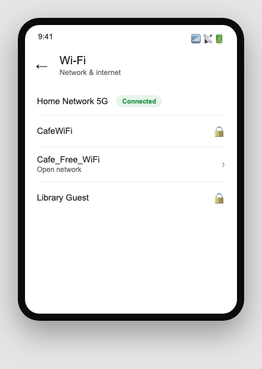
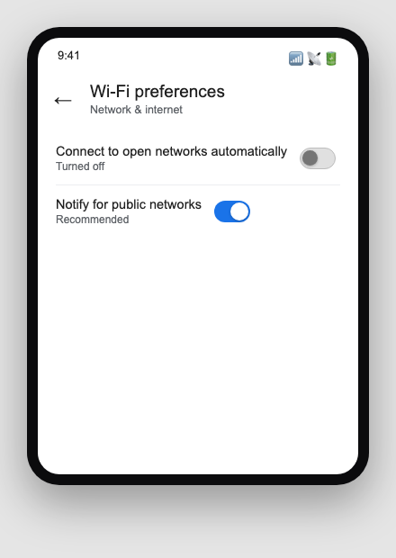
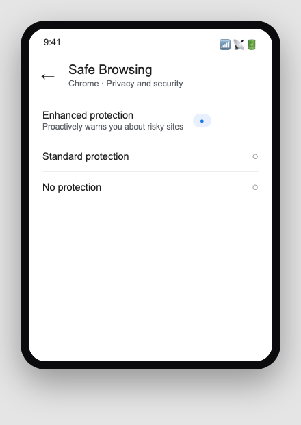
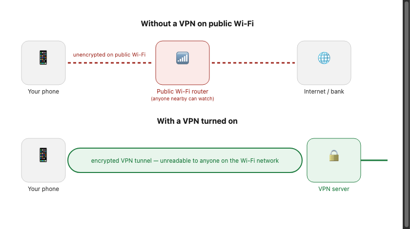

Sfinco Guides  ·  Volume 5 — Android Protection  ·  Chapter 6

# Wi-Fi safety and safer browsing

Staying safe on public networks — and the browser setting most people never check

Most of us connect a phone to Wi-Fi without thinking much about it. At a cafe, a library, a shopping centre — you see the network name, tap it, and you are online. This chapter covers what is actually happening when you do that, and the handful of settings that make it safe.

## How public Wi-Fi works — and where the risk actually is

Public Wi-Fi networks are, by their nature, shared with everyone else in the room. On an unencrypted or poorly secured network, someone with the right knowledge and software nearby can potentially see some of the data travelling between your phone and the internet.

The good news is that most websites and apps you use today, including all banking apps, use HTTPS encryption, shown as a padlock in your browser's address bar, which protects the content of your connection even on an open network. The remaining risk sits mostly with older or poorly built apps and websites that do not use HTTPS properly, and with a specific trick called an Evil Twin network.

| ℹ  DID YOU KNOW? An Evil Twin is a fake Wi-Fi network set up by an attacker to mimic a legitimate one — for example, "Cafe_Free_WiFi" instead of the cafe's real "CafeWiFi" network. If your phone connects to the fake network, the attacker can see much more of your traffic than they could on the genuine one. |

## Checking your Wi-Fi settings before you connect

Settings path:  Settings  >  Network & internet  >  Wi-Fi.

Android generally warns you when a network has no password at all, but it is worth glancing at the network name yourself before connecting, and choosing the one that matches what the venue's staff or signage actually says.

*Mockup illustration, styled to match a typical Android settings layout — reshoot on a real device before final layout.*

★  TIP:  If in doubt about which network is genuinely the venue's, ask a staff member for the exact name rather than guessing between two similarly named options.

## Turning off automatic Wi-Fi connection to open networks

Some phones are set, by default, to automatically join any open network they have connected to before, or any network with no password at all nearby, without asking you first.

Settings path:  Settings  >  Network & internet  >  Wi-Fi  >  Wi-Fi preferences  >  turn off "Connect to open networks automatically."

*Mockup illustration, styled to match a typical Android settings layout — reshoot on a real device before final layout.*

| ⚠  WARNING With automatic connection to open networks turned on, your phone can join an unfamiliar, unsecured network without you ever noticing, sending some of your traffic across a network you never chose to trust. |

## Safe Browsing in Chrome

Google Chrome, the browser installed by default on most Android phones, includes a built-in feature called Safe Browsing that warns you before you open a website known to host scams, phishing pages, or malware.

Settings path:  Open Chrome  >  tap the three dots  >  Settings  >  Privacy and security  >  Safe Browsing, and choose "Enhanced protection" or "Standard protection."

*Mockup illustration, styled to match the Google Chrome app — reshoot on a real device before final layout.*

| ✓  WELL DONE IF YOU HAVE THIS With Safe Browsing set to Enhanced protection, Chrome checks websites and downloads against Google's constantly updated list of dangerous sites before you ever reach them, giving you a warning screen instead of a silent risk. |

## What is a VPN — in plain English

A VPN, or Virtual Private Network, is a service that encrypts all of your phone's internet traffic and routes it through a secure server before it reaches the internet. This means the website or app you are visiting sees the VPN server's location, not your actual location, and anyone else on the same Wi-Fi network cannot see your browsing activity at all.

## Which VPN to choose — a plain-English comparison

There are hundreds of VPN providers. Here are four reputable options with native Android apps, compared simply.

| VPN Provider | Cost | Best for |
| --- | --- | --- |
| Mullvad | ~AU$8/mo | Privacy-first, no account required, no logs, accepts cash payment. Best for maximum anonymity |
| ProtonVPN | Free tier / ~AU$12/mo | Swiss-based, strong privacy laws, free tier available with limited servers. Good for everyday use |
| ExpressVPN | ~AU$15/mo | Very fast, easy to use, good Australian server coverage. Best for streaming and travel |
| NordVPN | ~AU$7/mo (annual) | Popular, reliable, good value on annual plan. Solid choice for most everyday users |

## How to install and use a VPN on your phone

Choose a VPN provider from the table above and subscribe through their official website. Download their Android app directly from the Google Play Store. Open the app and sign in with the account you created. Tap Connect to start the VPN — a small key-shaped icon will appear at the top of your screen when it is active. Use the VPN whenever you are on public Wi-Fi, and consider enabling any "auto-connect on unsecured networks" option the app offers.

| ✓  WELL DONE IF YOU HAVE THIS A VPN running on public Wi-Fi, combined with Safe Browsing turned on and automatic connection to open networks turned off, covers the vast majority of real-world network and browsing risks for an Android phone. |

## Quick review — your chapter 6 checklist

| Done | Item |
| --- | --- |
| ☐ | I check that I am joining the venue's genuine Wi-Fi network before connecting |
| ☐ | Automatic connection to open networks is turned off |
| ☐ | Chrome's Safe Browsing is set to Enhanced or Standard protection |
| ☐ | I have a VPN installed and use it on public networks |

With your network and browsing settings squared away, the next chapter covers backups and exactly what to do if your phone is ever lost or stolen.
