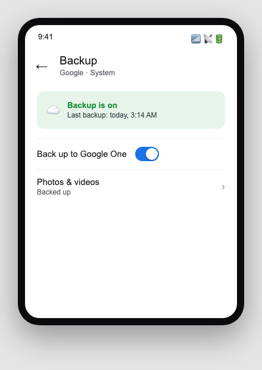
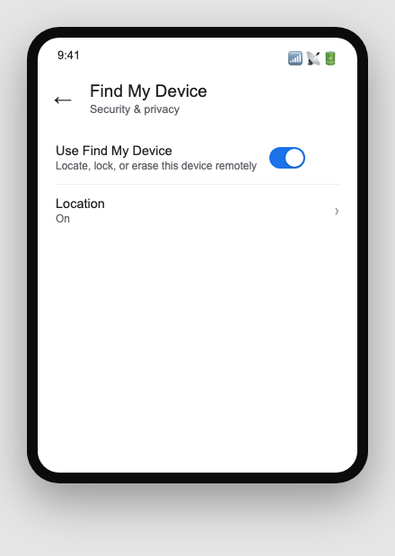

Sfinco Guides  ·  Volume 5 — Android Protection  ·  Chapter 7

# Backups, Find My Device, and what to do if things go wrong

Setting up your safety net before you ever need it

A lost or stolen phone is stressful enough without also losing every photo, contact, and message you had on it. This chapter covers the two things that turn a disaster into an inconvenience: a good backup, and Find My Device set up in advance.

## Google Photos and Google One — your backup options

Most Android phones back up photos automatically through Google Photos, and can back up app data, contacts, and settings more broadly through Google One.

Settings path:  Settings  >  Google  >  Backup, to confirm what is currently being backed up and when it last ran.

*Mockup illustration, styled to match a typical Android settings layout — reshoot on a real device before final layout.*

★  TIP:  Check the "last backup" date shown on this screen. If it is weeks or months old, tap "Back up now" and make sure your phone has both Wi-Fi and enough battery to complete it.

| ℹ  DID YOU KNOW? If your phone is ever lost, stolen, damaged beyond repair, or reset, a proper backup lets you restore your photos, contacts, and most app data onto a replacement phone within minutes of signing back into your Google Account. Without a backup, that photo of your grandchild's first birthday may be gone for good. |

## Setting up Find My Device — before you need it

Find My Device lets you locate your phone on a map, make it ring at full volume even if it is on silent, lock it remotely, or erase it entirely if you are certain it will not be recovered.

Settings path:  Settings  >  Security & privacy  >  Find My Device  >  ensure it is turned on.

*Mockup illustration, styled to match a typical Android settings layout — reshoot on a real device before final layout.*

| ⚠  WARNING Find My Device only works if it was already turned on before your phone went missing. It cannot be enabled remotely after the fact, which is exactly why this is worth checking today rather than after something happens. |

## Malicious apps and unusual behaviour

Occasionally, a malicious app slips past Google Play Protect and causes your phone to behave unusually, draining the battery quickly, showing unexpected pop-up ads, or sending texts you did not write.

| ⚠  WARNING If your phone is showing signs of a malicious app, such as unexplained pop-ups or messages you did not send, run a Play Protect scan immediately from the Play Store app, and uninstall any recently added app you do not recognise or no longer trust. If problems persist, a factory reset after backing up your genuine data is the most reliable fix. |

## The first thirty minutes — what to do if your phone goes missing

If your phone is ever lost or stolen, the steps below are designed to be followed calmly, in order, using another device.

| Time | What to do |
| --- | --- |
| 0–5 min | Use Find My Device from a computer or another phone. Go to android.com/find and sign in with your Google Account |
| 5–10 min | Choose the right action. If the map shows your phone at a specific, stationary location like your home, it may simply be misplaced. If it is at an unfamiliar location, it is more likely stolen |
| 10–15 min | Lock the phone remotely with a message and contact number displayed on the lock screen |
| 15–20 min | Change your Google Account password. Do this from a different, trusted device |
| 20–25 min | Notify your bank. If you had any banking apps logged in, call your bank to flag this as a precaution |
| 25–30 min | Report to police if stolen. Provide the IMEI number, found on the original box or under Settings > About phone |

★  TIP:  Find your phone's IMEI number now, before you ever need it, and save it somewhere safe — a note in a password manager, a photo of the original box, or written down in a locked drawer. You can also find it by dialling *#06# on the phone itself.

## A note on insurance

Check whether your home and contents insurance policy covers a mobile phone used outside the home, since many standard policies only cover items while inside your house. If you regularly carry your phone with you, and it is a recent, higher-value model, a specific mobile phone add-on may be worth the extra cost.

## Quick review — your chapter 7 checklist

| Done | Item |
| --- | --- |
| ☐ | Google Backup is turned on and shows a recent backup date |
| ☐ | Find My Device is turned on |
| ☐ | I know where to find my phone's IMEI number |
| ☐ | I have checked whether my insurance covers my phone outside the home |

With a proper backup and Find My Device ready to go, the final chapter brings everything together into a fifteen-minute monthly routine.
