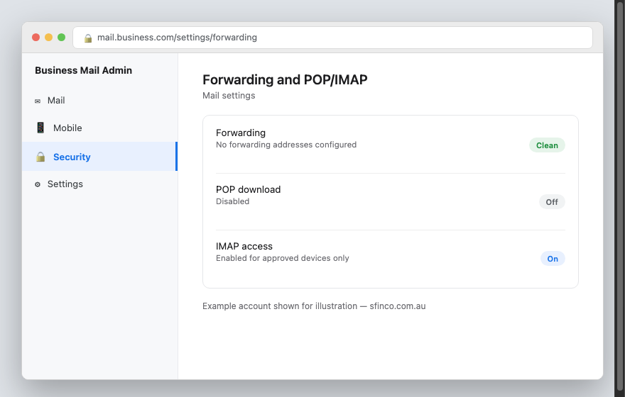
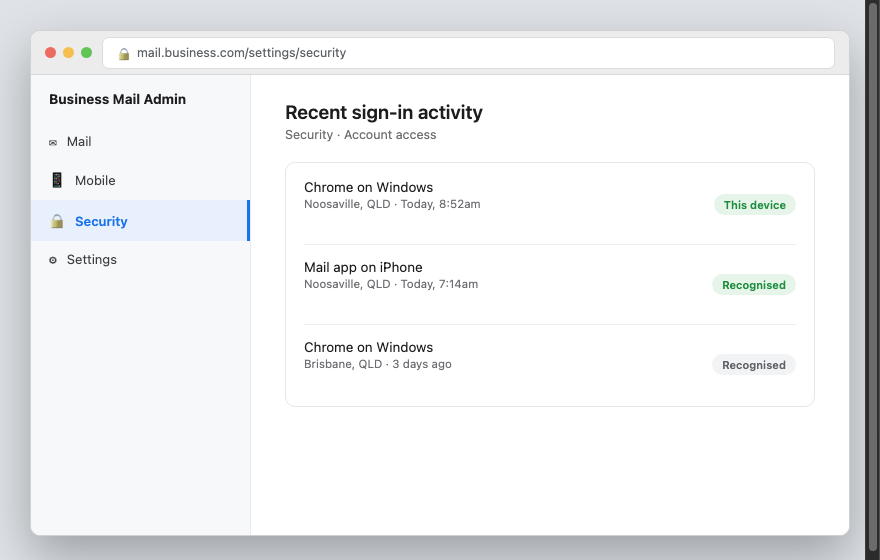
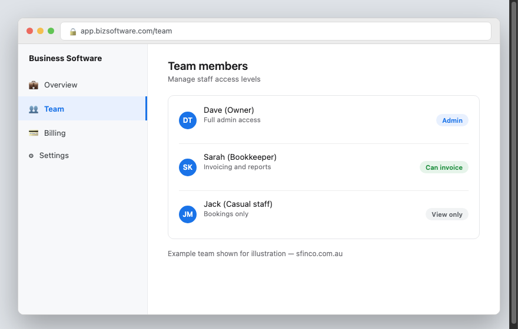
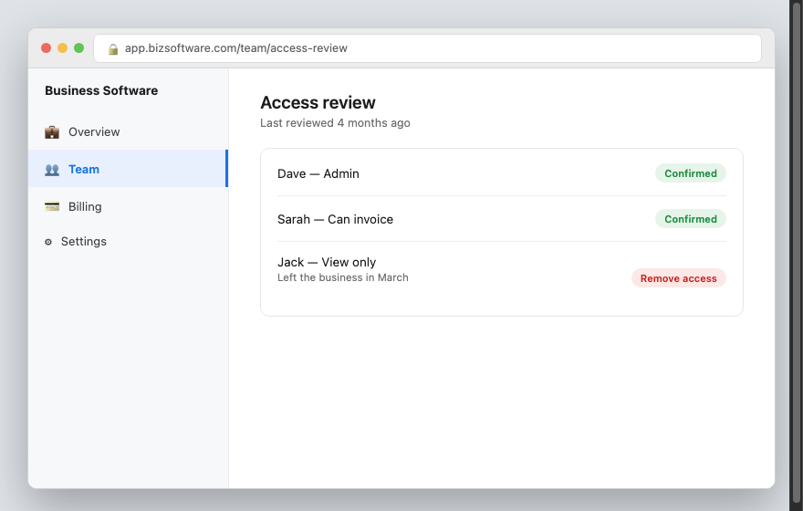
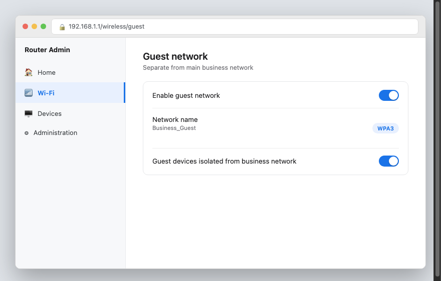
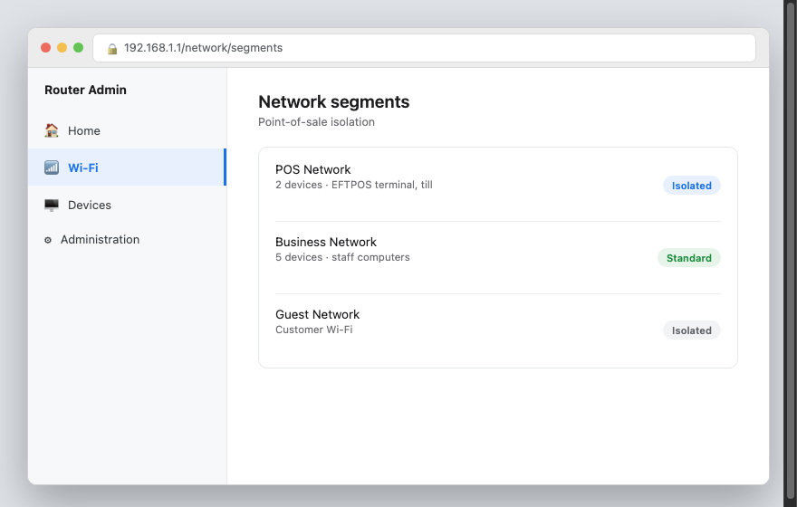
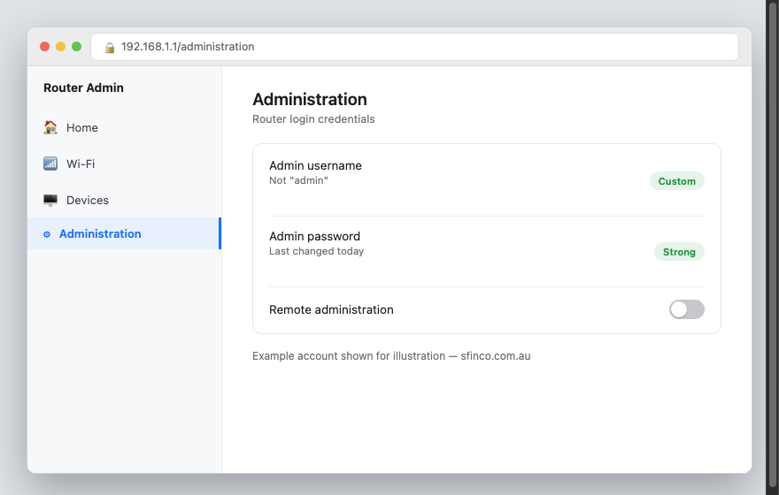
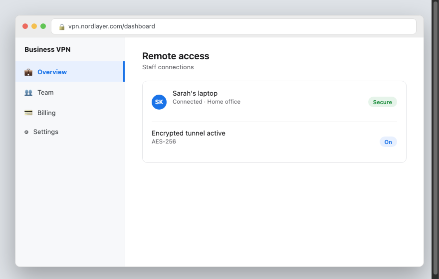
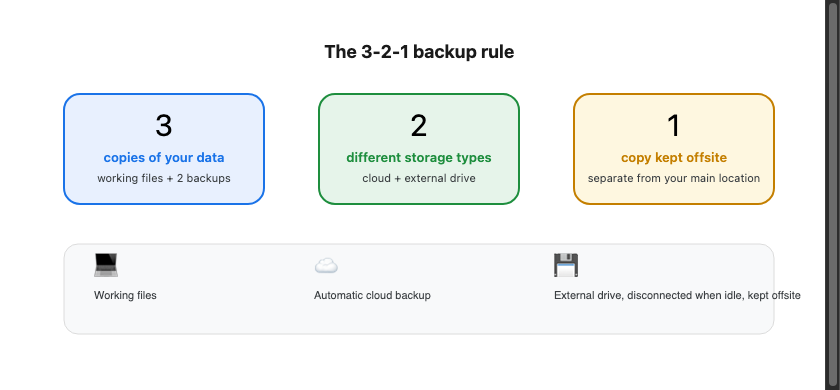
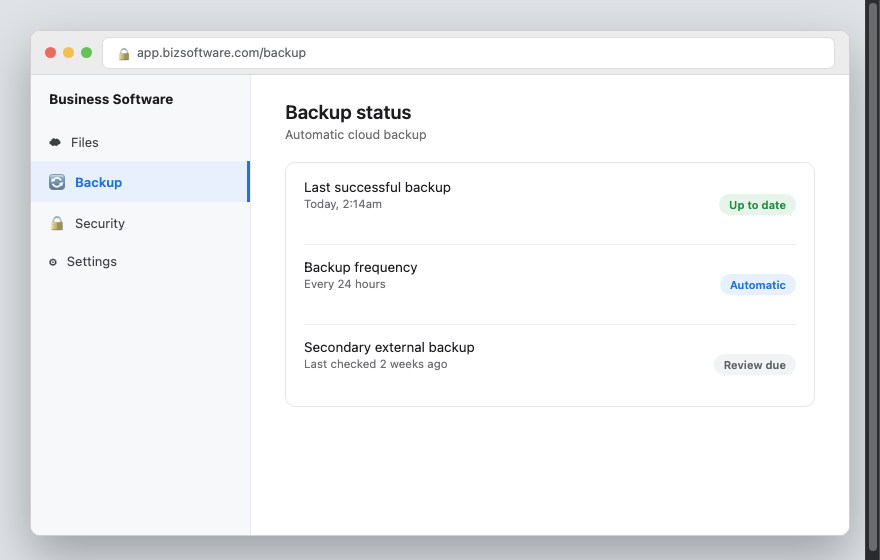

SFINCO GUIDES

VOLUME 6

SMALL BUSINESS PROTECTION

Cyber security for Australian small businesses

---

Author: Leonardo Pinheiro
Series: Sfinco Guides
Volume: 6 of 8
Category: Business Cybersecurity / Small Business Operations
Format: Non-fiction, instructional, plain-English guide
Audience: Small business owners and sole traders, particularly on the Sunshine Coast
Region: Australia (Sunshine Coast, Queensland focus, nationally applicable)

Publisher: Sfinco
Brand colours: Blue #1B4F8A · Amber #C47F00
Website: sfinco.com.au

---

---

Sfinco Guides  ·  Volume 6

Small Business Protection

Cyber security for Australian small businesses

# Introduction

Most cyber security advice is written for large companies with IT departments, dedicated security teams, and budgets to match. If you run a small business, none of that is much use to you. You are the owner, the bookkeeper, the person who answers the phone, and often the person who has to figure out why an invoice looks strange, all before lunch.

Small businesses are not attacked less often than large ones. In many ways, they are attacked more, because criminals know that a small business is less likely to have proper protections in place, and a single successful scam can do real, lasting damage to a business that does not have a large company's cash reserves to absorb the loss.

This is not a technical manual, and it does not assume you have any background in IT. What it is, is a plain-English, practical guide to the handful of things that genuinely matter for protecting your business, your staff, and your customers, written by someone who has spent years in banking and technology helping small businesses on the Sunshine Coast do exactly this.

Whether you run a cafe, a trades business, a small retail shop, or a professional services practice, this book is written for you.

## Who is this book for?

This guide is for small business owners and sole traders who want to protect their business without hiring a full-time IT person or becoming a technical expert themselves. In particular, this guide will be helpful if you:

have ever received an invoice or payment request that felt slightly "off"

manage staff who have access to email, banking, or customer records

store any customer information, whether that is names and addresses or payment details

worry about what would happen to your business if you were locked out of your systems for a day, or a week

want a clear, practical starting point rather than a long list of jargon

## A quick word from the author

I work in banking and technology on the Sunshine Coast in Queensland, and this book grew directly out of conversations with small business owners across Noosa, Tewantin, Eumundi, and Cooroy who had been targeted by scams, and in some cases, had genuinely lost money because of them. The pattern I kept seeing was not a lack of care. It was a lack of a clear, simple starting point.

This book, and the Sfinco Cyber Audit service it complements, exist to close that gap. You do not need to read this cover to cover before you are "allowed" to run your business safely. Start with Chapter 1, work through what is relevant to you, and come back to the rest when you have time.

# How to use this book

This book is designed to be used, not just read. Here is how to get the most out of it.

## Work through it chapter by chapter

Each chapter builds on the one before it, starting with the accounts and passwords that protect everything else, and working through to email security, staff access, scams, backups, and what to do if something goes wrong. If you are starting from scratch, work through Chapter 1 onward in order.

That said, every chapter also stands on its own. If invoice scams are the most urgent concern for your business right now, feel free to jump straight to that chapter.

## Do the steps as you go

This is a book to work through with your accounts open, not to read in one sitting and set aside. Each chapter includes practical steps you can put in place immediately, most of which take less than fifteen minutes.

*  TIP:  If you use a specific piece of software this book does not cover by name, such as a particular accounting package or point-of-sale system, the same underlying principles still apply. Search for the equivalent setting using the terms in this book as a starting point.

## Use the tools at the back of the book

Chapter 8 ends with a one-page monthly security checklist designed for a busy small business owner. Five minutes a month, done consistently, protects you far better than an intensive review done once and never repeated.

The very back of the book also has a Quick Reference Card with emergency contacts and first-response steps, and a Glossary of every term used in this guide.

## A note on regulatory obligations

This book touches on a small number of areas where Australian small businesses have specific legal obligations, particularly around customer data and privacy.

! IMPORTANT: If your business experiences a data breach involving customer personal information, you may have obligations under the Privacy Act 1988 and the Notifiable Data Breaches scheme, administered by the Office of the Australian Information Commissioner (OAIC). This book explains what to do in practical terms in Chapter 7, but if you are ever unsure whether a breach must be reported, seek advice from the OAIC directly at oaic.gov.au, or from a solicitor.

This book does not constitute legal or financial advice, and does not replace a formal cyber security assessment tailored to your specific business.

## What this book does not cover

This guide focuses on the practical, everyday security decisions available to any small business, regardless of size or industry. It does not cover compliance frameworks required of larger or regulated organisations, such as the Australian Privacy Principles in full detail, PCI DSS for businesses processing large volumes of card payments, or industry-specific regulatory obligations. If your business fits any of these categories, this book is a useful starting point, but you should also seek specialist advice.

If you would like a more thorough, tailored assessment of your specific business, Sfinco offers remote SMB Cyber Audits for Sunshine Coast small businesses, see the back of this book for details.

Ready? Chapter 1 starts with why small businesses are targeted at all.

sfinco.com.au

Part of the Sfinco Guides series, protecting Australians online

---

Sfinco Guides  ·  Volume 6: Small Business Protection  ·  Chapter 1

# Why small businesses are targeted

You don't need to be a big company to be worth attacking

| ▶  REAL STORY Dave runs a small landscaping business in Eumundi with four staff. One afternoon, his bookkeeper received an email that appeared to come from Dave himself, asking her to urgently pay a "supplier invoice" of $4,200 to a new bank account before the end of the day, since he was "in a meeting and hard to reach." The email address looked almost right, one letter different from Dave's real one, and the tone matched how Dave usually wrote. She paid it. Dave found out three days later when the real supplier called asking why their invoice was overdue. The money was gone. Dave is not careless, and neither is his bookkeeper. The email simply arrived at a moment when everyone was busy, and looked convincing enough not to question. That is exactly the gap this chapter closes. |

Stories like Dave's are extremely common across small businesses in Australia, and the Sunshine Coast is no exception. Small businesses are often seen as a "smaller" target, but criminals see it differently: fewer defences, less time spent checking things twice, and a genuine chance the loss will not be reported at all.

## What is actually at risk?

To understand why your business is worth targeting, it helps to think about what a successful attack could cost you. It is usually more than the money involved in a single incident.

Your cash flow, a single successful invoice scam can be a genuinely serious loss for a small business

Your customer data, names, addresses, and sometimes payment details, all of which carry legal obligations if exposed

Your email account, often the single most valuable target, since it can be used to impersonate you to staff, suppliers, and customers

Your reputation, customers who hear that your business was compromised may lose confidence, even if no fault lies with you

Your time, recovering from an incident, even a minor one, can consume days you do not have to spare

| ℹ  DID YOU KNOW? The Australian Cyber Security Centre (ACSC) receives a report of a cybercrime roughly every six minutes, and small and medium businesses report a significantly higher average financial loss per incident than individuals. Small businesses are a genuine, ongoing target, not an unlikely edge case. |

## How do attacks actually happen?

Attacks on small businesses generally fall into a small number of well-worn patterns. Understanding them is most of the battle.

Business email compromise (BEC).  A scammer impersonates you, a staff member, or a supplier by email, usually to redirect a payment to a fraudulent account. This is the single most financially damaging scam type for small businesses.

Invoice fraud.  A fake invoice, sometimes for a genuine-looking but entirely fictitious service, or a real invoice with the bank details subtly altered, is sent hoping it will be paid without a second look.

Phishing emails targeting staff.  An email designed to steal a staff member's login details, often disguised as an IT notice, a shared document, or a message from a well-known service like Microsoft 365 or Xero.

Ransomware.  Malware that locks your business's files and systems, demanding payment to restore access, often arriving through a malicious email attachment or an outdated, unpatched system.

Weak or reused passwords.  A password reused across multiple accounts means that if one service is breached, criminals can often access several of your business accounts using the same credentials.

## Why small businesses are targeted more than they realise

Small businesses often assume they are "too small to be worth it." Criminals do not think this way. Automated scam campaigns are sent to thousands of businesses at once, regardless of size, and a small business is frequently an easier target than a large one precisely because it has fewer layers of checking in place, such as a second person required to approve a payment.

## The good news

Every single scam type in this chapter has a straightforward defence, and none of them require hiring an IT department. A simple habit, like verifying any change to payment details by phone before paying, closes the door on the most damaging scam in this chapter entirely.

| ✓  WELL DONE IF YOU HAVE THIS If your business already requires a phone call to verify any change of bank details before paying an invoice, you are already protected against the single most costly scam facing small businesses today. |

The rest of this book walks through exactly what to check, one chapter at a time, starting with the accounts and passwords that protect everything else in your business.

---

Sfinco Guides  ·  Volume 6: Small Business Protection  ·  Chapter 2

# Locking the front door

Passwords, multi-factor authentication, and the single change that stops most account takeovers

Every protection in this book sits behind one gate: the login screen of your business accounts, email, banking, accounting software, and anything else your business relies on. This chapter covers the layers that make that gate a genuine barrier.

## Layer 1, Strong, unique passwords

A strong password is long, not reused anywhere else, and not something easily guessed from public information about you or your business, such as your business name or ABN.

★  TIP:  A passphrase of four or five random words, such as "correct horse battery staple," is both easier to remember and harder to crack than a short password with substituted symbols like "P@ssw0rd1."

| ⚠  WARNING If any staff member reuses their personal email password for a business account, a breach of an unrelated website they use personally can hand an attacker direct access to your business systems. This is one of the most common ways small business accounts are compromised. |

## Layer 2, A password manager for the whole business

Remembering a unique, strong password for every business account is unrealistic without help. A password manager generates and stores strong passwords, and can share specific logins with staff without them ever seeing the actual password in plain text.

| Password manager | Cost | Best for |
| --- | --- | --- |
| Bitwarden | Free / ~AU$5/mo per user for teams | Best value, open source, solid free tier for solo operators |
| 1Password | ~AU$10/mo per user | Easiest to use, excellent for small teams, strong sharing features |
| Dashlane | ~AU$8/mo per user | Good all-rounder with built-in dark web monitoring |

| ℹ  DID YOU KNOW? A password manager also protects your business if a staff member leaves. Instead of trying to remember every account they had access to, you can revoke their access to shared logins from one place, without needing to change every password individually. |

## Layer 3, Multi-factor authentication (MFA)

Multi-factor authentication (also called two-factor authentication) requires a second step beyond your password, usually a code from an app or a prompt on your phone, to sign in. This single change is the most effective step in this entire book.

★  TIP:  Turn on MFA for your email first. Email is usually the "master key" that can be used to reset passwords for everything else, which makes it the single most important account to protect.

| ✓  WELL DONE IF YOU HAVE THIS If MFA is turned on for your business email, your accounting software, and your online banking, you have closed the door on the vast majority of account takeover attempts, even if a password is ever guessed or leaked. |

## Setting expectations with staff

Even the best technical protections rely on staff understanding a few simple rules. Put these in writing, even informally, and revisit them when you bring on new staff.

Never share passwords by text, email, or sticky note

Always use the password manager, rather than a personal notebook or spreadsheet

Turn on MFA on any account that offers it

Report anything that looks suspicious immediately, rather than trying to handle it alone

## Quick review, your chapter 2 checklist

| Done | Item |
| --- | --- |
| ☐ | All business accounts use strong, unique passwords |
| ☐ | A password manager is set up for the business |
| ☐ | MFA is turned on for business email, banking, and accounting software |
| ☐ | Staff understand the business's basic password rules |

With your accounts locked down, the next chapter looks specifically at email security, the single most targeted part of any small business.

---

Sfinco Guides  ·  Volume 6: Small Business Protection  ·  Chapter 3

# Email security and protecting your domain

The single most targeted part of any small business, and the settings most owners never check

Email is where almost every scam in this book eventually arrives. This chapter covers the handful of settings that make your business email significantly harder to impersonate or break into.

## Checking for suspicious forwarding rules

One of the most common ways criminals maintain access after breaking into an email account is by quietly setting up a forwarding rule that sends a copy of every email, including invoices and password resets, to an address you have never heard of.

Settings path (Microsoft 365):  Outlook  >  Settings  >  Mail  >  Forwarding.

Settings path (Google Workspace):  Gmail  >  Settings  >  See all settings  >  Forwarding and POP/IMAP.

*Mockup illustration, styled to match a typical business email admin panel, reshoot using your actual email provider before final layout.*

| ⚠  WARNING If you find a forwarding rule you did not set up, treat this as a serious sign your account has been compromised. Remove the rule, change your password immediately, and turn on MFA if it is not already active. |

## Checking sign-in activity

Most business email providers keep a log of recent sign-ins, including the approximate location and device used. Reviewing this occasionally can reveal an unauthorised sign-in before it causes real damage.

Settings path (Microsoft 365):  Outlook  >  My Account  >  Security info  >  Recent activity.

Settings path (Google Workspace):  Google Account  >  Security  >  Your devices.

*Mockup illustration, styled to match a typical business email admin panel, reshoot using your actual email provider before final layout.*

★  TIP:  If you see a sign-in from a country your business has no connection to, change your password immediately and review your forwarding rules and connected apps.

## Domain protections, SPF, DKIM, and DMARC in plain English

These three settings, configured once by whoever manages your website or email hosting, make it significantly harder for a scammer to send an email that appears to come from your business's own domain.

| Setting | What it does in plain English |
| --- | --- |
| SPF | Lists which mail servers are allowed to send email on behalf of your domain |
| DKIM | Digitally signs your outgoing emails so recipients can verify they genuinely came from you |
| DMARC | Tells receiving mail servers what to do with emails that fail the SPF or DKIM checks, such as rejecting them |

| ℹ  DID YOU KNOW? Without DMARC configured, a scammer can send an email that appears to come from your exact business email address, even though they do not have access to your account at all. This is a common tactic used against customers and suppliers of small businesses. |

If you are not sure whether these are set up for your domain, ask whoever manages your website hosting or email, or mention it during a Sfinco Cyber Audit.

## Safer everyday email habits

Beyond the technical settings, a handful of habits meaningfully reduce risk for any small business.

Verify any change to payment details by phone, using a number you already have on file, never one provided in the email itself

Be cautious of urgency, particularly requests marked "urgent" or asking you to bypass your normal process

Check the actual sender address, not just the display name, since these can differ

Avoid opening unexpected attachments, particularly invoices or "remittance advice" from senders you were not expecting

## Quick review, your chapter 3 checklist

| Done | Item |
| --- | --- |
| ☐ | I have checked for unexpected email forwarding rules |
| ☐ | I have reviewed recent sign-in activity on business email accounts |
| ☐ | SPF, DKIM, and DMARC are configured for my business domain, or I have asked my provider to confirm this |
| ☐ | Staff know to verify payment detail changes by phone before paying |

With your email locked down, the next chapter looks at staff access, and making sure people only have the access they actually need.

---

Sfinco Guides  ·  Volume 6: Small Business Protection  ·  Chapter 4

# Staff access worth trimming

Who can see what, and the offboarding step almost every business forgets

Every staff member with access to an account, a shared drive, or a piece of software is a potential way in for a scammer, whether through their own mistake or because their access was never removed after they left. This chapter covers keeping access matched to who actually needs it.

## The principle of least privilege, in plain English

Least privilege simply means giving each person access to only what they need to do their job, no more. A casual staff member taking phone bookings does not need access to your accounting software's bank feed. A bookkeeper does not need admin access to your website.

*Mockup illustration, styled to match a typical business admin panel, reshoot using your actual software before final layout.*

| ℹ  DID YOU KNOW? Most accounting, email, and point-of-sale platforms let you assign different permission levels to different staff, such as "view only," "can invoice," or "full admin," rather than giving everyone the same access. |

## Reviewing who has access to what

Settings path: this varies by platform, but is usually found under Settings > Users, Team, or Staff within whatever accounting, email, or point-of-sale software your business uses.

*Mockup illustration, styled to match a typical business admin panel, reshoot using your actual software before final layout.*

★  TIP:  Set a reminder to review staff access every six months. Roles change, responsibilities shift, and access that made sense a year ago may no longer be appropriate.

## The offboarding step almost every business forgets

When a staff member leaves, whether on good terms or not, their access to every business account should be removed on their last day, not "at some point."

| ⚠  WARNING A former staff member who still has access to your email, banking, or customer records, even without malicious intent, represents a real and unnecessary risk. Access should be removed the same day someone leaves, as a standard part of your offboarding process, every time. |

A simple offboarding checklist, kept somewhere handy, makes this consistent rather than dependent on remembering everything under pressure.

| Done | Step |
| --- | --- |
| ☐ | Remove access to business email |
| ☐ | Remove access to accounting or point-of-sale software |
| ☐ | Remove access to shared drives or documents |
| ☐ | Change any shared passwords they knew |
| ☐ | Collect any business devices, keys, or access cards |

## Shared logins, a habit worth breaking

It is common in small businesses for everyone to share a single login to a piece of software, for convenience. This makes it impossible to know who did what, and means removing one person's access requires changing the password for everyone.

| ✓  WELL DONE IF YOU HAVE THIS If every staff member has their own individual login for your business's key systems, rather than sharing one account between several people, you already have far better visibility and control than most small businesses. |

## Quick review, your chapter 4 checklist

| Done | Item |
| --- | --- |
| ☐ | Staff access matches what each person actually needs |
| ☐ | I have an offboarding checklist for when someone leaves |
| ☐ | Access is reviewed at least every six months |
| ☐ | Staff have individual logins rather than shared accounts, wherever possible |

With access under control, the next chapter looks at the scams most likely to target your business directly.

---

Sfinco Guides  ·  Volume 6: Small Business Protection  ·  Chapter 5

# Scams targeting small businesses

How to spot them, what to do, and how to recover if you paid

## Why scams work, the psychology behind them

Every scam in this chapter relies on the same handful of psychological triggers: urgency, authority, and the everyday busyness of running a small business. A message that arrives at a genuinely busy moment, appears to come from someone you trust, and asks for something that sounds routine, is designed to make you skip the one step that would protect you, stopping to verify.

## The scams most likely to reach your business

Here are the most common scam types currently targeting Australian small businesses, with real examples of what they look like.

1. Fake "urgent payment" emails from the boss

An email appears to come from the business owner, often while they are known to be travelling or unreachable, asking a staff member to make an urgent payment.

| From: "Dave" (spoofed) |

| Hi, I'm stuck in meetings all day and can't take calls. Need you to pay this supplier invoice urgently before 3pm, new account details attached. Don't mention it to anyone else yet, it's a bit sensitive. Thanks |

*Illustrative mockup, not a real message, built to show the pattern.*

| ✶  CRITICAL, READ THIS CAREFULLY Any request to keep a payment "quiet," bypass your normal approval process, or act with unusual urgency should be treated as a serious warning sign, regardless of who it appears to be from. Always verify by phone, using a number you already have, before paying. |

2. Changed bank details from a "supplier"

An email, apparently from a genuine, regular supplier, advises that their bank account details have changed ahead of the next invoice.

| Supplier Accounts Team |

| Please note our bank account details have changed as of this month. Please update your records and use the new BSB and account number below for all future payments. |

*Illustrative mockup, not a real supplier message, built to show the pattern.*

Always confirm any change of bank details by phone, calling a number you already have on file for that supplier, never a number provided in the email itself.

3. Fake ATO or ASIC compliance emails

An email claims to come from the Australian Taxation Office or ASIC, warning of an overdue payment, a compliance issue, or an ABN that will be cancelled unless action is taken immediately.

| ATO |

| Your business has an outstanding compliance matter. Failure to respond within 24 hours may result in penalties or suspension of your ABN. Click here to resolve: ato-compliance-portal.info |

*Illustrative mockup, not a real ATO message, built to show the pattern.*

The ATO and ASIC do not send emails threatening immediate ABN cancellation with a link to click. If you are ever concerned about a genuine compliance matter, log in directly to your myGovID or ASIC Connect account, or call the ATO or ASIC using their official published numbers.

4. Fake domain or business listing renewal notices

An email or letter, styled to look official, warns that your business's website domain or online directory listing is about to expire, asking for immediate payment, often at a significantly inflated price.

| Domain Registry Notice |

| Your domain registration is due to expire. Renew now to avoid losing your website and business email: domain-renewal-notice.net |

*Illustrative mockup, not a real registrar message, built to show the pattern.*

★  TIP:  Check your domain's actual renewal date and provider directly, rather than through a link in an unsolicited email. Genuine renewal notices come from the registrar you originally purchased the domain through.

5. Fake Google or Facebook ad account suspension

An email or ad claims your Google Ads or Facebook Business account has been suspended or flagged, asking you to click a link and log in to "verify" your account.

| Meta Business Support |

| Your Business account has been restricted due to a policy violation. Verify your account within 24 hours to avoid permanent suspension. |

*Illustrative mockup, not a real Meta message, built to show the pattern.*

| ⚠  WARNING Clicking a link like this and entering your login details can hand a scammer full control of your business's advertising account, including the ability to spend your advertising budget on their own campaigns. Log in directly through the official app or website instead, never through a link in an email or ad. |

## The universal red flag checklist

Regardless of which scam you encounter, the same warning signs tend to appear.

You are asked to act with unusual urgency, or to bypass your normal process

You are asked to keep the request confidential or unusual for your normal workflow

A change of payment details arrives by email, with no phone confirmation offered or requested

The sender's actual email address does not quite match the organisation's real domain

You are asked to click a link and log in to "verify" or "resolve" something

## What to do if you think your business has paid a fraudulent invoice

Contact your bank immediately. Banks can sometimes recall a payment if it is reported within hours, though this becomes far less likely after a day or two. Contact the genuine supplier directly, using a number you already have, to confirm what happened. Report the incident to Scamwatch at scamwatch.gov.au and to ReportCyber at cyber.gov.au. If any customer personal information may have been exposed as part of the incident, review your obligations under the Notifiable Data Breaches scheme, covered in more detail in Chapter 7.

## Quick review, your chapter 5 checklist

| Done | Item |
| --- | --- |
| ☐ | Staff know to verify urgent payment requests by phone, even from "the boss" |
| ☐ | Any change of supplier bank details is confirmed by phone before paying |
| ☐ | I know that the ATO and ASIC never threaten immediate action by email with a click-through link |
| ☐ | I check domain and listing renewals directly with my actual provider |
| ☐ | I log in to Google, Meta, and similar business accounts directly, never through an email link |

With scams covered, the next chapter looks at keeping your business's network and remote access safe.

---

Sfinco Guides  ·  Volume 6: Small Business Protection  ·  Chapter 6

# Wi-Fi, point-of-sale, and remote access

Keeping your network, your till, and your remote staff safe

Most small businesses run at least one Wi-Fi network, often a point-of-sale system, and increasingly, at least one staff member working remotely some of the time. This chapter covers the settings that keep all three genuinely safe.

## Separating customer Wi-Fi from your business network

If you offer Wi-Fi to customers, it should run on a completely separate network from the one your point-of-sale system, computers, and business devices use.

Settings path: usually found in your router or modem's admin panel under Guest Network or a similar name.

*Mockup illustration, styled to match a typical router admin panel, reshoot using your actual equipment before final layout.*

| ⚠  WARNING If customers and your point-of-sale system share the same Wi-Fi network, a compromised customer device could potentially be used to access your business systems. A separate guest network closes this off entirely, and takes most routers only a few minutes to set up. |

## Keeping your point-of-sale system on its own network

Beyond separating customer Wi-Fi, your point-of-sale or EFTPOS system should ideally sit on its own dedicated network, separate even from the computers your staff use for email and general business tasks.

*Mockup illustration, styled to match a typical router admin panel, reshoot using your actual equipment before final layout.*

★  TIP:  If you are not sure how to set this up, ask your point-of-sale provider or internet provider for help. Most business-grade routers support multiple separate networks, and providers are usually happy to assist with initial setup.

## Changing default router and admin passwords

Every router and point-of-sale system ships with a default administrator password, widely published online. If this has never been changed, anyone who can guess or look up the default can potentially access your network's settings directly.

Settings path: usually found in your router or point-of-sale system's admin panel under Administration or System.

*Mockup illustration, styled to match a typical router admin panel, reshoot using your actual equipment before final layout.*

| ℹ  DID YOU KNOW? Default router passwords for most makes and models are freely available online with a simple search, meaning an unchanged default password offers essentially no protection at all. |

## Remote access for staff working from home

If any staff member accesses business systems from home or on the road, a VPN adds a meaningful layer of protection, particularly if they are ever using public Wi-Fi.

| VPN Provider | Cost | Best for |
| --- | --- | --- |
| ProtonVPN Business | ~AU$10/mo per user | Strong privacy focus, straightforward team management |
| NordLayer | ~AU$12/mo per user | Built specifically for small business teams |
| Tailscale | Free for small teams | Simple, secure connection between staff devices and business systems |

*Mockup illustration, styled to match a typical VPN app, reshoot using your actual software before final layout.*

| ✓  WELL DONE IF YOU HAVE THIS If remote staff already connect through a VPN before accessing business email, files, or point-of-sale data, you have closed off one of the more common ways businesses are compromised through home or public Wi-Fi. |

## Quick review, your chapter 6 checklist

| Done | Item |
| --- | --- |
| ☐ | Customer Wi-Fi is separate from the business network |
| ☐ | Point-of-sale devices are on their own dedicated network |
| ☐ | Default router and admin passwords have been changed |
| ☐ | Remote staff use a VPN to access business systems |

With your network settings squared away, the next chapter covers backups and what to do if your business is ever affected by a breach or ransomware.

---

Sfinco Guides  ·  Volume 6: Small Business Protection  ·  Chapter 7

# Backups and incident response

Setting up your safety net, and what to do if something goes wrong

A ransomware attack or a serious data breach is stressful enough without also discovering your business has no way to recover its files, or no clear idea of what to do next. This chapter covers backups, and a calm, practical response plan.

## The 3-2-1 backup rule, in plain English

A reliable backup strategy for a small business follows a simple rule: keep three copies of your data, on two different types of storage, with one copy kept somewhere separate from your main location.

In practice, for most small businesses, this means your working files, an automatic cloud backup (through your accounting software, Microsoft 365, or Google Workspace), and a separate external drive or secondary cloud backup kept genuinely independent of your main systems.

| ℹ  DID YOU KNOW? Ransomware specifically targets connected backups where possible. A backup drive that stays permanently plugged into your main computer offers far less protection than one that is disconnected when not actively backing up. |

## Checking your current backup is actually working

Settings path: this varies by platform, but most cloud accounting, email, and file storage services show a "last backed up" or "last synced" date somewhere in their settings.

*Mockup illustration, styled to match a typical cloud backup admin panel, reshoot using your actual software before final layout.*

★  TIP:  Do not assume a backup is working simply because you set it up once. Check the actual "last backup" date every few months, and periodically confirm you can genuinely restore a file from it.

## Ransomware, what it is and how to reduce the damage

Ransomware is malware that encrypts your business's files and demands payment to unlock them. The single best defence is a backup that ransomware cannot also reach and encrypt, combined with staff who know not to open unexpected attachments.

| ⚠  WARNING If your business is ever affected by ransomware, do not pay the ransom. Payment does not guarantee your files will be restored, and it funds further criminal activity. Disconnect affected devices from the network immediately, and seek help from a trusted IT professional or the Australian Cyber Security Centre. |

## Data breaches and your obligations under the Privacy Act

If your business experiences a breach that exposes customer personal information, such as names, addresses, or payment details, you may have obligations under the Privacy Act 1988 and the Notifiable Data Breaches (NDB) scheme, administered by the Office of the Australian Information Commissioner (OAIC).

! IMPORTANT: The NDB scheme generally requires businesses to notify affected individuals and the OAIC if a data breach is likely to result in serious harm. Whether your specific business is covered, and whether a particular incident meets this threshold, depends on your circumstances. If you are ever unsure, contact the OAIC directly at oaic.gov.au, or seek advice from a solicitor. This book provides general guidance only and is not a substitute for professional legal advice.

## The first sixty minutes, what to do if something goes wrong

If your business is ever affected by a breach, ransomware, or a serious scam, the steps below are designed to be followed calmly, in order.

| Time | What to do |
| --- | --- |
| 0–10 min | Disconnect affected devices from the network, without turning them off, to preserve evidence |
| 10–20 min | Change passwords for any potentially affected accounts, from a separate, unaffected device |
| 20–30 min | Contact your bank if any payment or banking information may be affected |
| 30–45 min | Report the incident to ReportCyber at cyber.gov.au and, if applicable, Scamwatch at scamwatch.gov.au |
| 45–60 min | Consider whether the incident is notifiable under the Privacy Act, and seek advice from the OAIC or a solicitor if unsure |

★  TIP:  Write down the key contact details below before you ever need them, not while you are already dealing with an incident.

## A note on cyber insurance

Cyber insurance policies for small businesses have become significantly more accessible in recent years, and can cover costs including data recovery, legal advice, and business interruption following an incident. If your business handles customer data or processes payments, it is worth asking your existing insurance broker whether a cyber insurance policy is available and appropriate for your size of business.

## Quick review, your chapter 7 checklist

| Done | Item |
| --- | --- |
| ☐ | My business backup follows the 3-2-1 rule |
| ☐ | I have checked the actual "last backup" date within the past month |
| ☐ | I know not to pay a ransomware demand, and who to contact instead |
| ☐ | I understand my business's potential obligations under the Notifiable Data Breaches scheme |
| ☐ | I have asked my insurance broker about cyber insurance |

With a proper backup and response plan ready to go, the final chapter brings everything together into a fifteen-minute monthly routine.

---

Sfinco Guides  ·  Volume 6: Small Business Protection  ·  Chapter 8

# Your 15-minute small business security checkup

A simple monthly routine to keep your business protected for years to come

You have now worked through every major layer of small business security: your accounts and passwords, email security, staff access, scam awareness, your network and remote access, and your backups and incident response plan. This final chapter brings all of it together into one simple monthly habit.

| ℹ  DID YOU KNOW? Set a recurring reminder right now, the first Monday of every month works well for most business owners. Open your calendar app, create a new reminder called 'Business security checkup', and set it to repeat monthly. This is the single most important step in this chapter: the checklist only works if you actually come back to it. |

## The complete monthly checklist

Work through this list with your accounts open. Each item references the chapter where you can find full instructions if you need a refresher.

### Accounts and passwords

| Done | Item | Chapter |
| --- | --- | --- |
| ☐ | All business accounts still use strong, unique passwords | Ch. 2 |
| ☐ | MFA remains active on email, banking, and accounting software | Ch. 2 |

### Email security

| Done | Item | Chapter |
| --- | --- | --- |
| ☐ | No unexpected forwarding rules on business email | Ch. 3 |
| ☐ | Recent sign-in activity looks normal | Ch. 3 |

### Staff access

| Done | Item | Chapter |
| --- | --- | --- |
| ☐ | Staff access still matches what each person needs | Ch. 4 |
| ☐ | Any staff who left have had access fully removed | Ch. 4 |

### Scam awareness

| Done | Item | Chapter |
| --- | --- | --- |
| ☐ | No payment made this month without phone verification of bank details | Ch. 5 |
| ☐ | Staff have not clicked a suspicious link this month, or followed the recovery steps if they did | Ch. 5 |

### Network and remote access

| Done | Item | Chapter |
| --- | --- | --- |
| ☐ | Customer Wi-Fi remains separate from the business network | Ch. 6 |
| ☐ | Remote staff are still using a VPN to access business systems | Ch. 6 |

### Backups

| Done | Item | Chapter |
| --- | --- | --- |
| ☐ | Backup shows a successful, recent date | Ch. 7 |
| ☐ | I could describe my incident response plan from memory if asked | Ch. 7 |

## Two new habits worth adding

Beyond the checklist, two ongoing habits are worth building in.

Review your Sfinco Cyber Audit findings annually.  If your business has completed a Sfinco SMB Cyber Audit, revisit the findings once a year, since both your business and the threat landscape change over time.

Talk to your staff about scams regularly, not just once.  A five-minute conversation at a team meeting about a recent scam trend keeps awareness fresh in a way a one-off induction session never quite manages.

## A final word

Security is not a single project you finish and forget. It is a small, repeated habit, the same way you would reconcile your accounts or check your stock levels. Fifteen minutes a month, done consistently, will protect your business far better than an intense afternoon of changes done once and never revisited.

| ✓  WELL DONE You have completed Sfinco Guides Volume 6: Small Business Protection. Your business is now meaningfully more secure than it was when you started this book. Well done. Genuinely. |

Continuing your Sfinco journey:  The Sfinco Guides series continues with Volume 7 (NGO and Not-for-Profit Protection), and Volume 8 (Personal Finance Protection), each written in the same plain-English, step-by-step style. See the final pages of this book for details.

---

Sfinco Guides  ·  Volume 6

## Glossary

These are the key terms used throughout this book, explained in plain English. You do not need to memorise them, this section is here to help if you encounter a word and want a clear definition.

| Term | Definition |
| --- | --- |
| BEC (Business Email Compromise) | A scam where a criminal impersonates a trusted person or organisation by email, usually to redirect a payment |
| DKIM | A setting that digitally signs your outgoing emails so recipients can verify they genuinely came from you |
| DMARC | A setting that tells receiving mail servers what to do with emails that fail SPF or DKIM checks |
| Least privilege | The principle of giving each person access only to what they genuinely need for their role |
| MFA (Multi-factor authentication) | A security method requiring both your password and a second step, such as a code or prompt, to sign in |
| NDB scheme | The Notifiable Data Breaches scheme, which may require businesses to report certain data breaches to the OAIC and affected individuals |
| OAIC | The Office of the Australian Information Commissioner, which administers the Privacy Act 1988 and the NDB scheme |
| Password manager | Software that generates and securely stores strong, unique passwords for every account |
| Phishing | A scam that impersonates a trusted organisation, via email, to trick you into handing over personal or financial information |
| Ransomware | Malware that encrypts your files and demands payment to unlock them |
| Scamwatch | The Australian government's national scam reporting service, run by the ACCC |
| SPF | A setting that lists which mail servers are allowed to send email on behalf of your domain |
| VPN (Virtual Private Network) | A service that encrypts internet traffic and routes it through a secure server, particularly useful for remote staff |

Sfinco Guides  ·  Volume 6

## Quick reference card

Cut out or photograph this page and keep it somewhere handy. These are the numbers and steps you are most likely to need in a hurry.

### Emergency contacts

| Contact | Details |
| --- | --- |
| My bank's business fraud line | _________________________________ |
| Scamwatch (ACCC) | scamwatch.gov.au · 1300 302 502 |
| ReportCyber (ACSC) | cyber.gov.au · 1300 292 371 |
| OAIC (data breach guidance) | oaic.gov.au · 1300 363 992 |
| IDCARE (identity support) | idcare.org · 1800 595 160 |

### My business details

| Detail | Your information |
| --- | --- |
| My genuine supplier bank details (verified) | _________________________________ |
| Business email provider support | _________________________________ |
| IT support contact | _________________________________ |
| Backup, last checked | _________________________________ |

### If you suspect a fraudulent payment

| Step | What to do |
| --- | --- |
| 1. Call your bank immediately | Ask about a payment recall |
| 2. Call the genuine supplier | Using a number you already have, not from the email |
| 3. Report it | scamwatch.gov.au and cyber.gov.au |
| 4. Review affected accounts | Change passwords, check for forwarding rules |

### If you suspect a data breach

| Step | What to do |
| --- | --- |
| 1. Disconnect affected devices | Without turning them off |
| 2. Assess what data may be affected | Customer records, payment details, etc. |
| 3. Consider NDB obligations | oaic.gov.au or a solicitor |
| 4. Notify affected individuals if required | As guided by the OAIC |

Sfinco Guides  ·  Volume 6

## Monthly security checkup

15 minutes · First Monday of every month

Month / Year: _________________     Completed by: _________________

### 🔐 Accounts and passwords

| Done | Item | Chapter |
| --- | --- | --- |
| ☐ | Strong, unique passwords in use | Ch 2 |
| ☐ | MFA active on key accounts | Ch 2 |

### 📧 Email security

| Done | Item | Chapter |
| --- | --- | --- |
| ☐ | No unexpected forwarding rules | Ch 3 |
| ☐ | Sign-in activity reviewed | Ch 3 |

### 👥 Staff access

| Done | Item | Chapter |
| --- | --- | --- |
| ☐ | Access matches current roles | Ch 4 |
| ☐ | Departed staff fully offboarded | Ch 4 |

### 🚨 Scams

| Done | Item | Chapter |
| --- | --- | --- |
| ☐ | Payment details verified by phone this month | Ch 5 |

### 🛰 Network and remote access

| Done | Item | Chapter |
| --- | --- | --- |
| ☐ | Guest and business Wi-Fi separated | Ch 6 |
| ☐ | Remote staff using VPN | Ch 6 |

### 💾 Backups

| Done | Item | Chapter |
| --- | --- | --- |
| ☐ | Backup successful and recent | Ch 7 |
| ☐ | Incident response plan reviewed | Ch 7 |

sfinco.com.au · Vol 6 Small Business Protection

## Sfinco Guides, the complete series

More books in the series

The Sfinco Guides series is designed to cover every device and situation you are likely to encounter. Each book follows the same plain-English, step-by-step format, with real Australian examples, screenshots, and no technical jargon.

### Series 1, Personal protection

| Volume | What it covers |
| --- | --- |
| Vol 1 Available now | iPhone Protection. Your simple guide to staying safe online. Passcode · Face ID · Apple ID · App permissions · Scams · Wi-Fi · Find My |
| Vol 2 Available now | MacBook Protection. Securing your Mac in plain English. Login & FileVault · Gatekeeper · Apple ID · Scams · Firewall & VPN · Time Machine |
| Vol 3 Available now | Family and Home Network Protection. Keeping everyone safe under one roof. Router security · guest Wi-Fi · smart devices · scams · parental controls |
| Vol 4 Available now | Windows Protection. A plain-English guide for Windows users. Sign-in & BitLocker · Microsoft account · Defender · Scams · Firewall & VPN · Backups |
| Vol 5 Available now | Android Protection. Staying safe on your Android phone. Play Protect · app permissions · Google account · 2FA · scam texts and calls |

### Series 2, Organisational protection

| Volume | What it covers |
| --- | --- |
| Vol 6 Available now | Small Business Protection. Cyber security for Australian small businesses. Email security · staff access · backups · scam invoices · incident response |
| Vol 7 Coming soon | NGO and Not-for-Profit Protection. Protecting organisations that protect others. Volunteer access · donor data · email compromise · free tools for small teams |
| Vol 8 Coming soon | Personal Finance Protection. Protecting your money in a digital world. Banking security · investment scams · superannuation · password managers · wills |

| ★  TIP All Sfinco Guides are available on Amazon (search 'Sfinco Guides' or scan the QR code on the next page). Paperback and e-book editions are available. Bulk copies for local business networks, chambers of commerce, and industry associations are available directly through sfinco.com.au, contact us for pricing. |

## Connect with us

Scan to continue your Sfinco journey.

Each QR code below links to a different part of the Sfinco ecosystem. Scan any of them with your phone's camera to go directly to the relevant page.

| Where it takes you | What you'll find |
| --- | --- |
| [ QR CODE ] WEBSITE | Visit the Sfinco website, free resources, guides, blog, and updates on new books in the series sfinco.com.au |
| [ QR CODE ] CYBER AUDIT | Book a Sfinco SMB Cyber Audit, a remote-first cyber security risk assessment for Sunshine Coast small businesses sfinco.com.au/business |
| [ QR CODE ] ALL BOOKS | Browse all Sfinco Guides, the complete series on Amazon and direct from our website sfinco.com.au/guides |
| [ QR CODE ] TECH HELP | Book a Senior Tech Concierge session, in-person help with your devices on the Sunshine Coast sfinco.com.au/concierge |
| [ QR CODE ] FREE DOWNLOAD | Free printable resources, scam reference card, monthly checklist, and more (no sign-up required) sfinco.com.au/resources |

| ℹ  NOTE QR codes are scanned using your phone's camera app, no separate app needed. All Sfinco links are safe and will never ask for payment details. |

Sfinco Guides  ·  Volume 6

## About the author

The author of the Sfinco Guides series works in banking and technology on the Sunshine Coast in Queensland, with nearly two decades of experience across customer service, financial services, and digital security.

Holding qualifications in cybersecurity (CompTIA Security+), financial advising (RG146), and information technology, and completing further studies at CQUniversity, the author brings together a rare combination of technical knowledge and the ability to explain it clearly to people who have no interest in becoming technical experts.

The inspiration for this series came from years of seeing the same pattern: intelligent, capable, careful people and businesses being harmed by scams and digital threats, not because they were careless, but because nobody had ever given them a clear, practical guide to protecting themselves. That gap is what these books, and the Sfinco SMB Cyber Audit service, exist to close.

The author also volunteers with CoderDojo, teaching digital skills to young people on the Sunshine Coast, and has a background in community technology education across Australia and internationally.

Sfinco was founded on the belief that every Australian, and every Australian small business, deserves to feel safe and confident in their digital life, regardless of size, technical background, or budget.

| Sfinco Protecting Australians through technology, money, and trust. sfinco.com.au Noosa · Sunshine Coast · Queensland · Australia |

## Publication details

Sfinco Guides is published by Sfinco · ABN [to be added]

First published 2026 · © Sfinco · All rights reserved

No part of this publication may be reproduced without written permission from the publisher.

The information in this book is provided for general guidance only and does not constitute professional legal, financial, or cybersecurity advice.