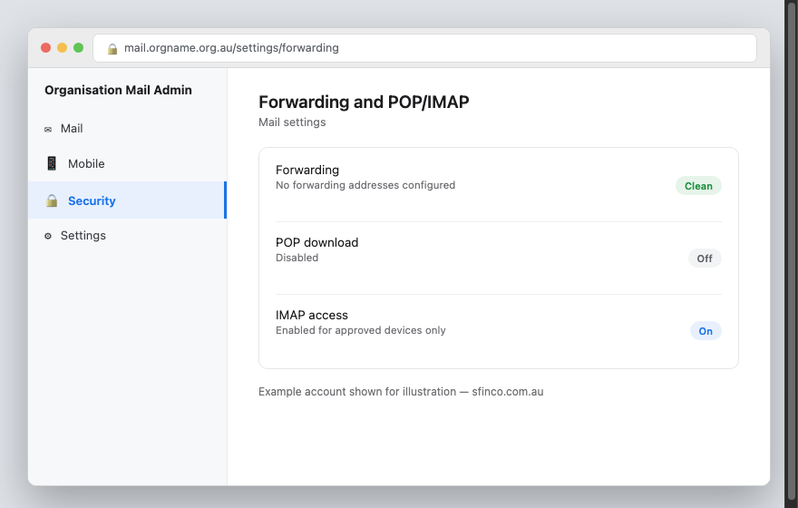
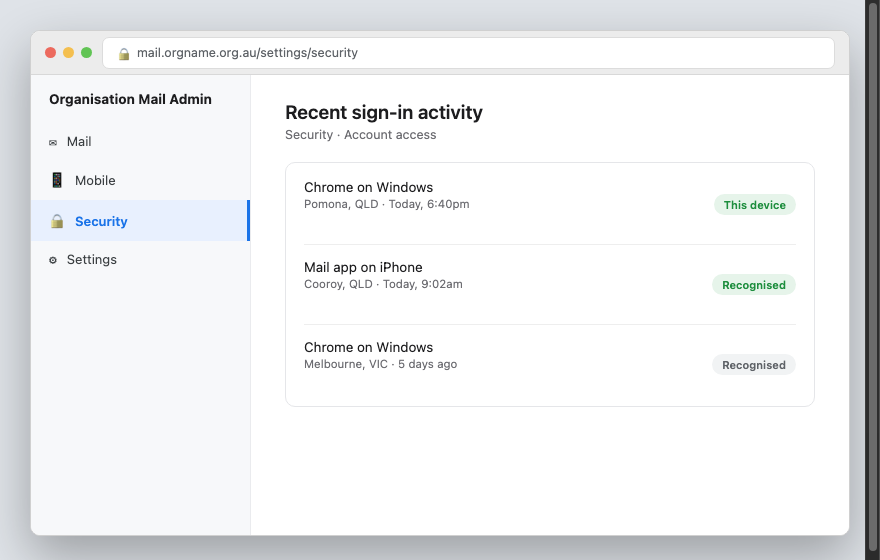

Sfinco Guides  ·  Volume 7 — NGO and Not-for-Profit Protection  ·  Chapter 3

# Email security and protecting your domain

The single most targeted part of any community organisation, and the settings most committees never check

Email is where almost every scam in this book eventually arrives, and it is also how your organisation communicates with the donors and members who trust you. This chapter covers the handful of settings that make your organisation's email significantly harder to break into or impersonate.

## Checking for suspicious forwarding rules

One of the most common ways criminals maintain access after breaking into an email account is by quietly setting up a forwarding rule that sends a copy of every email, including donor correspondence and password resets, to an address nobody on the committee recognises.

Settings path (Microsoft 365):  Outlook  >  Settings  >  Mail  >  Forwarding.

Settings path (Google Workspace):  Gmail  >  Settings  >  See all settings  >  Forwarding and POP/IMAP.

*Mockup illustration, styled to match a typical organisational email admin panel — reshoot using your actual email provider before final layout.*

| ⚠  WARNING If you find a forwarding rule nobody on the committee set up, treat this as a serious sign the account has been compromised. Remove the rule, change the password immediately, and turn on MFA if it is not already active. |

## Checking sign-in activity

Most organisational email providers keep a log of recent sign-ins, including the approximate location and device used. Reviewing this occasionally, particularly for shared committee accounts, can reveal an unauthorised sign-in before it causes real damage.

Settings path (Microsoft 365):  Outlook  >  My Account  >  Security info  >  Recent activity.

Settings path (Google Workspace):  Google Account  >  Security  >  Your devices.

*Mockup illustration, styled to match a typical organisational email admin panel — reshoot using your actual email provider before final layout.*

★  TIP:  If you see a sign-in from a location no committee member has any connection to, change the password immediately and review forwarding rules and connected apps.

## Domain protections — SPF, DKIM, and DMARC in plain English

These three settings, configured once by whoever manages your organisation's website or email hosting, make it significantly harder for a scammer to send an email that appears to come from your organisation's own domain, protecting your donors from impersonation scams.

| Setting | What it does in plain English |
| --- | --- |
| SPF | Lists which mail servers are allowed to send email on behalf of your domain |
| DKIM | Digitally signs your outgoing emails so recipients can verify they genuinely came from you |
| DMARC | Tells receiving mail servers what to do with emails that fail the SPF or DKIM checks, such as rejecting them |

| ℹ  DID YOU KNOW? Without DMARC configured, a scammer can send an email that appears to come from your exact organisational email address, even without access to your account at all. This has been used to send fake donation requests that appear to genuinely come from well-known charities. |

If you are not sure whether these are set up for your domain, ask whoever manages your website hosting or email, or a technically minded volunteer or board member.

## Safer everyday email habits for committees

Beyond the technical settings, a handful of habits meaningfully reduce risk for any community organisation.

Verify any payment request by phone, using a number you already have on file, never one provided in the email itself

Be cautious of urgency, particularly requests marked "urgent" or asking you to bypass your normal approval process

Check the actual sender address, not just the display name, since these can differ

Avoid opening unexpected attachments, particularly invoices from senders you were not expecting

## Quick review — your chapter 3 checklist

| Done | Item |
| --- | --- |
| ☐ | We have checked for unexpected email forwarding rules |
| ☐ | We have reviewed recent sign-in activity on organisational email accounts |
| ☐ | SPF, DKIM, and DMARC are configured for our domain, or we have asked our provider to confirm this |
| ☐ | Committee members know to verify payment requests by phone before transferring funds |

With your email locked down, the next chapter looks at volunteer and committee access, and what happens when people move on.
