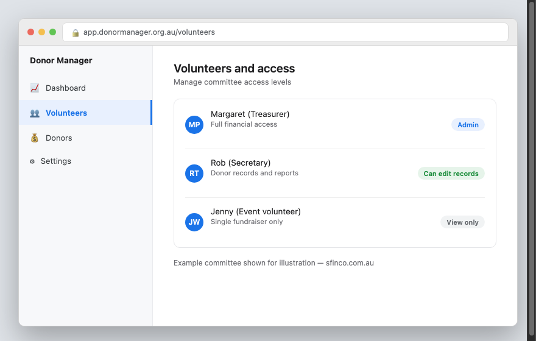
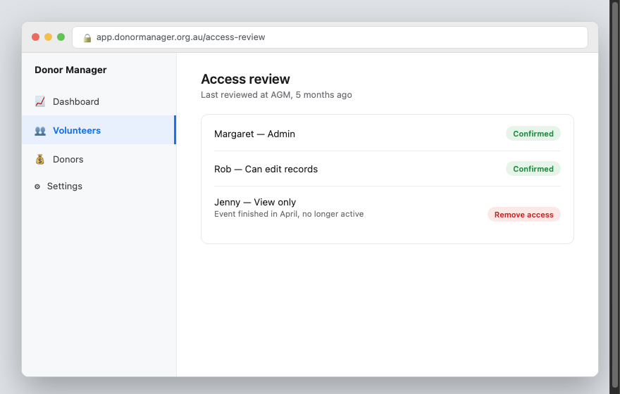

Sfinco Guides  ·  Volume 7 — NGO and Not-for-Profit Protection  ·  Chapter 4

# Volunteer and committee access worth trimming

Who can see what, and the offboarding step almost every committee forgets

Volunteer organisations face a particular challenge that most businesses do not: people genuinely come and go, often with the best of intentions, and access granted for a single event or a short-term role is easily forgotten once that role ends. This chapter covers keeping access matched to who actually needs it, right now.

## The principle of least privilege, in plain English

Least privilege simply means giving each person access to only what they need for their current role, no more. A volunteer helping with a single fundraising event does not need access to your donor database. A committee member handling social media does not need access to your banking.

*Mockup illustration, styled to match a typical donor management platform — reshoot using your actual software before final layout.*

| ℹ  DID YOU KNOW? Most donor management, email, and accounting platforms let you assign different permission levels to different users, such as "view only," "can edit donor records," or "full admin," rather than giving everyone the same access. |

## Reviewing who has access to what

Settings path: this varies by platform, but is usually found under Settings > Users, Team, or Members within whatever donor management, email, or accounting software your organisation uses.

*Mockup illustration, styled to match a typical donor management platform — reshoot using your actual software before final layout.*

★  TIP:  Review access at every committee handover, typically at your organisation's AGM, as a standing agenda item rather than something that only happens if someone remembers.

## The offboarding step almost every committee forgets

When a volunteer or committee member's involvement ends, whether after a single event or a multi-year role, their access to every organisational account should be removed promptly, not "whenever someone gets around to it."

| ⚠  WARNING A former volunteer or committee member who still has access to your email, banking, or donor records, even without any malicious intent, represents a real and unnecessary risk. This is one of the most common gaps in community organisation security, precisely because turnover is so frequent. |

A simple offboarding checklist, kept somewhere handy such as your committee handover documents, makes this consistent rather than dependent on remembering everything at a busy handover meeting.

| Done | Step |
| --- | --- |
| ☐ | Remove access to organisational email |
| ☐ | Remove access to donor management or accounting software |
| ☐ | Remove access to shared drives or documents |
| ☐ | Change any shared passwords they knew |
| ☐ | Collect any organisational devices or access cards |

## Shared logins — a habit worth breaking, even for volunteers

It is common in small organisations for the entire committee to share a single login to a piece of software, for convenience. This makes it impossible to know who did what, and means removing one person's access requires changing the password for everyone else too.

| ✓  WELL DONE IF YOU HAVE THIS If every committee member and long-term volunteer has their own individual login for your organisation's key systems, rather than sharing one account between several people, you already have far better visibility and control than most small organisations. |

## Quick review — your chapter 4 checklist

| Done | Item |
| --- | --- |
| ☐ | Volunteer and committee access matches what each person currently needs |
| ☐ | We have an offboarding checklist reviewed at every handover |
| ☐ | Access is reviewed at least annually, ideally at the AGM |
| ☐ | Committee members have individual logins rather than shared accounts, wherever possible |

With access under control, the next chapter looks at the scams most likely to target your organisation directly.
