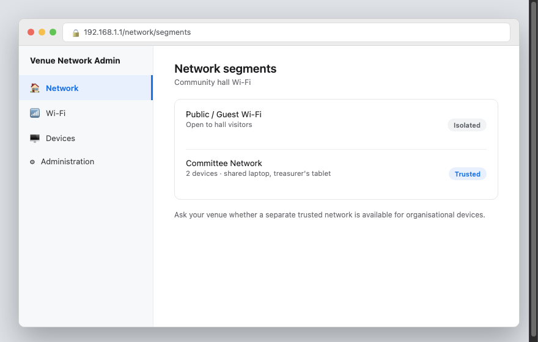
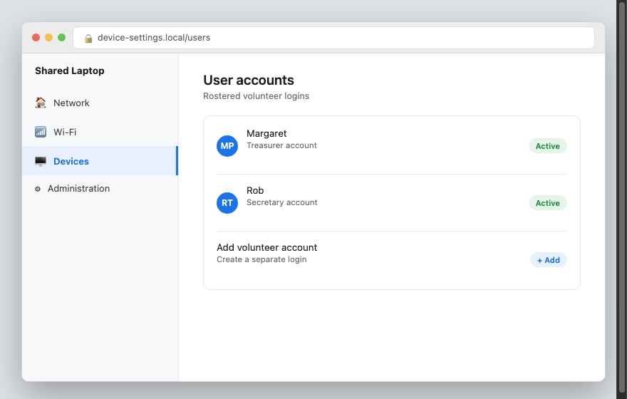

Sfinco Guides  ·  Volume 7 — NGO and Not-for-Profit Protection  ·  Chapter 6

# Wi-Fi, shared devices, and remote access

Keeping your network safe when your team works from many different places

Community organisations often operate from a community hall, a shared office, or nowhere fixed at all, with volunteers connecting from home, from a cafe, or from a shared laptop kept in a cupboard between events. This chapter covers keeping all of it genuinely safe.

## Separating public Wi-Fi from organisational devices

If your organisation operates from a venue that offers public or community Wi-Fi, such as a community hall or library space, your organisation's own devices should ideally connect to a separate, more trusted network wherever one is available.

Settings path: ask the venue whether a private or staff network is available, separate from any public or guest Wi-Fi.

*Mockup illustration, styled to match a typical venue Wi-Fi admin panel — reshoot using your actual venue's network before final layout.*

| ⚠  WARNING If your organisation's laptop or tablet connects to the same open Wi-Fi network as members of the public, treat this as a real, if modest, risk, particularly if that device is ever used for banking or donor data entry. A VPN, covered later in this chapter, is a simple way to reduce this risk. |

## Managing a shared organisational device

Many small organisations rely on a single shared laptop or tablet, used by whoever is rostered on that day. This convenience comes with a real risk if the device is not set up carefully.

*Mockup illustration, styled to match a typical device settings panel — reshoot using your actual equipment before final layout.*

★  TIP:  If your shared device supports separate user accounts, set one up for each regular volunteer rather than one shared login. This makes it far easier to see who did what, and to remove access for a single person without affecting everyone else.

## Changing default passwords on shared equipment

Any router, shared device, or piece of equipment your organisation owns ships with a default administrator password, widely published online. If this has never been changed, anyone who can guess or look up the default can potentially access your equipment's settings directly.

Settings path: usually found in your router or device's admin panel under Administration or System.

*Mockup illustration, styled to match a typical router admin panel — reshoot using your actual equipment before final layout.*

| ℹ  DID YOU KNOW? Default passwords for most makes and models of router and shared equipment are freely available online with a simple search, meaning an unchanged default password offers essentially no protection at all. |

## A free or low-cost VPN for remote volunteers

If any volunteer or committee member accesses organisational systems from home or on public Wi-Fi, a VPN adds a meaningful layer of protection, and several options are genuinely free for small teams.

| VPN Provider | Cost | Best for |
| --- | --- | --- |
| ProtonVPN | Free tier available | Strong privacy focus, a genuinely usable free plan for small teams |
| Tailscale | Free for small teams | Simple, secure connection between volunteer devices and organisational systems |

*Mockup illustration, styled to match a typical VPN app — reshoot using your actual software before final layout.*

| ✓  WELL DONE IF YOU HAVE THIS If remote volunteers already connect through a VPN before accessing organisational email, donor records, or banking, you have closed off one of the more common ways community organisations are compromised through home or public Wi-Fi. |

## Quick review — your chapter 6 checklist

| Done | Item |
| --- | --- |
| ☐ | Organisational devices use a trusted network, separate from any public Wi-Fi where possible |
| ☐ | Shared devices have separate accounts for each regular volunteer, where supported |
| ☐ | Default passwords have been changed on all organisational equipment |
| ☐ | Remote volunteers use a free VPN to access organisational systems |

With your network settings squared away, the next chapter covers donor data protection, backups, and what to do if your organisation is ever affected by a breach.
