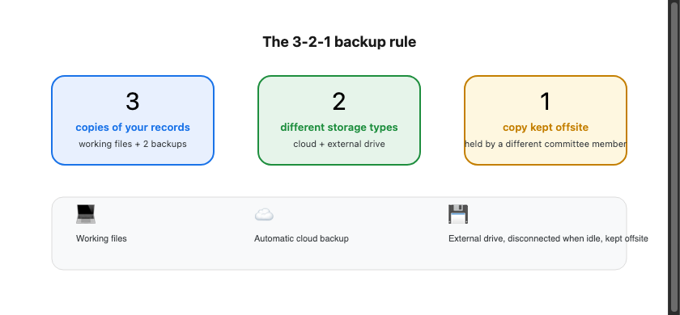
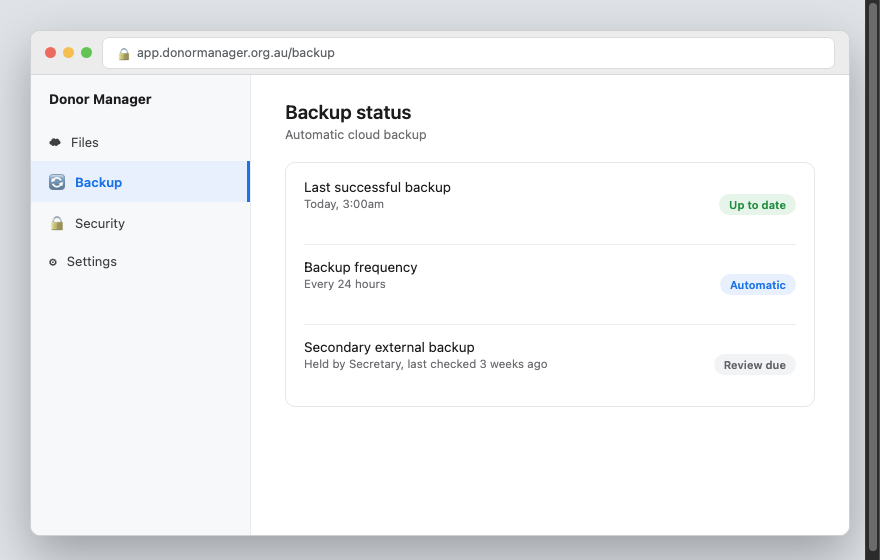

Sfinco Guides  ·  Volume 7 — NGO and Not-for-Profit Protection  ·  Chapter 7

# Donor data, backups, and incident response

Setting up your safety net, and what to do if something goes wrong

A ransomware attack or a serious data breach is stressful enough without also discovering your organisation has no way to recover its records, or no clear idea of what to do next, and no clarity on what you are required to tell your donors. This chapter covers backups, donor data obligations, and a calm, practical response plan.

## The 3-2-1 backup rule, in plain English

A reliable backup strategy follows a simple rule: keep three copies of your data, on two different types of storage, with one copy kept somewhere separate from your main location.

In practice, for most small organisations, this means your working files, an automatic cloud backup (through Google Workspace, Microsoft 365, or your donor management platform), and a separate external drive or secondary cloud backup kept genuinely independent of your main systems.

| ℹ  DID YOU KNOW? Ransomware specifically targets connected backups where possible. A backup drive that stays permanently plugged into a shared organisational laptop offers far less protection than one that is disconnected when not actively backing up, and kept by a different committee member. |

## Checking your current backup is actually working

Settings path: this varies by platform, but most cloud email, file storage, and donor management services show a "last backed up" or "last synced" date somewhere in their settings.

*Mockup illustration, styled to match a typical cloud backup admin panel — reshoot using your actual software before final layout.*

★  TIP:  Do not assume a backup is working simply because someone set it up once, possibly years ago under a different committee. Check the actual "last backup" date every few months, and make this a standing item at committee meetings.

## Ransomware — what it is and how to reduce the damage

Ransomware is malware that encrypts your organisation's files and demands payment to unlock them. The single best defence is a backup that ransomware cannot also reach and encrypt, combined with volunteers who know not to open unexpected attachments.

| ⚠  WARNING If your organisation is ever affected by ransomware, do not pay the ransom. Payment does not guarantee your files will be restored, and it funds further criminal activity. Disconnect affected devices from the network immediately, and seek help from a trusted IT-literate volunteer, a local IT provider, or the Australian Cyber Security Centre. |

## Donor and client data — your obligations under the Privacy Act

If your organisation experiences a breach that exposes donor, member, or client personal information, such as names, addresses, or payment details, you may have obligations under the Privacy Act 1988 and the Notifiable Data Breaches (NDB) scheme, administered by the Office of the Australian Information Commissioner (OAIC).

! IMPORTANT: The NDB scheme generally requires organisations to notify affected individuals and the OAIC if a data breach is likely to result in serious harm. Whether your specific organisation is covered, and whether a particular incident meets this threshold, depends on your circumstances, including your annual turnover. If you are ever unsure, contact the OAIC directly at oaic.gov.au, or seek advice from a solicitor. This is separate from any reporting obligations your organisation has to the ACNC as a registered charity, which relate to annual financial and governance reporting rather than data breaches. This book provides general guidance only and is not a substitute for professional legal advice.

## The first sixty minutes — what to do if something goes wrong

If your organisation is ever affected by a breach, ransomware, or a serious scam, the steps below are designed to be followed calmly, in order, by whichever committee member is available.

| Time | What to do |
| --- | --- |
| 0–10 min | Disconnect affected devices from the network, without turning them off, to preserve evidence |
| 10–20 min | Change passwords for any potentially affected accounts, from a separate, unaffected device |
| 20–30 min | Contact your bank if any payment or banking information may be affected |
| 30–45 min | Report the incident to ReportCyber at cyber.gov.au and, if applicable, Scamwatch at scamwatch.gov.au |
| 45–60 min | Consider whether the incident is notifiable under the Privacy Act, and seek advice from the OAIC or a solicitor if unsure |

★  TIP:  Write down the key contact details below before you ever need them, ideally somewhere that survives a change of committee, such as a shared password manager note rather than one person's personal files.

## A note on insurance

Many community organisations already hold public liability or volunteer insurance. It is worth asking your existing insurer or broker whether a cyber incident, including a data breach or ransomware attack, is covered under your current policy, or whether a separate, often low-cost cyber insurance add-on is available for small not-for-profits.

## Quick review — your chapter 7 checklist

| Done | Item |
| --- | --- |
| ☐ | Our backup follows the 3-2-1 rule |
| ☐ | We have checked the actual "last backup" date within the past month |
| ☐ | We know not to pay a ransomware demand, and who to contact instead |
| ☐ | We understand our organisation's potential obligations under the Notifiable Data Breaches scheme |
| ☐ | We have asked our insurer about cyber cover |

With a proper backup and response plan ready to go, the final chapter brings everything together into a fifteen-minute monthly routine.
