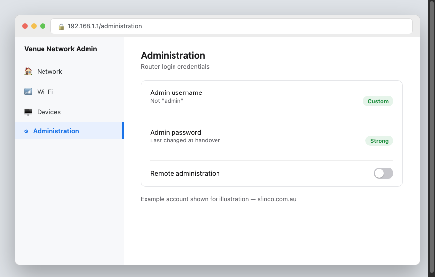
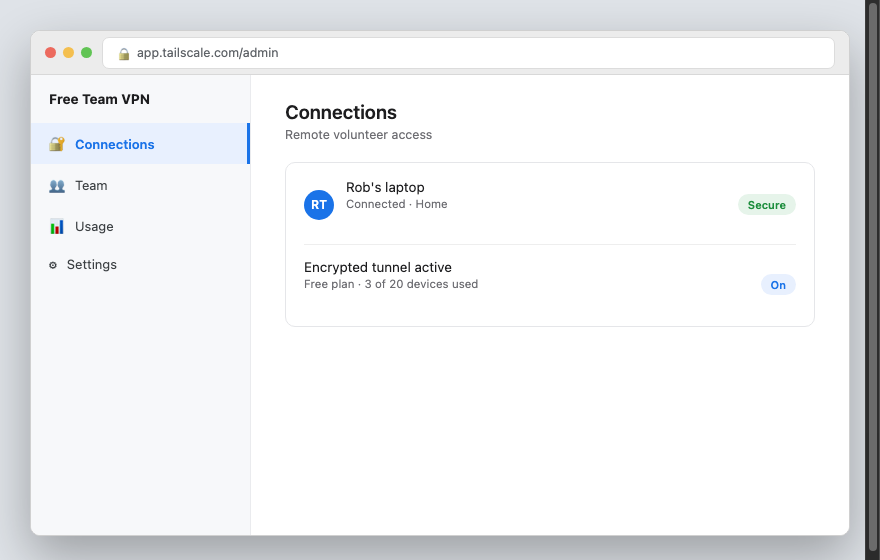

SFINCO GUIDES

VOLUME 7

NGO AND NOT-FOR-PROFIT PROTECTION

Protecting organisations that protect others

---

Series: Sfinco Guides
Volume: 7 of 8
Category: Nonprofit Cybersecurity / Community Organisation Operations
Format: Non-fiction, instructional, plain-English guide
Audience: Volunteers, committee members, and staff of small charities and not-for-profits, particularly on the Sunshine Coast
Region: Australia (Sunshine Coast, Queensland focus, nationally applicable)

Publisher: Sfinco
Brand colours: Blue #1B4F8A · Amber #C47F00
Website: sfinco.com.au

---

---

Sfinco Guides  ·  Volume 7

NGO and Not-for-Profit Protection

Protecting organisations that protect others

# Introduction

Charities and not-for-profits carry a particular kind of trust. People hand over their details, their stories, and often their money, because they believe in what the organisation does. That trust is exactly what makes these organisations worth protecting, and exactly why criminals target them.

Most cyber security advice assumes a paid IT department and a dedicated budget. Community organisations rarely have either. They run on volunteers, committee members giving up their evenings, and small part-time staff teams who are already stretched across fundraising, service delivery, and everything in between.

This is not a technical manual, and it does not assume any background in IT. What it is, is a plain-English, practical guide to the handful of things that genuinely matter for protecting your organisation, your volunteers, and the people who trust you with their information, written by someone who has spent years in banking and technology, and who understands that a "we'll get to it eventually" approach to security is often the realistic starting point for a small organisation.

Whether you run a local charity, a community group, a sporting club committee, or a small not-for-profit service provider, this book is written for you.

## Who is this book for?

This guide is for anyone involved in running a small charity or not-for-profit, whether as paid staff, a committee member, or a volunteer. In particular, this guide will be helpful if you:

manage donor records, member lists, or client information of any kind

handle any part of your organisation's banking, invoicing, or fundraising

have volunteers who come and go, sometimes with access to shared accounts or devices

worry about what a data breach or a scam could mean for the people your organisation serves

want a clear, practical starting point rather than a long list of jargon written for a large corporation

## A quick word from the author

I work in banking and technology on the Sunshine Coast in Queensland, and this book grew out of a simple observation: the community organisations doing some of the most important work in our region are often the least equipped to protect themselves online, not through any fault of their own, but because nobody had ever put together a guide written specifically for their situation.

This book exists to close that gap. You do not need a technical background, a paid IT contractor, or a large budget to put the protections in this book in place. Most of what follows costs nothing beyond a bit of your time.

# How to use this book

This book is designed to be used, not just read. Here is how to get the most out of it.

## Work through it chapter by chapter

Each chapter builds on the one before it, starting with the accounts and passwords that protect everything else, and working through to email security, volunteer access, scams, remote access, and donor data protection. If you are starting from scratch, work through Chapter 1 onward in order.

That said, every chapter also stands on its own. If donor data protection is the most urgent concern for your organisation right now, feel free to jump straight to that chapter.

## Do the steps as you go

This is a book to work through with your accounts open, not to read in one sitting and set aside. Each chapter includes practical steps you can put in place immediately, most of which take less than fifteen minutes and cost nothing.

*  TIP:  Many software providers offer free or heavily discounted plans specifically for registered charities and not-for-profits, including Google Workspace, Microsoft 365, and Canva. Chapter 2 covers how to check whether your organisation qualifies.

## Use the tools at the back of the book

Chapter 8 ends with a one-page monthly security checklist designed to be worked through by whoever is available, even if that person changes from month to month. The very back of the book also has a Quick Reference Card with emergency contacts and first-response steps, and a Glossary of every term used in this guide.

## A note on regulatory obligations

This book touches on a small number of areas where Australian charities and not-for-profits have specific obligations, particularly around donor and client data, and reporting to the Australian Charities and Not-for-profits Commission (ACNC).

! IMPORTANT: If your organisation experiences a data breach involving donor, member, or client personal information, you may have obligations under the Privacy Act 1988 and the Notifiable Data Breaches (NDB) scheme, administered by the Office of the Australian Information Commissioner (OAIC). Separately, registered charities have annual reporting obligations to the ACNC, which are unrelated to but sometimes confused with data breach obligations. This book explains what to do in practical terms in Chapter 7, but if you are ever unsure of your specific obligations, contact the OAIC at oaic.gov.au, the ACNC at acnc.gov.au, or a solicitor.

This book does not constitute legal or financial advice, and does not replace a formal cyber security assessment tailored to your specific organisation.

## What this book does not cover

This guide focuses on the practical, everyday security decisions available to any small community organisation, regardless of size or cause. It does not cover the more complex compliance requirements of larger charities with paid IT staff, or industry-specific obligations for organisations handling particularly sensitive information, such as health or child safety records, which carry additional legal requirements beyond the scope of this book.

If your organisation is a small business rather than a charity or not-for-profit, see Volume 6 in this series, Small Business Protection, which covers similar ground from a commercial perspective.

Ready? Chapter 1 starts with why community organisations are targeted at all.

sfinco.com.au

Part of the Sfinco Guides series — protecting Australians online

---

Sfinco Guides  ·  Volume 7 — NGO and Not-for-Profit Protection  ·  Chapter 1

# Why community organisations are targeted

Trust is exactly what makes you worth attacking

| ▶  REAL STORY Margaret volunteers as treasurer for a small community support charity in Pomona, a role she took on after the previous treasurer retired. One evening, she received an email that appeared to come from the charity's president, asking her to urgently transfer $1,800 to a "new supplier" providing hampers for an upcoming appeal, since the president was travelling and hard to reach by phone. The email address looked almost right, and referenced the actual appeal by name, details a scammer had gathered from the charity's public Facebook page. Margaret transferred the funds that evening. The charity only discovered the loss three weeks later, at the next committee meeting. Margaret is not careless, and the charity is not poorly run. The scammer had simply done their homework, and the request arrived in exactly the way a genuine one might. That is exactly the gap this chapter closes. |

Stories like Margaret's are common across small charities and community organisations, and the Sunshine Coast is no exception. Public fundraising pages, published committee lists, and genuinely well-meaning transparency about upcoming appeals give scammers exactly the information they need to craft a convincing, targeted request.

## What is actually at risk?

To understand why your organisation is worth targeting, it helps to think about what a successful attack could cost, beyond the immediate financial loss.

Your funds — often donated by people who trust your organisation to use their money carefully, making any loss feel especially painful

Your donor and member data — names, addresses, and sometimes payment details, all of which carry legal obligations if exposed

Your email account — often the single most valuable target, since it can be used to impersonate your organisation to donors, members, and volunteers

Your reputation — donors and the community you serve may lose confidence if your organisation is publicly linked to a scam or breach

Your volunteers' time — recovering from an incident consumes hours that volunteers do not have to spare from their actual mission

| ℹ  DID YOU KNOW? The Australian Cyber Security Centre and Scamwatch have both specifically flagged charities and not-for-profits as an increasingly targeted sector, partly because published committee lists, public financial reports, and social media appeals give scammers unusually detailed information to work with. |

## How do attacks actually happen?

Attacks on community organisations generally fall into a small number of well-worn patterns. Understanding them is most of the battle.

Business email compromise (BEC).  A scammer impersonates a committee member, staff member, or supplier by email, usually to redirect a payment, exactly as happened to Margaret.

Fake donation or fundraising scams.  A scammer sets up a fake fundraising page or social media appeal using your organisation's name and logo, diverting genuine donor goodwill and money away from your cause.

Phishing emails targeting volunteers.  An email designed to steal a volunteer's or committee member's login details, often disguised as a shared document or a message from a well-known service like Microsoft 365 or Google Workspace.

Ransomware.  Malware that locks your organisation's files and systems, demanding payment to restore access, particularly damaging for organisations with limited backup arrangements.

Weak or shared passwords.  A password shared across a committee, or reused from a personal account, means a single breach can expose access to your organisation's entire digital presence.

## Why community organisations are targeted more than they realise

Committee members and volunteers often assume a small charity is "too small" or "too obscure" to be worth attacking. Criminals do not think this way. Automated scam campaigns target thousands of organisations regardless of size or cause, and a volunteer-run organisation is frequently an easier target than a business precisely because it has fewer layers of checking in place, and because volunteer turnover means institutional knowledge about "how we normally do things" is easily lost.

## The good news

Every single scam type in this chapter has a straightforward defence, and none of them require hiring an IT department or spending money your organisation does not have. A simple habit, like verifying any payment request by phone before transferring funds, closes the door on the most damaging scam in this chapter entirely.

| ✓  WELL DONE IF YOU HAVE THIS If your organisation already requires a second committee member to verify any unusual payment request by phone before it is actioned, you are already protected against the single most costly scam facing community organisations today. |

The rest of this book walks through exactly what to check, one chapter at a time, starting with the accounts and passwords that protect everything else your organisation relies on.

---

Sfinco Guides  ·  Volume 7 — NGO and Not-for-Profit Protection  ·  Chapter 2

# Locking the front door

Passwords, multi-factor authentication, and free tools most organisations don't know they qualify for

Every protection in this book sits behind one gate: the login screen of your organisation's email, banking, and any software you rely on. This chapter covers the layers that make that gate a genuine barrier, at no cost to your organisation.

## Layer 1 — Strong, unique passwords for every account

A strong password is long, not reused anywhere else, and not something easily guessed from public information about your organisation, such as its name or founding year.

★  TIP:  A passphrase of four or five random words is both easier for a volunteer to remember and harder to guess than a short password with substituted symbols. Write it down somewhere secure if needed, such as in a password manager, rather than relying on memory alone across a changing committee.

| ⚠  WARNING If your organisation's social media, banking, or email password is shared verbally or written on a whiteboard in a shared office, treat this as an immediate risk. Anyone with access to that space, now or in the future, effectively has access to your accounts. |

## Layer 2 — A free password manager for the committee

Remembering a unique, strong password for every organisational account, across a committee that changes over time, is unrealistic without help. A password manager generates and stores strong passwords, and can share specific logins with committee members without them ever seeing the actual password in plain text.

| Password manager | Cost | Best for |
| --- | --- | --- |
| Bitwarden | Free for small teams | Best free option, open source, well suited to volunteer committees |
| 1Password | ~AU$10/mo per user, nonprofit discount available | Easiest to use, worth it if your budget allows |

| ℹ  DID YOU KNOW? A password manager solves one of the most common problems for volunteer-run organisations: what happens to shared logins when a committee member moves on. Instead of trying to remember every account a departing volunteer had access to, you can revoke their access to shared logins from one place. |

## Layer 3 — Multi-factor authentication (MFA)

Multi-factor authentication (also called two-factor authentication) requires a second step beyond your password, usually a code from an app or a prompt on a phone, to sign in. This single change is the most effective step in this entire book, and it is free.

★  TIP:  Turn on MFA for your organisation's email first. Email is usually the "master key" that can be used to reset passwords for everything else, including your banking and donor management software.

| ✓  WELL DONE IF YOU HAVE THIS If MFA is turned on for your organisation's email, banking, and donor management software, you have closed the door on the vast majority of account takeover attempts, even if a password is ever guessed or leaked. |

## Free and discounted tools worth checking

Many registered charities and not-for-profits qualify for free or significantly discounted access to mainstream software, which often includes better built-in security than free consumer alternatives.

| Provider | What's available | Where to check eligibility |
| --- | --- | --- |
| Google for Nonprofits | Free Google Workspace (email, storage, video calls) for eligible charities | google.com/nonprofits |
| Microsoft 365 Nonprofit | Free or discounted Microsoft 365 licences, including security features | microsoft.com/nonprofits |
| TechSoup Australia | Discounted access to a wide range of software, hardware, and cloud services | techsoup.com.au |

| ℹ  DID YOU KNOW? Eligibility for these programs generally requires your organisation to be a registered charity with the ACNC, or to hold Deductible Gift Recipient (DGR) status. If your organisation is not yet registered, this is worth checking as a first step, since it can unlock genuinely significant savings beyond just software. |

## Setting expectations with volunteers and committee members

Even the best technical protections rely on everyone involved understanding a few simple rules. Put these in writing, even informally, and revisit them whenever new committee members or volunteers join.

Never share passwords verbally, by text, or on a shared physical note

Always use the password manager, rather than a personal notebook or spreadsheet

Turn on MFA on any account that offers it

Report anything that looks suspicious immediately, rather than trying to handle it alone

## Quick review — your chapter 2 checklist

| Done | Item |
| --- | --- |
| ☐ | All organisational accounts use strong, unique passwords |
| ☐ | A free password manager is set up for the committee |
| ☐ | MFA is turned on for email, banking, and donor management software |
| ☐ | We have checked our eligibility for Google for Nonprofits, Microsoft 365 Nonprofit, or TechSoup |

With your accounts locked down, the next chapter looks specifically at email security, the single most targeted part of any community organisation.

---

Sfinco Guides  ·  Volume 7 — NGO and Not-for-Profit Protection  ·  Chapter 3

# Email security and protecting your domain

The single most targeted part of any community organisation, and the settings most committees never check

Email is where almost every scam in this book eventually arrives, and it is also how your organisation communicates with the donors and members who trust you. This chapter covers the handful of settings that make your organisation's email significantly harder to break into or impersonate.

## Checking for suspicious forwarding rules

One of the most common ways criminals maintain access after breaking into an email account is by quietly setting up a forwarding rule that sends a copy of every email, including donor correspondence and password resets, to an address nobody on the committee recognises.

Settings path (Microsoft 365):  Outlook  >  Settings  >  Mail  >  Forwarding.

Settings path (Google Workspace):  Gmail  >  Settings  >  See all settings  >  Forwarding and POP/IMAP.

*Mockup illustration, styled to match a typical organisational email admin panel — reshoot using your actual email provider before final layout.*

| ⚠  WARNING If you find a forwarding rule nobody on the committee set up, treat this as a serious sign the account has been compromised. Remove the rule, change the password immediately, and turn on MFA if it is not already active. |

## Checking sign-in activity

Most organisational email providers keep a log of recent sign-ins, including the approximate location and device used. Reviewing this occasionally, particularly for shared committee accounts, can reveal an unauthorised sign-in before it causes real damage.

Settings path (Microsoft 365):  Outlook  >  My Account  >  Security info  >  Recent activity.

Settings path (Google Workspace):  Google Account  >  Security  >  Your devices.

*Mockup illustration, styled to match a typical organisational email admin panel — reshoot using your actual email provider before final layout.*

★  TIP:  If you see a sign-in from a location no committee member has any connection to, change the password immediately and review forwarding rules and connected apps.

## Domain protections — SPF, DKIM, and DMARC in plain English

These three settings, configured once by whoever manages your organisation's website or email hosting, make it significantly harder for a scammer to send an email that appears to come from your organisation's own domain, protecting your donors from impersonation scams.

| Setting | What it does in plain English |
| --- | --- |
| SPF | Lists which mail servers are allowed to send email on behalf of your domain |
| DKIM | Digitally signs your outgoing emails so recipients can verify they genuinely came from you |
| DMARC | Tells receiving mail servers what to do with emails that fail the SPF or DKIM checks, such as rejecting them |

| ℹ  DID YOU KNOW? Without DMARC configured, a scammer can send an email that appears to come from your exact organisational email address, even without access to your account at all. This has been used to send fake donation requests that appear to genuinely come from well-known charities. |

If you are not sure whether these are set up for your domain, ask whoever manages your website hosting or email, or a technically minded volunteer or board member.

## Safer everyday email habits for committees

Beyond the technical settings, a handful of habits meaningfully reduce risk for any community organisation.

Verify any payment request by phone, using a number you already have on file, never one provided in the email itself

Be cautious of urgency, particularly requests marked "urgent" or asking you to bypass your normal approval process

Check the actual sender address, not just the display name, since these can differ

Avoid opening unexpected attachments, particularly invoices from senders you were not expecting

## Quick review — your chapter 3 checklist

| Done | Item |
| --- | --- |
| ☐ | We have checked for unexpected email forwarding rules |
| ☐ | We have reviewed recent sign-in activity on organisational email accounts |
| ☐ | SPF, DKIM, and DMARC are configured for our domain, or we have asked our provider to confirm this |
| ☐ | Committee members know to verify payment requests by phone before transferring funds |

With your email locked down, the next chapter looks at volunteer and committee access, and what happens when people move on.

---

Sfinco Guides  ·  Volume 7 — NGO and Not-for-Profit Protection  ·  Chapter 4

# Volunteer and committee access worth trimming

Who can see what, and the offboarding step almost every committee forgets

Volunteer organisations face a particular challenge that most businesses do not: people genuinely come and go, often with the best of intentions, and access granted for a single event or a short-term role is easily forgotten once that role ends. This chapter covers keeping access matched to who actually needs it, right now.

## The principle of least privilege, in plain English

Least privilege simply means giving each person access to only what they need for their current role, no more. A volunteer helping with a single fundraising event does not need access to your donor database. A committee member handling social media does not need access to your banking.

*Mockup illustration, styled to match a typical donor management platform — reshoot using your actual software before final layout.*

| ℹ  DID YOU KNOW? Most donor management, email, and accounting platforms let you assign different permission levels to different users, such as "view only," "can edit donor records," or "full admin," rather than giving everyone the same access. |

## Reviewing who has access to what

Settings path: this varies by platform, but is usually found under Settings > Users, Team, or Members within whatever donor management, email, or accounting software your organisation uses.

*Mockup illustration, styled to match a typical donor management platform — reshoot using your actual software before final layout.*

★  TIP:  Review access at every committee handover, typically at your organisation's AGM, as a standing agenda item rather than something that only happens if someone remembers.

## The offboarding step almost every committee forgets

When a volunteer or committee member's involvement ends, whether after a single event or a multi-year role, their access to every organisational account should be removed promptly, not "whenever someone gets around to it."

| ⚠  WARNING A former volunteer or committee member who still has access to your email, banking, or donor records, even without any malicious intent, represents a real and unnecessary risk. This is one of the most common gaps in community organisation security, precisely because turnover is so frequent. |

A simple offboarding checklist, kept somewhere handy such as your committee handover documents, makes this consistent rather than dependent on remembering everything at a busy handover meeting.

| Done | Step |
| --- | --- |
| ☐ | Remove access to organisational email |
| ☐ | Remove access to donor management or accounting software |
| ☐ | Remove access to shared drives or documents |
| ☐ | Change any shared passwords they knew |
| ☐ | Collect any organisational devices or access cards |

## Shared logins — a habit worth breaking, even for volunteers

It is common in small organisations for the entire committee to share a single login to a piece of software, for convenience. This makes it impossible to know who did what, and means removing one person's access requires changing the password for everyone else too.

| ✓  WELL DONE IF YOU HAVE THIS If every committee member and long-term volunteer has their own individual login for your organisation's key systems, rather than sharing one account between several people, you already have far better visibility and control than most small organisations. |

## Quick review — your chapter 4 checklist

| Done | Item |
| --- | --- |
| ☐ | Volunteer and committee access matches what each person currently needs |
| ☐ | We have an offboarding checklist reviewed at every handover |
| ☐ | Access is reviewed at least annually, ideally at the AGM |
| ☐ | Committee members have individual logins rather than shared accounts, wherever possible |

With access under control, the next chapter looks at the scams most likely to target your organisation directly.

---

Sfinco Guides  ·  Volume 7 — NGO and Not-for-Profit Protection  ·  Chapter 5

# Scams targeting community organisations

How to spot them, what to do, and how to recover if you paid

## Why scams work — the psychology behind them

Every scam in this chapter relies on the same handful of psychological triggers: urgency, authority, and the genuine goodwill that runs through community organisations. A message that appears to come from someone you trust, references a real appeal or event, and asks for something that sounds routine, is designed to make you skip the one step that would protect you — stopping to verify.

## The scams most likely to reach your organisation

Here are the most common scam types currently targeting Australian charities and not-for-profits, with real examples of what they look like.

1. Fake "urgent payment" emails from a committee member

An email appears to come from the president or treasurer, often while they are known to be busy or travelling, asking for an urgent payment.

| "President" (spoofed) |

| Hi, I'm at a conference all day and hard to reach by phone. Need you to transfer this hamper supplier payment urgently, new account details attached. Keep it between us for now, will explain later. Thanks |

*Illustrative mockup, not a real message — built to show the pattern.*

| ✶  CRITICAL — READ THIS CAREFULLY Any request to keep a payment "between us," bypass your normal committee approval process, or act with unusual urgency should be treated as a serious warning sign, regardless of who it appears to be from. Always verify by phone, using a number you already have, before transferring funds. |

2. Cloned donation pages and fake fundraising appeals

A scammer copies your organisation's name, logo, and appeal details onto a fake donation page or social media post, directing genuine donor goodwill and money to themselves.

| Fake Appeal Page |

| Support our Winter Appeal! Every dollar helps families doing it tough this winter. Donate now via this secure link. |

*Illustrative mockup, not a real fundraising page — built to show the pattern.*

Always direct donors to your organisation's official website address, and consider periodically searching your organisation's name to check for impersonating pages or posts.

3. Fake ACNC or grant compliance emails

An email claims to come from the ACNC or a government grant body, warning of a compliance issue or a grant payment requiring urgent action.

| ACNC Notice |

| Your charity's registration requires urgent action to avoid removal from the register. Verify your details within 24 hours: acnc-charity-portal.info |

*Illustrative mockup, not a real ACNC message — built to show the pattern.*

The ACNC does not send emails threatening immediate deregistration with a link to click. If you are ever concerned about a genuine compliance matter, log in directly to the ACNC Charity Portal at acnc.gov.au, or call them using their official published number.

4. Fake grant or funding notification

An email claims your organisation has been awarded a grant or funding, asking for bank details or an upfront "processing fee" to release the funds.

| Funding Notice |

| Congratulations, your organisation has been selected for a $10,000 community grant. To release funds, please provide your bank details and a $150 processing fee. |

*Illustrative mockup, not a real grant notification — built to show the pattern.*

| ⚠  WARNING Genuine grant bodies never ask for an upfront fee to release funding you have supposedly already been awarded. If you did not apply for the grant in question, treat the message as highly suspicious regardless of how official it looks. |

5. Fake volunteer or board recruitment phishing

A message, often sent broadly, invites your organisation to a "volunteer matching" or "board recruitment" platform, asking committee members to log in with existing credentials to "verify" their organisation.

| Volunteer Connect |

| Your organisation has been matched with 3 potential board members. Log in with your Google or Microsoft account to view their profiles. |

*Illustrative mockup, not a real recruitment platform — built to show the pattern.*

Logging in to an unfamiliar third-party site using your organisation's Google or Microsoft credentials can expose those credentials to a fake login page. Verify any unfamiliar platform independently before entering organisational login details anywhere.

## The universal red flag checklist

Regardless of which scam you encounter, the same warning signs tend to appear.

You are asked to act with unusual urgency, or to bypass your normal committee process

You are asked to keep the request confidential, or it feels unusual for your normal workflow

You are asked for an upfront fee to receive money you were supposedly already awarded

The sender's actual email address does not quite match the organisation's real domain

You are asked to log in to an unfamiliar site using your organisation's existing credentials

## What to do if you think your organisation has paid a fraudulent request

Contact your bank immediately. Banks can sometimes recall a payment if it is reported within hours, though this becomes far less likely after a day or two. Contact the genuine party directly, using a number you already have, to confirm what happened. Report the incident to Scamwatch at scamwatch.gov.au and to ReportCyber at cyber.gov.au. If any donor or client personal information may have been exposed, review your obligations under the Notifiable Data Breaches scheme, covered in more detail in Chapter 7.

## Quick review — your chapter 5 checklist

| Done | Item |
| --- | --- |
| ☐ | Committee members know to verify urgent payment requests by phone, even from "the president" |
| ☐ | We periodically check for cloned donation pages or fake appeals using our organisation's name |
| ☐ | We know the ACNC never threatens immediate deregistration by email with a click-through link |
| ☐ | We know genuine grants never require an upfront fee to release funding |
| ☐ | We never log in to an unfamiliar platform using our organisation's existing credentials |

With scams covered, the next chapter looks at keeping your network and remote access safe for a team that is often working from many different places.

---

Sfinco Guides  ·  Volume 7 — NGO and Not-for-Profit Protection  ·  Chapter 6

# Wi-Fi, shared devices, and remote access

Keeping your network safe when your team works from many different places

Community organisations often operate from a community hall, a shared office, or nowhere fixed at all, with volunteers connecting from home, from a cafe, or from a shared laptop kept in a cupboard between events. This chapter covers keeping all of it genuinely safe.

## Separating public Wi-Fi from organisational devices

If your organisation operates from a venue that offers public or community Wi-Fi, such as a community hall or library space, your organisation's own devices should ideally connect to a separate, more trusted network wherever one is available.

Settings path: ask the venue whether a private or staff network is available, separate from any public or guest Wi-Fi.

*Mockup illustration, styled to match a typical venue Wi-Fi admin panel — reshoot using your actual venue's network before final layout.*

| ⚠  WARNING If your organisation's laptop or tablet connects to the same open Wi-Fi network as members of the public, treat this as a real, if modest, risk, particularly if that device is ever used for banking or donor data entry. A VPN, covered later in this chapter, is a simple way to reduce this risk. |

## Managing a shared organisational device

Many small organisations rely on a single shared laptop or tablet, used by whoever is rostered on that day. This convenience comes with a real risk if the device is not set up carefully.

*Mockup illustration, styled to match a typical device settings panel — reshoot using your actual equipment before final layout.*

★  TIP:  If your shared device supports separate user accounts, set one up for each regular volunteer rather than one shared login. This makes it far easier to see who did what, and to remove access for a single person without affecting everyone else.

## Changing default passwords on shared equipment

Any router, shared device, or piece of equipment your organisation owns ships with a default administrator password, widely published online. If this has never been changed, anyone who can guess or look up the default can potentially access your equipment's settings directly.

Settings path: usually found in your router or device's admin panel under Administration or System.

*Mockup illustration, styled to match a typical router admin panel — reshoot using your actual equipment before final layout.*

| ℹ  DID YOU KNOW? Default passwords for most makes and models of router and shared equipment are freely available online with a simple search, meaning an unchanged default password offers essentially no protection at all. |

## A free or low-cost VPN for remote volunteers

If any volunteer or committee member accesses organisational systems from home or on public Wi-Fi, a VPN adds a meaningful layer of protection, and several options are genuinely free for small teams.

| VPN Provider | Cost | Best for |
| --- | --- | --- |
| ProtonVPN | Free tier available | Strong privacy focus, a genuinely usable free plan for small teams |
| Tailscale | Free for small teams | Simple, secure connection between volunteer devices and organisational systems |

*Mockup illustration, styled to match a typical VPN app — reshoot using your actual software before final layout.*

| ✓  WELL DONE IF YOU HAVE THIS If remote volunteers already connect through a VPN before accessing organisational email, donor records, or banking, you have closed off one of the more common ways community organisations are compromised through home or public Wi-Fi. |

## Quick review — your chapter 6 checklist

| Done | Item |
| --- | --- |
| ☐ | Organisational devices use a trusted network, separate from any public Wi-Fi where possible |
| ☐ | Shared devices have separate accounts for each regular volunteer, where supported |
| ☐ | Default passwords have been changed on all organisational equipment |
| ☐ | Remote volunteers use a free VPN to access organisational systems |

With your network settings squared away, the next chapter covers donor data protection, backups, and what to do if your organisation is ever affected by a breach.

---

Sfinco Guides  ·  Volume 7 — NGO and Not-for-Profit Protection  ·  Chapter 7

# Donor data, backups, and incident response

Setting up your safety net, and what to do if something goes wrong

A ransomware attack or a serious data breach is stressful enough without also discovering your organisation has no way to recover its records, or no clear idea of what to do next, and no clarity on what you are required to tell your donors. This chapter covers backups, donor data obligations, and a calm, practical response plan.

## The 3-2-1 backup rule, in plain English

A reliable backup strategy follows a simple rule: keep three copies of your data, on two different types of storage, with one copy kept somewhere separate from your main location.

In practice, for most small organisations, this means your working files, an automatic cloud backup (through Google Workspace, Microsoft 365, or your donor management platform), and a separate external drive or secondary cloud backup kept genuinely independent of your main systems.

| ℹ  DID YOU KNOW? Ransomware specifically targets connected backups where possible. A backup drive that stays permanently plugged into a shared organisational laptop offers far less protection than one that is disconnected when not actively backing up, and kept by a different committee member. |

## Checking your current backup is actually working

Settings path: this varies by platform, but most cloud email, file storage, and donor management services show a "last backed up" or "last synced" date somewhere in their settings.

*Mockup illustration, styled to match a typical cloud backup admin panel — reshoot using your actual software before final layout.*

★  TIP:  Do not assume a backup is working simply because someone set it up once, possibly years ago under a different committee. Check the actual "last backup" date every few months, and make this a standing item at committee meetings.

## Ransomware — what it is and how to reduce the damage

Ransomware is malware that encrypts your organisation's files and demands payment to unlock them. The single best defence is a backup that ransomware cannot also reach and encrypt, combined with volunteers who know not to open unexpected attachments.

| ⚠  WARNING If your organisation is ever affected by ransomware, do not pay the ransom. Payment does not guarantee your files will be restored, and it funds further criminal activity. Disconnect affected devices from the network immediately, and seek help from a trusted IT-literate volunteer, a local IT provider, or the Australian Cyber Security Centre. |

## Donor and client data — your obligations under the Privacy Act

If your organisation experiences a breach that exposes donor, member, or client personal information, such as names, addresses, or payment details, you may have obligations under the Privacy Act 1988 and the Notifiable Data Breaches (NDB) scheme, administered by the Office of the Australian Information Commissioner (OAIC).

! IMPORTANT: The NDB scheme generally requires organisations to notify affected individuals and the OAIC if a data breach is likely to result in serious harm. Whether your specific organisation is covered, and whether a particular incident meets this threshold, depends on your circumstances, including your annual turnover. If you are ever unsure, contact the OAIC directly at oaic.gov.au, or seek advice from a solicitor. This is separate from any reporting obligations your organisation has to the ACNC as a registered charity, which relate to annual financial and governance reporting rather than data breaches. This book provides general guidance only and is not a substitute for professional legal advice.

## The first sixty minutes — what to do if something goes wrong

If your organisation is ever affected by a breach, ransomware, or a serious scam, the steps below are designed to be followed calmly, in order, by whichever committee member is available.

| Time | What to do |
| --- | --- |
| 0–10 min | Disconnect affected devices from the network, without turning them off, to preserve evidence |
| 10–20 min | Change passwords for any potentially affected accounts, from a separate, unaffected device |
| 20–30 min | Contact your bank if any payment or banking information may be affected |
| 30–45 min | Report the incident to ReportCyber at cyber.gov.au and, if applicable, Scamwatch at scamwatch.gov.au |
| 45–60 min | Consider whether the incident is notifiable under the Privacy Act, and seek advice from the OAIC or a solicitor if unsure |

★  TIP:  Write down the key contact details below before you ever need them, ideally somewhere that survives a change of committee, such as a shared password manager note rather than one person's personal files.

## A note on insurance

Many community organisations already hold public liability or volunteer insurance. It is worth asking your existing insurer or broker whether a cyber incident, including a data breach or ransomware attack, is covered under your current policy, or whether a separate, often low-cost cyber insurance add-on is available for small not-for-profits.

## Quick review — your chapter 7 checklist

| Done | Item |
| --- | --- |
| ☐ | Our backup follows the 3-2-1 rule |
| ☐ | We have checked the actual "last backup" date within the past month |
| ☐ | We know not to pay a ransomware demand, and who to contact instead |
| ☐ | We understand our organisation's potential obligations under the Notifiable Data Breaches scheme |
| ☐ | We have asked our insurer about cyber cover |

With a proper backup and response plan ready to go, the final chapter brings everything together into a fifteen-minute monthly routine.

---

Sfinco Guides  ·  Volume 7 — NGO and Not-for-Profit Protection  ·  Chapter 8

# Your 15-minute organisation security checkup

A simple monthly routine to keep your organisation protected for years to come

You have now worked through every major layer of security for a community organisation: your accounts and passwords, email security, volunteer access, scam awareness, your network and remote access, and donor data protection with backups. This final chapter brings all of it together into one simple monthly habit.

| ℹ  DID YOU KNOW? Set a recurring reminder right now, or better still, add it as a standing item on your committee meeting agenda. This is the single most important step in this chapter: the checklist only works if someone actually comes back to it, regardless of who is on the committee at the time. |

## The complete monthly checklist

Work through this list with your accounts open, or delegate it to a specific committee role each month. Each item references the chapter where you can find full instructions if you need a refresher.

### Accounts and passwords

| Done | Item | Chapter |
| --- | --- | --- |
| ☐ | All organisational accounts still use strong, unique passwords | Ch. 2 |
| ☐ | MFA remains active on email, banking, and donor management software | Ch. 2 |

### Email security

| Done | Item | Chapter |
| --- | --- | --- |
| ☐ | No unexpected forwarding rules on organisational email | Ch. 3 |
| ☐ | Recent sign-in activity looks normal | Ch. 3 |

### Volunteer and committee access

| Done | Item | Chapter |
| --- | --- | --- |
| ☐ | Access still matches what each person currently needs | Ch. 4 |
| ☐ | Any volunteers or committee members who left have had access fully removed | Ch. 4 |

### Scam awareness

| Done | Item | Chapter |
| --- | --- | --- |
| ☐ | No payment made this month without phone verification | Ch. 5 |
| ☐ | We have checked for any cloned donation pages using our organisation's name | Ch. 5 |

### Network and remote access

| Done | Item | Chapter |
| --- | --- | --- |
| ☐ | Shared devices still have separate accounts where supported | Ch. 6 |
| ☐ | Remote volunteers are still using a VPN to access organisational systems | Ch. 6 |

### Backups

| Done | Item | Chapter |
| --- | --- | --- |
| ☐ | Backup shows a successful, recent date | Ch. 7 |
| ☐ | We could describe our incident response plan if asked, regardless of who is on the committee | Ch. 7 |

## Two new habits worth adding

Beyond the checklist, two ongoing habits are worth building in.

Make security part of committee handover, not a separate task.  Whenever committee roles change, particularly at your AGM, walk the incoming person through this checklist and the location of your password manager, rather than leaving it as unwritten knowledge held by whoever came before.

Talk to volunteers about scams at inductions.  A five-minute mention during volunteer induction, particularly about verifying payment requests and not sharing passwords, keeps awareness fresh across a team that is often changing.

## A final word

Security is not a single project you finish and forget. It is a small, repeated habit, the same way you would reconcile your accounts or check your event bookings. Fifteen minutes a month, done consistently regardless of who is on the committee, will protect your organisation and the people it serves far better than an intense effort done once and never revisited.

| ✓  WELL DONE You have completed Sfinco Guides Volume 7 — NGO and Not-for-Profit Protection. Your organisation is now meaningfully more secure than it was when you started this book. Well done. Genuinely. |

Continuing your Sfinco journey:  The Sfinco Guides series concludes with Volume 8 (Personal Finance Protection), written in the same plain-English, step-by-step style. See the final pages of this book for details.

---

Sfinco Guides  ·  Volume 7

## Glossary

These are the key terms used throughout this book, explained in plain English. You do not need to memorise them — this section is here to help if you encounter a word and want a clear definition.

| Term | Definition |
| --- | --- |
| ACNC | The Australian Charities and Not-for-profits Commission, the national regulator for registered charities |
| BEC (Business Email Compromise) | A scam where a criminal impersonates a trusted person or organisation by email, usually to redirect a payment |
| DGR status | Deductible Gift Recipient status, which allows donors to claim tax deductions for donations, and is often required for nonprofit software discounts |
| DKIM | A setting that digitally signs your outgoing emails so recipients can verify they genuinely came from you |
| DMARC | A setting that tells receiving mail servers what to do with emails that fail SPF or DKIM checks |
| Least privilege | The principle of giving each person access only to what they genuinely need for their current role |
| MFA (Multi-factor authentication) | A security method requiring both your password and a second step, such as a code or prompt, to sign in |
| NDB scheme | The Notifiable Data Breaches scheme, which may require organisations to report certain data breaches to the OAIC and affected individuals |
| OAIC | The Office of the Australian Information Commissioner, which administers the Privacy Act 1988 and the NDB scheme |
| Password manager | Software that generates and securely stores strong, unique passwords for every account |
| Phishing | A scam that impersonates a trusted organisation — via email — to trick you into handing over personal or financial information |
| Ransomware | Malware that encrypts your files and demands payment to unlock them |
| Scamwatch | The Australian government's national scam reporting service, run by the ACCC |
| SPF | A setting that lists which mail servers are allowed to send email on behalf of your domain |
| VPN (Virtual Private Network) | A service that encrypts internet traffic and routes it through a secure server, particularly useful for remote volunteers |

Sfinco Guides  ·  Volume 7

## Quick reference card

Cut out or photograph this page and keep it somewhere handy, ideally in your organisation's shared files. These are the numbers and steps you are most likely to need in a hurry.

### Emergency contacts

| Contact | Details |
| --- | --- |
| Our bank's fraud line | _________________________________ |
| Scamwatch (ACCC) | scamwatch.gov.au · 1300 302 502 |
| ReportCyber (ACSC) | cyber.gov.au · 1300 292 371 |
| OAIC (data breach guidance) | oaic.gov.au · 1300 363 992 |
| ACNC (charity compliance) | acnc.gov.au · 13 22 62 |
| IDCARE (identity support) | idcare.org · 1800 595 160 |

### Our organisation's details

| Detail | Your information |
| --- | --- |
| Our genuine supplier bank details (verified) | _________________________________ |
| Email provider support | _________________________________ |
| IT-literate volunteer or provider contact | _________________________________ |
| Backup — last checked | _________________________________ |

### If you suspect a fraudulent payment

| Step | What to do |
| --- | --- |
| 1. Call the bank immediately | Ask about a payment recall |
| 2. Call the genuine party | Using a number you already have, not from the email |
| 3. Report it | scamwatch.gov.au and cyber.gov.au |
| 4. Review affected accounts | Change passwords, check for forwarding rules |

### If you suspect a data breach

| Step | What to do |
| --- | --- |
| 1. Disconnect affected devices | Without turning them off |
| 2. Assess what data may be affected | Donor records, payment details, etc. |
| 3. Consider NDB obligations | oaic.gov.au or a solicitor |
| 4. Notify affected individuals if required | As guided by the OAIC |

Sfinco Guides  ·  Volume 7

## Monthly security checkup

15 minutes · Standing committee meeting item

Month / Year: _________________     Completed by: _________________

### 🔐 Accounts and passwords

| Done | Item | Chapter |
| --- | --- | --- |
| ☐ | Strong, unique passwords in use | Ch 2 |
| ☐ | MFA active on key accounts | Ch 2 |

### 📧 Email security

| Done | Item | Chapter |
| --- | --- | --- |
| ☐ | No unexpected forwarding rules | Ch 3 |
| ☐ | Sign-in activity reviewed | Ch 3 |

### 👥 Volunteer and committee access

| Done | Item | Chapter |
| --- | --- | --- |
| ☐ | Access matches current roles | Ch 4 |
| ☐ | Departed volunteers fully offboarded | Ch 4 |

### 🚨 Scams

| Done | Item | Chapter |
| --- | --- | --- |
| ☐ | Payments verified by phone this month | Ch 5 |

### 🛰 Network and remote access

| Done | Item | Chapter |
| --- | --- | --- |
| ☐ | Shared devices have separate accounts | Ch 6 |
| ☐ | Remote volunteers using VPN | Ch 6 |

### 💾 Backups

| Done | Item | Chapter |
| --- | --- | --- |
| ☐ | Backup successful and recent | Ch 7 |
| ☐ | Incident response plan reviewed | Ch 7 |

sfinco.com.au · Vol 7 NGO and Not-for-Profit Protection

## Sfinco Guides — the complete series

More books in the series

The Sfinco Guides series is designed to cover every device and situation you are likely to encounter. Each book follows the same plain-English, step-by-step format — with real Australian examples, screenshots, and no technical jargon.

### Series 1 — Personal protection

| Volume | What it covers |
| --- | --- |
| Vol 1 Available now | iPhone Protection. Your simple guide to staying safe online. Passcode · Face ID · Apple ID · App permissions · Scams · Wi-Fi · Find My |
| Vol 2 Available now | MacBook Protection. Securing your Mac in plain English. Login & FileVault · Gatekeeper · Apple ID · Scams · Firewall & VPN · Time Machine |
| Vol 3 Available now | Family and Home Network Protection. Keeping everyone safe under one roof. Router security · guest Wi-Fi · smart devices · scams · parental controls |
| Vol 4 Available now | Windows Protection. A plain-English guide for Windows users. Sign-in & BitLocker · Microsoft account · Defender · Scams · Firewall & VPN · Backups |
| Vol 5 Available now | Android Protection. Staying safe on your Android phone. Play Protect · app permissions · Google account · 2FA · scam texts and calls |

### Series 2 — Organisational protection

| Volume | What it covers |
| --- | --- |
| Vol 6 Available now | Small Business Protection. Cyber security for Australian small businesses. Email security · staff access · backups · scam invoices · incident response |
| Vol 7 Available now | NGO and Not-for-Profit Protection. Protecting organisations that protect others. Volunteer access · donor data · email compromise · free tools for small teams |
| Vol 8 Coming soon | Personal Finance Protection. Protecting your money in a digital world. Banking security · investment scams · superannuation · password managers · wills |

| ★  TIP All Sfinco Guides are available on Amazon (search 'Sfinco Guides' or scan the QR code on the next page). Paperback and e-book editions are available. Bulk copies for charities, community networks, and volunteer organisations are available directly through sfinco.com.au — contact us for pricing, including not-for-profit discounts. |

## Connect with us

Scan to continue your Sfinco journey.

Each QR code below links to a different part of the Sfinco ecosystem. Scan any of them with your phone's camera to go directly to the relevant page.

| Where it takes you | What you'll find |
| --- | --- |
| [ QR CODE ] WEBSITE | Visit the Sfinco website — free resources, guides, blog, and updates on new books in the series sfinco.com.au |
| [ QR CODE ] CYBER AUDIT | Book a Sfinco SMB Cyber Audit — also available to eligible charities and not-for-profits on the Sunshine Coast sfinco.com.au/business |
| [ QR CODE ] ALL BOOKS | Browse all Sfinco Guides — the complete series on Amazon and direct from our website sfinco.com.au/guides |
| [ QR CODE ] TECH HELP | Book a Senior Tech Concierge session — in-person help with your devices on the Sunshine Coast sfinco.com.au/concierge |
| [ QR CODE ] FREE DOWNLOAD | Free printable resources — scam reference card, monthly checklist, and more (no sign-up required) sfinco.com.au/resources |

| ℹ  NOTE QR codes are scanned using your phone's camera app — no separate app needed. All Sfinco links are safe and will never ask for payment details. |

Sfinco Guides  ·  Volume 7

## About the author

The author of the Sfinco Guides series works in banking and technology on the Sunshine Coast in Queensland, with nearly two decades of experience across customer service, financial services, and digital security.

Holding qualifications in cybersecurity (CompTIA Security+), financial advising (RG146), and information technology, and completing further studies at CQUniversity, the author brings together a rare combination of technical knowledge and the ability to explain it clearly to people who have no interest in becoming technical experts.

The inspiration for this series came from years of seeing the same pattern: intelligent, capable, careful people and organisations being harmed by scams and digital threats — not because they were careless, but because nobody had ever given them a clear, practical guide to protecting themselves. That gap is what these books exist to close.

The author also volunteers with CoderDojo, teaching digital skills to young people on the Sunshine Coast, and has a background in community technology education across Australia and internationally, giving genuine, first-hand understanding of how volunteer organisations actually operate.

Sfinco was founded on the belief that every Australian, and every organisation working to help Australians, deserves to feel safe and confident in their digital life — regardless of size, technical background, or budget.

| Sfinco Protecting Australians through technology, money, and trust. sfinco.com.au Noosa · Sunshine Coast · Queensland · Australia |

## Publication details

Sfinco Guides is published by Sfinco · ABN [to be added]

First published 2026 · © Sfinco · All rights reserved

No part of this publication may be reproduced without written permission from the publisher.

The information in this book is provided for general guidance only and does not constitute professional legal, financial, or cybersecurity advice.