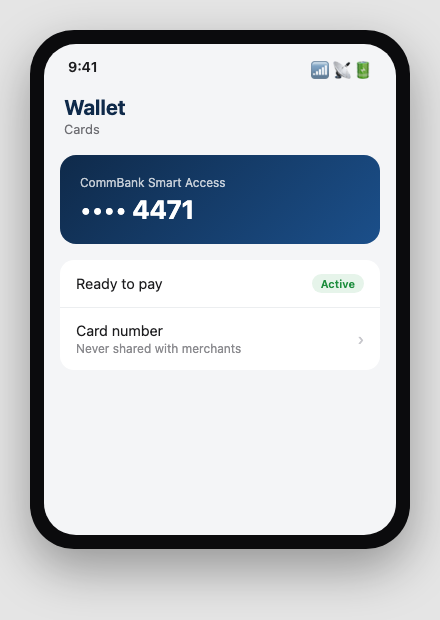
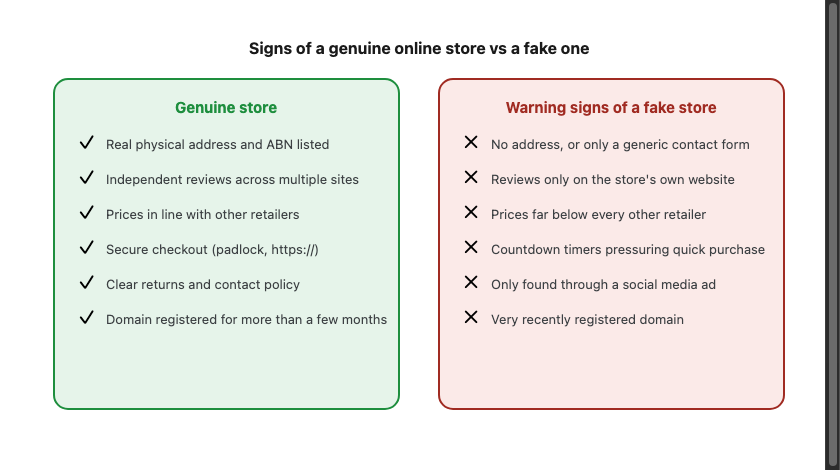
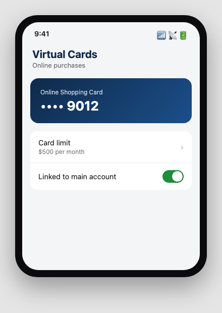

Sfinco Guides  ·  Volume 8 — Personal Finance Protection  ·  Chapter 6

# Safer online shopping and payments

The everyday habits that protect your card and your bank account

Most of us shop online regularly, and most of the time, nothing goes wrong. This chapter covers the handful of habits that keep it that way, and the newer payment methods worth understanding.

## Digital wallets — safer than they might seem

Adding your card to Apple Pay, Google Pay, or a similar digital wallet is generally safer than using the physical card itself for online or tap-and-go purchases, since your actual card number is never shared with the shop or website.

Settings path:  your phone's Wallet app  >  Add card, following the prompts from your bank.

*Mockup illustration, styled to match a typical digital wallet app — reshoot using your actual phone before final layout.*

| ℹ  DID YOU KNOW? When you pay with a digital wallet, the shop receives a unique, encrypted code for that transaction rather than your actual card number, which is why a digital wallet is generally considered more secure than swiping or inserting a physical card. |

## Buy now, pay later services — what to know

Services like Afterpay, Zip, and Klarna let you split a purchase into instalments, generally without a formal credit check. They are a genuine payment option, not inherently a scam, but they carry specific risks worth understanding.

★  TIP:  Missed buy now, pay later payments can affect your credit file in Australia, and multiple concurrent buy now, pay later commitments can be easy to lose track of. Treat them with the same care as any other form of credit, not as "not really borrowing."

| ⚠  WARNING If you did not initiate a buy now, pay later purchase yourself, and receive a confirmation for one you do not recognise, contact the provider immediately. This can indicate someone has used your details to make a fraudulent purchase. |

## Spotting a fake online store

Fake online stores, often advertised through social media, are designed to take payment for goods that never arrive.

Before buying from an unfamiliar online store, check for a genuine physical address and ABN, search the store's name alongside the word "reviews" or "scam," and be cautious of prices that seem significantly below every other retailer for the same item.

| ✓  WELL DONE IF YOU HAVE THIS If you already check for reviews and search a store's name before buying from somewhere unfamiliar, you are already doing one of the most effective checks against fake online stores. |

## Using a separate card for online purchases

Some banks let you create a virtual card, or you may choose to keep a separate card with a lower limit specifically for online shopping. If that card's details are ever compromised, the damage is limited to whatever balance or limit sits on that card alone, rather than your main everyday account.

*Mockup illustration, styled to match a typical Australian banking app — reshoot using your actual bank's app before final layout.*

## Quick review — your chapter 6 checklist

| Done | Item |
| --- | --- |
| ☐ | My cards are added to a digital wallet where possible |
| ☐ | I understand buy now, pay later is a form of credit, and track my commitments |
| ☐ | I check for reviews and a genuine ABN before buying from an unfamiliar online store |
| ☐ | I use a separate card or virtual card for online purchases where practical |

With your shopping and payment habits covered, the next chapter looks at wills, powers of attorney, and making sure your family can find your accounts if something happens to you.
