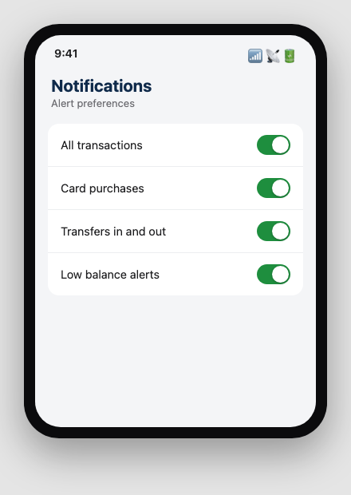
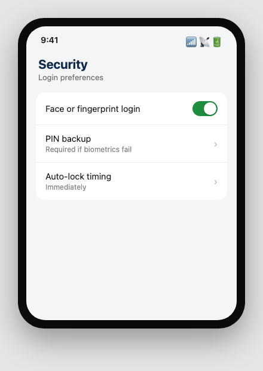
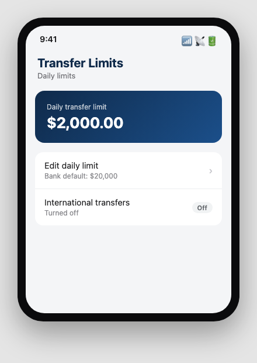
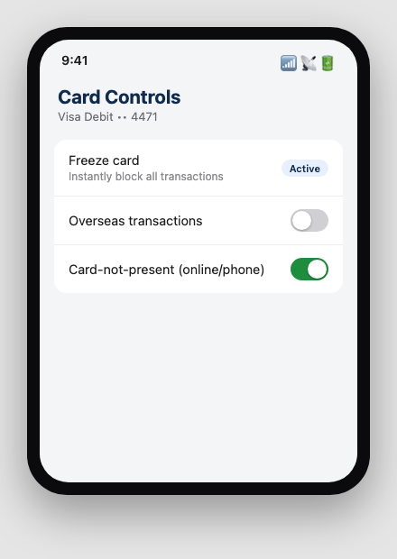
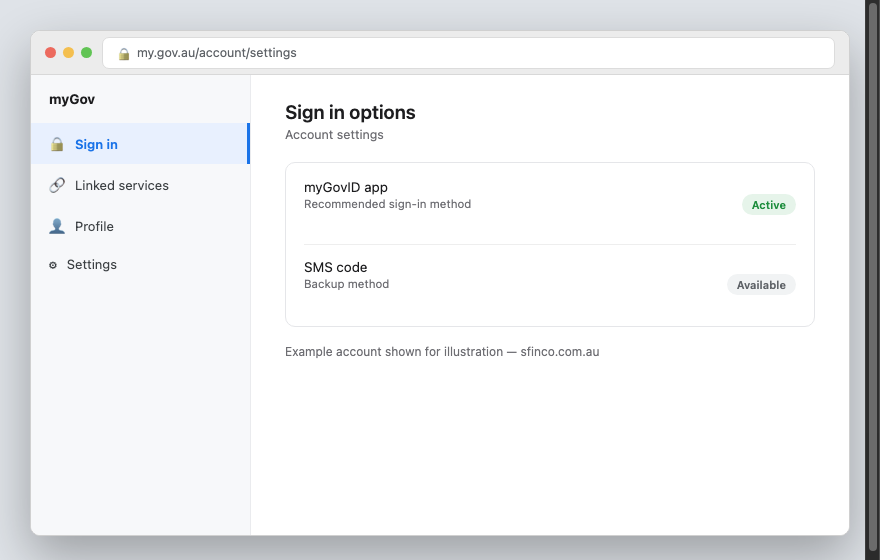
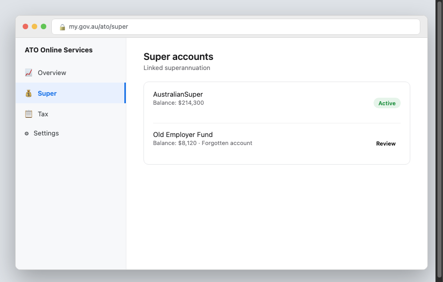
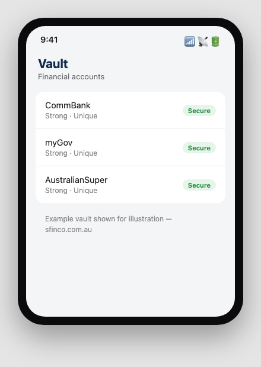
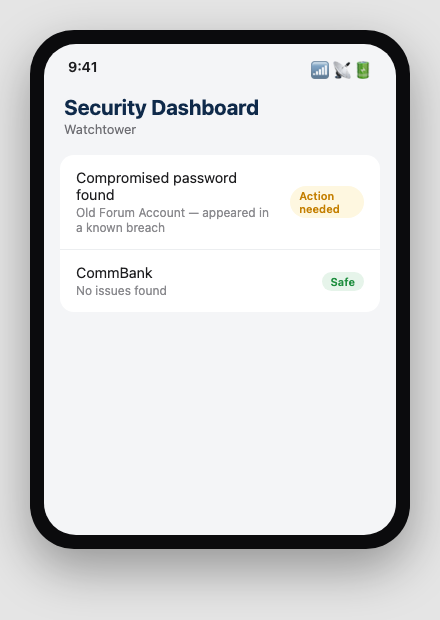
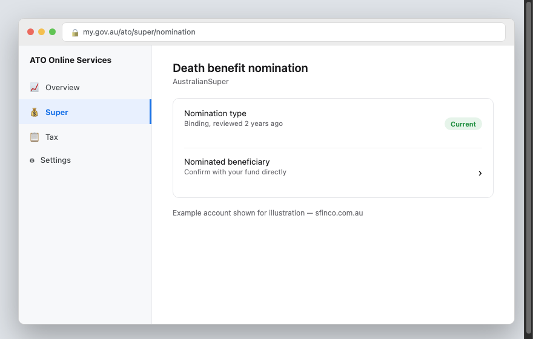

SFINCO GUIDES

VOLUME 8

PERSONAL FINANCE PROTECTION

Protecting your money in a digital world

---

Author: Leonardo Pinheiro
Series: Sfinco Guides
Volume: 8 of 8
Category: Personal Finance Security / Cybersecurity for Consumers
Format: Non-fiction, instructional, plain-English guide
Audience: Adults who want plain-English, practical guidance, particularly Australians aged 60+
Region: Australia (Sunshine Coast, Queensland focus, nationally applicable)

Publisher: Sfinco
Brand colours: Blue #1B4F8A · Amber #C47F00
Website: sfinco.com.au

---

---

Sfinco Guides  ·  Volume 8

Personal Finance Protection

Protecting your money in a digital world

# Introduction

This is the final volume in the Sfinco Guides series, and in many ways, the one all the others have been building towards. Your phone, your computer, your email, your Wi-Fi, all of it eventually connects back to the same thing: your money, and your ability to keep it safe.

This book is different from the others in one important way. It is not about protecting a device. It is about protecting your banking, your superannuation, and your savings from the specific scams and habits that put them at risk, and about making sure the people you trust can find and manage your finances if you are ever unable to yourself.

What this guide is not is financial advice. Nothing in this book tells you what to invest in, how to structure your superannuation, or what is "worth it" for your personal situation. What it does is help you recognise the scams and habits that put your money at risk, and point you towards the right kind of qualified help when a decision genuinely calls for it.

Whether you are managing your own retirement savings, helping a family member with theirs, or simply want more confidence around your everyday banking, this book is written for you.

## Who is this book for?

This guide is for anyone who wants to feel more confident and secure about their money in a digital world. In particular, this guide will be helpful if you:

do most or all of your banking through an app or a website

manage your own superannuation, or want to understand it better before retirement

have ever been approached about an investment opportunity that seemed exciting, or too good to pass up

want to make sure your family could find and manage your accounts if something happened to you

simply want peace of mind that your money is as protected as the rest of your digital life

## A quick word from the author

I work as a Customer Banking Specialist in Noosaville, holding RG146 accreditation (the qualification required to provide general advice on financial products in Australia) and pursuing further studies in financial crime investigation and compliance. Over years in banking, I have sat across the desk from people who lost genuinely significant money to scams that, in hindsight, had clear warning signs nobody had ever pointed out to them.

This book is my attempt to point those warning signs out in advance, in the same plain-English style as the rest of the Sfinco Guides series. It complements, rather than replaces, the guidance you would get from your bank, a licensed financial adviser, or ASIC's MoneySmart service.

! IMPORTANT: This book provides general information only. It is not personal financial advice, and it does not take into account your individual circumstances. Any business or individual providing personal financial advice in Australia must hold an Australian Financial Services Licence (AFSL) or be an authorised representative of one. Where this book touches on investment decisions, superannuation, or wills, it points you towards seeking advice from an appropriately licensed or qualified professional, rather than offering that advice itself.

# How to use this book

This book is designed to be used, not just read. Here is how to get the most out of it.

## Work through it chapter by chapter

Each chapter builds on the one before it, starting with your everyday banking security and working through to superannuation, investment scams, safer shopping habits, and your digital estate. If you are starting from scratch, work through Chapter 1 onward in order.

That said, every chapter also stands on its own. If an investment opportunity has been presented to you recently and you want to check it against the warning signs in this book, feel free to jump straight to that chapter.

## Do the steps as you go

This is a book to work through with your banking app and accounts open, not to read in one sitting and set aside. Each chapter includes practical steps you can put in place immediately, most of which take less than fifteen minutes.

*  TIP:  If you are ever unsure whether something in this book applies to a specific decision you are facing, ASIC's free MoneySmart service (moneysmart.gov.au) is an excellent, independent starting point, alongside your bank or a licensed financial adviser.

## Use the tools at the back of the book

Chapter 8 ends with a one-page monthly security checklist you can use to keep your financial accounts protected over time. The very back of the book also has a Quick Reference Card with emergency contacts and first-response steps, and a Glossary of every term used in this guide.

## A note on scope and regulation

This book touches on areas with specific Australian regulatory frameworks, and it is worth being clear about what is, and is not, being said.

Banking security (Chapters 2, 4, and 6) is general good practice, not regulated advice, and applies regardless of which bank you use.

Superannuation (Chapter 3) involves genuinely significant, long-term decisions. This book explains how to keep your super account secure and recognise super-related scams, but does not recommend specific funds, contribution strategies, or investment options within your super. For that, speak to your super fund or a licensed financial adviser.

Investments (Chapter 5) covered in this book relate entirely to recognising investment scams, not evaluating genuine investment opportunities. Any decision to invest should involve advice from an AFSL holder or authorised representative, appropriate to your personal circumstances.

Wills and estates (Chapter 7) require a qualified solicitor for anything legally binding. This book explains what to organise and gather, not how to draft legal documents.

## What this book does not cover

This guide focuses on protecting your money from scams and unsafe digital habits. It does not cover budgeting, debt management, tax planning, or specific investment strategy, all of which are better served by a qualified financial counsellor, accountant, or licensed adviser suited to your situation.

Ready? Chapter 1 starts with why your money is a target in the first place.

sfinco.com.au

Part of the Sfinco Guides series, protecting Australians online

---

Sfinco Guides  ·  Volume 8: Personal Finance Protection  ·  Chapter 1

# Why your money is a target

Every scam in this book eventually wants the same thing

| ▶  REAL STORY Peter, 68, from Tewantin, was contacted on social media by someone who seemed genuinely interested in getting to know him, over several weeks of friendly messages. Eventually, she mentioned she had been making excellent returns through a cryptocurrency trading platform, and offered to show him how it worked. Peter started with $500 through a professional-looking app that showed his "investment" steadily growing. Encouraged, he invested his superannuation drawdown of $85,000 over the following two months. When he tried to withdraw his money, the platform demanded a "release fee" of $12,000 first. Peter is a careful, sensible person who had never been scammed before. The scam worked precisely because it was patient, personal, and never asked for everything at once. That is exactly the gap this chapter closes. |

Stories like Peter's, often called "pig butchering" scams by investigators because of how deliberately the victim is fattened up before the loss, are devastatingly common across Australia, and older Australians with genuine savings are disproportionately targeted. This chapter is not here to frighten you. It is here to show you clearly why your money specifically is worth targeting, and the patterns that show up again and again.

## What makes your money worth targeting?

Scammers targeting individuals generally look for a specific combination of factors, and understanding them helps explain why the schemes in this book exist at all.

Genuine savings, decades of work, often including a lump sum of superannuation, represent a large, appealing target compared to a smaller, everyday amount

Trust in institutions, a scam impersonating your bank, the ATO, or a government service borrows the trust you already have in the real organisation

Time and attention, many scams, particularly investment and romance scams, rely on patience and a genuine emotional connection built over weeks or months

Unfamiliarity with new technology, cryptocurrency, instant transfers, and new payment platforms are all genuinely useful, but their newness also means fewer people instinctively recognise what "normal" looks like

| ℹ  DID YOU KNOW? The National Anti-Scam Centre reported that Australians lost over $2 billion to scams in a recent year, with investment scams consistently representing the single largest category of loss by dollar value, disproportionately affecting people over 55. |

## How do these scams actually happen?

Attacks on your money generally fall into a small number of well-worn patterns, covered in detail throughout this book.

Investment and cryptocurrency scams.  A fake or fraudulent investment opportunity, often introduced through social media or a personal connection, promising unusually high, reliable returns.

Romance and relationship scams.  A scammer builds a genuine-feeling relationship over time, before introducing a financial request, an investment opportunity, or an emergency requiring money.

Superannuation scams.  A scammer impersonates a super fund or offers to help "consolidate" or "release early," gaining access to your superannuation account.

Remote access and impersonation scams.  A caller impersonating your bank or a government agency convinces you to install software or transfer money to a "safe account."

Everyday banking scams.  Phishing texts, fake invoices, and compromised payment details that target your regular banking and card transactions.

## Why older Australians are targeted more

People over 60 are disproportionately targeted, not because of any lack of intelligence or capability, but because this group is more likely to hold significant superannuation and savings, more likely to own their home outright, and, for those who are recently widowed, divorced, or isolated, more likely to be genuinely receptive to the sustained personal connection that romance and investment scams rely on.

## The good news

Every scam in this book relies on you skipping one specific step: independently verifying a request or an opportunity before acting on it. This single habit, applied consistently, closes the door on almost every scam covered in the chapters ahead.

| ✓  WELL DONE IF YOU HAVE THIS If you have never sent money to someone you have only ever met online, and you always verify unexpected financial requests independently before acting, you are already doing the two most protective things anyone can do with their money. |

The rest of this book walks through exactly what to check, one chapter at a time, starting with the everyday banking habits that protect the accounts you use daily.

---

Sfinco Guides  ·  Volume 8: Personal Finance Protection  ·  Chapter 2

# Locking down your everyday banking

The settings in your banking app that most people never check

Your banking app is the single most direct path to your money, which makes it worth spending fifteen minutes getting genuinely right. This chapter covers the settings available in almost every Australian bank's app, regardless of which bank you use.

## Turning on transaction alerts

Most banks let you receive an instant notification, by text or push notification, every time money moves in or out of your account. This turns "I noticed the fraud three weeks later" into "I noticed it within minutes."

Settings path: usually found in your banking app under Settings, Notifications, or Alerts.

*Mockup illustration, styled to match a typical Australian banking app, reshoot using your actual bank's app before final layout.*

★  TIP:  Turn on alerts for every transaction type, not just large ones. Many scams start with a small test transaction to check whether a card or account is "live" before a larger amount is taken.

| ⚠  WARNING If transaction alerts are turned off, unusual activity on your account may go unnoticed for days or weeks, particularly on an account you check infrequently. Turning this on costs nothing and takes under a minute. |

## Securing your banking app login

Settings path: usually found in your banking app under Settings, Security, or Login preferences.

*Mockup illustration, styled to match a typical Australian banking app, reshoot using your actual bank's app before final layout.*

Enable fingerprint or face login if your bank offers it, in addition to a PIN or password. This is both more convenient and generally more secure than a PIN alone, since it cannot be observed or guessed by someone nearby.

| ℹ  DID YOU KNOW? Australian banks are required to offer reasonable security measures to protect your account, but they generally cannot protect you from a genuine transaction you were personally tricked into approving. This is exactly why recognising scams, covered later in this book, matters as much as the technical settings in this chapter. |

## Understanding PayID and how scammers misuse it

PayID lets you receive money using your phone number or email instead of a BSB and account number. It is safe to use, but scammers sometimes misuse the "name confirmation" feature it provides to build trust in a fake payment request.

★  TIP:  A PayID confirming a name only tells you the account is registered to that name. It does not confirm the person you are dealing with is genuine, or that the transaction itself is legitimate. Treat it as one small piece of information, not proof of safety.

## Setting a daily transfer limit that suits you

Most banking apps let you set your own daily transfer limit, separate from your bank's default maximum.

Settings path: usually found in your banking app under Settings, Limits, or Transfer preferences.

*Mockup illustration, styled to match a typical Australian banking app, reshoot using your actual bank's app before final layout.*

| ⚠  WARNING A lower daily transfer limit, set to slightly above what you would genuinely need in a normal day, acts as a built-in circuit breaker. Even if you are ever convinced to make a fraudulent transfer, a sensible limit can prevent the entire balance of an account from being moved in one transaction. |

## Card controls worth knowing about

Most banking apps let you temporarily freeze a card, turn off overseas transactions, or turn off "card not present" transactions (used for online and phone purchases) directly from the app, without needing to call your bank.

*Mockup illustration, styled to match a typical Australian banking app, reshoot using your actual bank's app before final layout.*

| ✓  WELL DONE IF YOU HAVE THIS If you know how to freeze your own card instantly from your banking app, you can respond to a lost card or suspected fraud in seconds, rather than waiting on hold with your bank. |

## Quick review, your chapter 2 checklist

| Done | Item |
| --- | --- |
| ☐ | Transaction alerts are turned on for all transaction types |
| ☐ | Fingerprint or face login is enabled on my banking app |
| ☐ | I understand what PayID name confirmation does and does not prove |
| ☐ | My daily transfer limit is set to a sensible amount for my normal use |
| ☐ | I know how to freeze my card from my banking app |

With your everyday banking locked down, the next chapter looks at your myGov account and superannuation, and the scams that specifically target them.

---

Sfinco Guides  ·  Volume 8: Personal Finance Protection  ·  Chapter 3

# Your myGov account and superannuation

Protecting one of the largest sums of money most Australians will ever hold

For most Australians, superannuation represents one of the largest single amounts of money they will ever accumulate, often larger than the value of their home. It is also, for many people, the account they check least often, which makes it a genuinely attractive target.

## Securing your myGov account

myGov links to your superannuation, Medicare, Centrelink, and ATO records, which makes it a high-value target in its own right.

Settings path:  my.gov.au  >  Account settings  >  Sign in options.

*Mockup illustration, styled to match myGov, reshoot using your actual account before final layout.*

★  TIP:  Use the myGovID app for signing in wherever possible, rather than a code sent by text. It is generally considered more secure and is not vulnerable to a text message being intercepted.

| ⚠  WARNING Genuine myGov and ATO communications never ask you to click a link and enter your myGov password. If you receive a text or email claiming to be from myGov or the ATO with a login link, do not click it. Go to my.gov.au directly by typing the address yourself. |

## Checking your superannuation directly

Settings path:  my.gov.au  >  Linked services  >  Australian Taxation Office  >  Super, to view all your super accounts, including any you may have forgotten about.

*Mockup illustration, styled to match ATO online services, reshoot using your actual account before final layout.*

| ℹ  DID YOU KNOW? Many Australians have multiple, forgotten superannuation accounts from previous jobs, each charging separate fees. Checking this screen occasionally can reveal genuine, unclaimed money, though any decision to consolidate accounts should consider factors like insurance attached to an older account, best discussed with your fund or a licensed adviser. |

## Superannuation scams to watch for

Super-related scams typically fall into a small number of patterns, each exploiting the fact that most people do not check their super often.

Fake early release offers.  A scammer claims you can access your superannuation early, outside the genuine, narrow circumstances the ATO permits, in exchange for a fee.

Unsolicited consolidation calls.  A caller claims to represent your super fund or a "super comparison service," asking for your myGov or fund login details to "consolidate" your accounts on your behalf.

Fake fund switching pressure.  A caller pressures you to switch your super into a fund offering unusually high, guaranteed-sounding returns, a claim that should itself be treated as a warning sign.

| ✶  CRITICAL, READ THIS CAREFULLY Genuine early release of superannuation is only available in specific, narrow circumstances defined by the ATO, such as severe financial hardship or terminal illness, and is never arranged through an unsolicited caller offering to "help" for a fee. Never provide your myGov or super fund login details to anyone who contacts you unprompted. |

## When a super decision needs a licensed adviser

Whether to consolidate accounts, change your investment option within super, or make additional contributions are all genuine, significant decisions that depend on your personal circumstances.

! IMPORTANT: This book does not recommend specific super funds, contribution strategies, or investment options, since this constitutes personal financial advice, which in Australia can only be provided by a person or business holding an Australian Financial Services Licence (AFSL) or acting as an authorised representative of one. Your existing super fund, a licensed financial adviser, or ASIC's free MoneySmart service (moneysmart.gov.au) are appropriate places to seek this kind of guidance.

## Quick review, your chapter 3 checklist

| Done | Item |
| --- | --- |
| ☐ | My myGov account uses the myGovID app or another secure sign-in method |
| ☐ | I have checked my linked superannuation accounts through my.gov.au |
| ☐ | I know that genuine early release is never arranged through an unsolicited caller |
| ☐ | I know that specific super advice should come from my fund or a licensed adviser, not this book |

With your myGov and super accounts checked, the next chapter looks at password managers and the habits that protect every financial account you hold.

---

Sfinco Guides  ·  Volume 8: Personal Finance Protection  ·  Chapter 4

# Password managers and safer financial habits

One tool that protects every financial account you hold, all at once

A password manager is the single most effective tool for protecting your financial accounts, because it removes the temptation to reuse a password across your bank, your super fund, myGov, and everything else.

## Why reusing a password is a genuine financial risk

If the same password is used across your email and your bank, a breach at any one of those services, even one that has nothing to do with your bank, can expose the password used everywhere else it was reused.

| ⚠  WARNING Data breaches at unrelated websites happen constantly, and are often reported publicly months after they occur. If you have ever reused a banking or myGov password anywhere else, including an old, forgotten account, treat this as a genuine, current risk worth fixing today. |

## Setting up a password manager

A password manager generates and stores a strong, unique password for every account, so you only need to remember one master password.

| Password manager | Cost | Best for |
| --- | --- | --- |
| Bitwarden | Free / ~AU$13/yr for premium | Best free option, straightforward for a single user |
| 1Password | ~AU$4.50/mo | Very easy to use, good family sharing options |
| Dashlane | ~AU$5/mo | Good all-rounder with built-in dark web monitoring |

*Mockup illustration, styled to match a typical password manager app, reshoot using your actual app before final layout.*

★  TIP:  Start with just your three or four most important accounts, your email, your bank, myGov, and your super fund. You do not need to move everything across in one sitting.

## Turning on alerts for compromised passwords

Most password managers, and some banks, can tell you if a password you use has appeared in a known data breach, letting you change it before it is misused.

*Mockup illustration, styled to match a typical password manager app, reshoot using your actual app before final layout.*

| ℹ  DID YOU KNOW? The free website haveibeenpwned.com lets you check whether your email address has appeared in a known data breach, without needing to install anything, and is run by an independent, well-regarded security researcher. |

## Multi-factor authentication on every financial account

Multi-factor authentication (MFA) requires a second step beyond your password, usually a code or a prompt on your phone, to sign in. Turn this on for every financial account that offers it, starting with your email, since it is often the account used to reset everything else.

| ✓  WELL DONE IF YOU HAVE THIS If MFA is turned on for your email, your bank, and your myGov account, you have closed the door on the vast majority of account takeover attempts, even if a password is ever guessed or leaked. |

## A note on writing passwords down safely

If a password manager feels like too big a step right now, a physical notebook kept in a locked drawer, well away from your computer, is genuinely safer than reusing the same password everywhere. It is not the ideal solution, but it is a reasonable, honest middle step while you get comfortable with a password manager.

## Quick review, your chapter 4 checklist

| Done | Item |
| --- | --- |
| ☐ | A password manager is set up for my most important financial accounts |
| ☐ | I have checked whether any of my passwords appear in a known data breach |
| ☐ | MFA is turned on for my email, bank, and myGov account |
| ☐ | No password is reused across more than one financial account |

With your passwords and habits in order, the next chapter looks at the investment and romance scams that specifically target people's savings.

---

Sfinco Guides  ·  Volume 8: Personal Finance Protection  ·  Chapter 5

# Investment and romance scams

How to spot them, what to do, and how to recover if you have already sent money

## Why these scams work, the psychology behind them

Every scam in this chapter relies on patience, trust, and the genuine appeal of an opportunity that seems too good to question closely. Unlike a rushed phishing text, these scams often unfold over weeks or months, which makes them feel more credible, not less.

## The scams most likely to reach you

Here are the most common scam types currently targeting Australians around investments and money, with real examples of what they look like.

1. The cryptocurrency "trading platform" scam

A new online contact, often met through social media or a dating app, eventually introduces a cryptocurrency trading platform showing consistently impressive returns.

| New Contact |

| I've been using this platform for a few months now and it's honestly changed things for me. I could show you how it works if you're interested, no pressure at all. |

*Illustrative mockup, not a real message, built to show the pattern.*

| ✶  CRITICAL, READ THIS CAREFULLY A genuine investment platform never needs to be introduced by a new personal contact, and a legitimate opportunity will still be there next week after you have checked it independently. If a platform shows your balance "growing" but charges a fee before letting you withdraw, this is one of the clearest signs of a scam. |

2. Fake broker cold calls

A caller claims to be from a licensed investment firm, often referencing real market news to sound credible, offering an exclusive opportunity in shares, forex, or commodities.

| "Investment Advisor" |

| We're offering select clients early access to this opportunity before it goes public. Given your profile, I think you'd be a great fit, but I do need you to move quickly as spots are limited. |

*Illustrative mockup, not a real advisor call, built to show the pattern.*

Check whether a firm and individual are genuinely licensed using ASIC's free registers at moneysmart.gov.au or asic.gov.au before engaging further, and never let "spots are limited" pressure you into skipping this step.

3. Fake celebrity or news endorsement ads

A social media ad or fake news article shows a well-known Australian figure apparently endorsing a trading platform or cryptocurrency, generated using manipulated images or AI.

| Sponsored |

| Local businessman reveals the investment secret banks don't want you to know. Click to see how much you could be earning. |

*Illustrative mockup, not a real advertisement, built to show the pattern.*

| ⚠  WARNING Genuine public figures do not endorse specific trading platforms or cryptocurrency schemes through social media ads. These images and quotes are frequently fabricated using widely available editing and AI tools. |

4. The "your bank account needs protecting" call

A caller claims to be from your bank's fraud department, warning that your account has been compromised, and that your money needs to be moved to a "safe account" to protect it.

| "Bank Fraud Team" |

| We've detected suspicious activity and need to move your funds to a secure holding account immediately while we investigate. Can you confirm your online banking details so I can assist? |

*Illustrative mockup, not a real bank call, built to show the pattern.*

Your bank will never ask you to transfer money to a "safe account," and will never ask for your online banking password or a one-time code over the phone. Hang up and call your bank directly using the number on the back of your card.

5. The romance scam financial request

After weeks or months of relationship building, a new online partner introduces a financial need, an investment opportunity, or an emergency requiring money.

| Online Partner |

| I hate to even ask this, but I'm in a difficult situation and could really use your help. I'll pay you back as soon as I can, I promise. |

*Illustrative mockup, not a real message, built to show the pattern.*

Never send money to someone you have only met online, regardless of how genuine the relationship feels, or how long it has been going on. This applies just as strongly after months of contact as it does after days.

## The universal red flag checklist

Regardless of which scam you encounter, the same warning signs tend to appear.

You are asked to move quickly, or told an opportunity is only available for a limited time

A new personal contact introduces a financial or investment opportunity

You are asked to pay a fee before you can withdraw money that is supposedly already yours

You are asked for your online banking password, a one-time code, or to move money to a "safe account"

You have never met the person in real life, but they are asking you for money

## What to do if you think you have already sent money to a scam

Contact your bank immediately. Some payments can be recalled if reported within hours, though this becomes far less likely after a day or two. Report the incident to Scamwatch at scamwatch.gov.au and to the National Anti-Scam Centre. If the scam involved a relationship, consider speaking to IDCARE (idcare.org) for support, since these scams can be genuinely distressing beyond the financial loss. Do not send further money in an attempt to recover funds already lost, a common follow-up scam known as recovery fraud.

## Quick review, your chapter 5 checklist

| Done | Item |
| --- | --- |
| ☐ | I check any investment opportunity independently using ASIC's registers before engaging |
| ☐ | I know that genuine banks never ask me to move money to a "safe account" |
| ☐ | I have never sent money to someone I have only met online |
| ☐ | I know who to contact immediately if I think I have sent money to a scam |

With scams covered, the next chapter looks at safer everyday shopping and payment habits.

---

Sfinco Guides  ·  Volume 8: Personal Finance Protection  ·  Chapter 6

# Safer online shopping and payments

The everyday habits that protect your card and your bank account

Most of us shop online regularly, and most of the time, nothing goes wrong. This chapter covers the handful of habits that keep it that way, and the newer payment methods worth understanding.

## Digital wallets, safer than they might seem

Adding your card to Apple Pay, Google Pay, or a similar digital wallet is generally safer than using the physical card itself for online or tap-and-go purchases, since your actual card number is never shared with the shop or website.

Settings path:  your phone's Wallet app  >  Add card, following the prompts from your bank.

*Mockup illustration, styled to match a typical digital wallet app, reshoot using your actual phone before final layout.*

| ℹ  DID YOU KNOW? When you pay with a digital wallet, the shop receives a unique, encrypted code for that transaction rather than your actual card number, which is why a digital wallet is generally considered more secure than swiping or inserting a physical card. |

## Buy now, pay later services, what to know

Services like Afterpay, Zip, and Klarna let you split a purchase into instalments, generally without a formal credit check. They are a genuine payment option, not inherently a scam, but they carry specific risks worth understanding.

★  TIP:  Missed buy now, pay later payments can affect your credit file in Australia, and multiple concurrent buy now, pay later commitments can be easy to lose track of. Treat them with the same care as any other form of credit, not as "not really borrowing."

| ⚠  WARNING If you did not initiate a buy now, pay later purchase yourself, and receive a confirmation for one you do not recognise, contact the provider immediately. This can indicate someone has used your details to make a fraudulent purchase. |

## Spotting a fake online store

Fake online stores, often advertised through social media, are designed to take payment for goods that never arrive.

Before buying from an unfamiliar online store, check for a genuine physical address and ABN, search the store's name alongside the word "reviews" or "scam," and be cautious of prices that seem significantly below every other retailer for the same item.

| ✓  WELL DONE IF YOU HAVE THIS If you already check for reviews and search a store's name before buying from somewhere unfamiliar, you are already doing one of the most effective checks against fake online stores. |

## Using a separate card for online purchases

Some banks let you create a virtual card, or you may choose to keep a separate card with a lower limit specifically for online shopping. If that card's details are ever compromised, the damage is limited to whatever balance or limit sits on that card alone, rather than your main everyday account.

*Mockup illustration, styled to match a typical Australian banking app, reshoot using your actual bank's app before final layout.*

## Quick review, your chapter 6 checklist

| Done | Item |
| --- | --- |
| ☐ | My cards are added to a digital wallet where possible |
| ☐ | I understand buy now, pay later is a form of credit, and track my commitments |
| ☐ | I check for reviews and a genuine ABN before buying from an unfamiliar online store |
| ☐ | I use a separate card or virtual card for online purchases where practical |

With your shopping and payment habits covered, the next chapter looks at wills, powers of attorney, and making sure your family can find your accounts if something happens to you.

---

Sfinco Guides  ·  Volume 8: Personal Finance Protection  ·  Chapter 7

# Wills, powers of attorney, and your digital estate

Making sure the people you trust can find and manage your accounts

A surprising number of families discover, at the worst possible time, that they cannot access a loved one's accounts, do not know which bank or super fund to contact, or cannot locate a will at all. This chapter is about closing that gap while you are able to.

## What a will actually needs to cover in a digital world

A will remains a legal document that only a solicitor can properly draft, but modern life means it increasingly needs to account for things that did not exist a generation ago: online banking, superannuation death benefit nominations, and digital assets like cryptocurrency or accumulated loyalty points.

! IMPORTANT: This book cannot and does not provide legal advice, and a valid, up-to-date will requires a qualified solicitor. What this chapter can help with is making sure you have gathered the right information beforehand, so your solicitor's time, and your family's time later, is used efficiently.

## Superannuation death benefit nominations, often forgotten

Unlike most other assets, your superannuation is not automatically covered by your will unless you have made a specific death benefit nomination with your super fund. Many people are surprised to learn this.

Settings path:  contact your super fund directly, or check through my.gov.au  >  Linked services  >  Australian Taxation Office  >  Super.

*Mockup illustration, styled to match ATO online services, reshoot using your actual account before final layout.*

★  TIP:  Check whether your nomination is "binding" or "non-binding" with your fund. A binding nomination is generally legally required to be followed, while a non-binding nomination is only a guide for the fund's trustee. Ask your fund directly if you are unsure which applies to yours.

## Enduring power of attorney, a different kind of protection

A will only takes effect after death. An enduring power of attorney allows someone you trust to manage your financial affairs if you are ever unable to yourself, due to illness, injury, or cognitive decline, while you are still alive.

| ℹ  DID YOU KNOW? Setting up an enduring power of attorney while you are healthy and able to make your own decisions is generally far simpler and less contested than trying to arrange one after a health crisis has already begun. It is worth arranging well before it feels urgent. |

An enduring power of attorney is a legal document, and requirements vary slightly by state. In Queensland, this is arranged through the Queensland Public Trustee or a solicitor.

## Building a digital asset list for your family

Whether or not you use a formal password manager, it is worth preparing a simple list, kept somewhere secure, of what your family would need to find in your absence.

| What to list | Example |
| --- | --- |
| Bank and super accounts | Which banks and funds you hold accounts with |
| Online accounts of financial value | Investment platforms, cryptocurrency wallets, loyalty points |
| Where your password manager or password list is kept | Not the passwords themselves, just where to find them |
| Your solicitor's contact details | So your family knows who holds your will |

| ⚠  WARNING Never store this list as a single document containing actual passwords in plain text, especially somewhere like an unencrypted email draft or an unlocked phone note. List where things are and who to contact, kept in a secure, physical location or password-protected file, rather than the passwords themselves. |

## A note on Sfinco's Digital Estate Vault

Sfinco is developing a dedicated Digital Estate Vault, a secure way to organise exactly this kind of information for your family, alongside your password manager. It is not yet available. Once it launches, details will be shared at sfinco.com.au. Until then, the approach in this chapter, a physical or password-protected list, kept somewhere your family knows to look, remains a sound and completely free starting point.

## Quick review, your chapter 7 checklist

| Done | Item |
| --- | --- |
| ☐ | I have an up-to-date will prepared by a qualified solicitor |
| ☐ | I have checked my superannuation death benefit nomination with my fund |
| ☐ | I have arranged an enduring power of attorney while healthy and able to |
| ☐ | My family knows where to find a list of my accounts and who to contact |

With your accounts, your money, and your estate all covered, the final chapter brings everything in this book together into a fifteen-minute monthly routine.

---

Sfinco Guides  ·  Volume 8: Personal Finance Protection  ·  Chapter 8

# Your 15-minute financial security checkup

A simple monthly routine to keep your money protected for years to come

You have now worked through every major layer of personal finance protection: your everyday banking, your myGov and superannuation accounts, password managers, investment and romance scam awareness, safer shopping habits, and your digital estate. This final chapter brings all of it together into one simple monthly habit.

| ℹ  DID YOU KNOW? Set a recurring reminder right now, the first Sunday of every month works well for most people. Open the Reminders or Calendar app, create a new reminder called 'Financial security checkup', and set it to repeat monthly. This is the single most important step in this chapter: the checklist only works if you actually come back to it. |

## The complete monthly checklist

Work through this list with your accounts open. Each item references the chapter where you can find full instructions if you need a refresher.

### Everyday banking

| Done | Item | Chapter |
| --- | --- | --- |
| ☐ | Transaction alerts remain turned on | Ch. 2 |
| ☐ | My daily transfer limit still suits my normal use | Ch. 2 |

### myGov and superannuation

| Done | Item | Chapter |
| --- | --- | --- |
| ☐ | I have not received any unexpected super or myGov contact this month | Ch. 3 |
| ☐ | My myGov sign-in method remains secure | Ch. 3 |

### Passwords and accounts

| Done | Item | Chapter |
| --- | --- | --- |
| ☐ | No password is reused across financial accounts | Ch. 4 |
| ☐ | MFA remains active on email, bank, and myGov | Ch. 4 |

### Scam awareness

| Done | Item | Chapter |
| --- | --- | --- |
| ☐ | I have not sent money to anyone I have only met online | Ch. 5 |
| ☐ | Any investment approach this month has been independently checked via ASIC's registers | Ch. 5 |

### Shopping and payments

| Done | Item | Chapter |
| --- | --- | --- |
| ☐ | No unrecognised buy now, pay later purchases this month | Ch. 6 |
| ☐ | Any new online store was checked for reviews and a genuine ABN before buying | Ch. 6 |

### Estate and planning

| Done | Item | Chapter |
| --- | --- | --- |
| ☐ | My will and power of attorney remain current | Ch. 7 |
| ☐ | My family still knows where to find my account list | Ch. 7 |

## A closing word on the Sfinco Guides series

This is the eighth and final volume in the Sfinco Guides series. Across these eight books, you have covered your iPhone, your Mac, your home network, your Windows PC, your Android phone, and, in the final three organisational volumes, your small business or community organisation, and now your money itself.

The thread running through all eight has been the same: protecting people who don't know they need protecting, through technology, money, and trust. Not because you are careless, or behind, or unable to keep up, but because nobody had ever laid it out for you in plain English before.

| ✓  WELL DONE You have completed Sfinco Guides Volume 8: Personal Finance Protection, and with it, the full Sfinco Guides series. Genuinely, well done. |

If this series has been useful to you, please consider sharing it with someone you care about, particularly anyone who could use a plain-English starting point rather than a technical manual. That is exactly what these books were written for.

sfinco.com.au

---

Sfinco Guides  ·  Volume 8

## Glossary

These are the key terms used throughout this book, explained in plain English. You do not need to memorise them, this section is here to help if you encounter a word and want a clear definition.

| Term | Definition |
| --- | --- |
| AFSL | Australian Financial Services Licence, required to legally provide personal financial advice in Australia |
| Binding death benefit nomination | An instruction to your super fund about who receives your super when you die, which the fund is generally required to follow |
| Digital wallet | An app such as Apple Pay or Google Pay that stores an encrypted version of your card for safer tap-and-go or online payments |
| Enduring power of attorney | A legal document allowing someone you trust to manage your financial affairs if you are ever unable to yourself |
| MFA (Multi-factor authentication) | A security method requiring both your password and a second step, such as a code or prompt, to sign in |
| MoneySmart | ASIC's free, independent consumer finance and investment information service |
| myGovID | The Australian government's identity verification app, used to securely sign in to myGov and linked services |
| Password manager | Software that generates and securely stores strong, unique passwords for every account |
| PayID | A service allowing you to receive payments using your phone number or email instead of a BSB and account number |
| Phishing | A scam that impersonates a trusted organisation to trick you into handing over personal or financial information |
| Pig butchering scam | An investigative term for a scam that builds a long-term relationship with a victim before introducing a financial or investment request |
| Recovery fraud | A follow-up scam targeting people who have already lost money, offering to "recover" it for a further fee |
| RG146 | The Australian regulatory guide setting the minimum training standard for providing general financial product advice |
| Scamwatch | The Australian government's national scam reporting service, run by the ACCC |

Sfinco Guides  ·  Volume 8

## Quick reference card

Cut out or photograph this page and keep it somewhere handy, on the fridge, or saved as a photo on your phone. These are the numbers and steps you are most likely to need in a hurry.

### Emergency contacts

| Contact | Details |
| --- | --- |
| My bank's fraud line | _________________________________ |
| Scamwatch (ACCC) | scamwatch.gov.au · 1300 302 502 |
| MoneySmart (ASIC) | moneysmart.gov.au |
| IDCARE (identity support) | idcare.org · 1800 595 160 |
| National Debt Helpline | ndh.org.au · 1800 007 007 |

### My financial details

| Detail | Your information |
| --- | --- |
| My super fund(s) | _________________________________ |
| My solicitor | _________________________________ |
| My financial adviser (if any) | _________________________________ |
| Password manager, location noted | _________________________________ |

### If you think you have sent money to a scam

| Step | What to do |
| --- | --- |
| 1. Call your bank immediately | Ask about a payment recall |
| 2. Report it | scamwatch.gov.au and the National Anti-Scam Centre |
| 3. Do not pay a "recovery fee" | This is almost always a follow-up scam |
| 4. Seek support if needed | idcare.org, particularly after a romance scam |

### If you suspect a super or myGov scam

| Step | What to do |
| --- | --- |
| 1. Do not provide myGov or fund login details | Not to anyone who contacts you unprompted |
| 2. Log in directly at my.gov.au | Never through a link in a text or email |
| 3. Contact your super fund directly | Using their official number |
| 4. Report it | scamwatch.gov.au |

Sfinco Guides  ·  Volume 8

## Monthly security checkup

15 minutes · First Sunday of every month

Month / Year: _________________     Completed by: _________________

### 🏦 Everyday banking

| Done | Item | Chapter |
| --- | --- | --- |
| ☐ | Transaction alerts on | Ch 2 |
| ☐ | Transfer limit still suits me | Ch 2 |

### 🏛️ myGov and super

| Done | Item | Chapter |
| --- | --- | --- |
| ☐ | No unexpected super contact | Ch 3 |
| ☐ | myGov sign-in still secure | Ch 3 |

### 🔐 Passwords

| Done | Item | Chapter |
| --- | --- | --- |
| ☐ | No reused passwords | Ch 4 |
| ☐ | MFA active everywhere | Ch 4 |

### 🚨 Scams

| Done | Item | Chapter |
| --- | --- | --- |
| ☐ | No money sent to an online-only contact | Ch 5 |

### 🛍️ Shopping

| Done | Item | Chapter |
| --- | --- | --- |
| ☐ | No unrecognised BNPL purchases | Ch 6 |

### 📋 Estate

| Done | Item | Chapter |
| --- | --- | --- |
| ☐ | Will and power of attorney current | Ch 7 |
| ☐ | Family knows where to look | Ch 7 |

sfinco.com.au · Vol 8 Personal Finance Protection

## Sfinco Guides, the complete series

The full series, all eight volumes

The Sfinco Guides series is designed to cover every device, situation, and stage of life you are likely to encounter. Each book follows the same plain-English, step-by-step format, with real Australian examples, screenshots, and no technical jargon.

### Series 1, Personal protection

| Volume | What it covers |
| --- | --- |
| Vol 1 Available now | iPhone Protection. Your simple guide to staying safe online. Passcode · Face ID · Apple ID · App permissions · Scams · Wi-Fi · Find My |
| Vol 2 Available now | MacBook Protection. Securing your Mac in plain English. Login & FileVault · Gatekeeper · Apple ID · Scams · Firewall & VPN · Time Machine |
| Vol 3 Available now | Family and Home Network Protection. Keeping everyone safe under one roof. Router security · guest Wi-Fi · smart devices · scams · parental controls |
| Vol 4 Available now | Windows Protection. A plain-English guide for Windows users. Sign-in & BitLocker · Microsoft account · Defender · Scams · Firewall & VPN · Backups |
| Vol 5 Available now | Android Protection. Staying safe on your Android phone. Play Protect · app permissions · Google account · 2FA · scam texts and calls |

### Series 2, Organisational protection

| Volume | What it covers |
| --- | --- |
| Vol 6 Available now | Small Business Protection. Cyber security for Australian small businesses. Email security · staff access · backups · scam invoices · incident response |
| Vol 7 Available now | NGO and Not-for-Profit Protection. Protecting organisations that protect others. Volunteer access · donor data · email compromise · free tools for small teams |
| Vol 8 Available now | Personal Finance Protection. Protecting your money in a digital world. Banking security · investment scams · superannuation · password managers · wills |

| ★  TIP All Sfinco Guides are available on Amazon (search 'Sfinco Guides' or scan the QR code on the next page). Paperback and e-book editions are available. Bulk copies for community groups, RSL clubs, libraries, and medical practices are available directly through sfinco.com.au, contact us for pricing. |

## Connect with us

Scan to continue your Sfinco journey.

Each QR code below links to a different part of the Sfinco ecosystem. Scan any of them with your phone's camera to go directly to the relevant page.

| Where it takes you | What you'll find |
| --- | --- |
| [ QR CODE ] WEBSITE | Visit the Sfinco website, free resources, guides, blog, and updates on new books in the series sfinco.com.au |
| [ QR CODE ] TECH HELP | Book a Senior Tech Concierge session, in-person help with your devices on the Sunshine Coast sfinco.com.au/concierge |
| [ QR CODE ] ALL BOOKS | Browse all Sfinco Guides, the complete series on Amazon and direct from our website sfinco.com.au/guides |
| [ QR CODE ] BUSINESS | Sfinco for business, cyber security audits and assessments for Sunshine Coast small businesses sfinco.com.au/business |
| [ QR CODE ] FREE DOWNLOAD | Free printable resources, scam reference card, monthly checklist, and more (no sign-up required) sfinco.com.au/resources |

| ℹ  NOTE QR codes are scanned using your phone's camera app, no separate app needed. All Sfinco links are safe and will never ask for payment details. |

Sfinco Guides  ·  Volume 8

## About Leonardo Pinheiro

Leonardo Pinheiro, the author of the Sfinco Guides series, works in banking and technology on the Sunshine Coast in Queensland, with nearly two decades of experience across customer service, financial services, and digital security.

Holding qualifications in cybersecurity (CompTIA Security+), financial advising (RG146), and information technology, and completing further studies at CQUniversity, Leonardo brings together a rare combination of technical knowledge and the ability to explain it clearly to people who have no interest in becoming technical experts.

The inspiration for this series came from years of seeing the same pattern: intelligent, capable, careful people being harmed by scams and digital threats, not because they were careless, but because nobody had ever given them a clear, practical guide to protecting themselves. That gap is what these books, and Sfinco itself, exist to close.

Leonardo also volunteers with CoderDojo, teaching digital skills to young people on the Sunshine Coast, and has a background in community technology education across Australia and internationally.

Sfinco was founded on the belief that every Australian deserves to feel safe and confident in their digital life, regardless of their age, their technical background, or how much money they have.

| Sfinco Protecting Australians through technology, money, and trust. sfinco.com.au Noosa · Sunshine Coast · Queensland · Australia |

## Publication details

Sfinco Guides is published by Sfinco · ABN [to be added]

First published 2026 · © Sfinco · All rights reserved

No part of this publication may be reproduced without written permission from the publisher.

The information in this book is provided for general guidance only and does not constitute professional legal, financial, or cybersecurity advice.